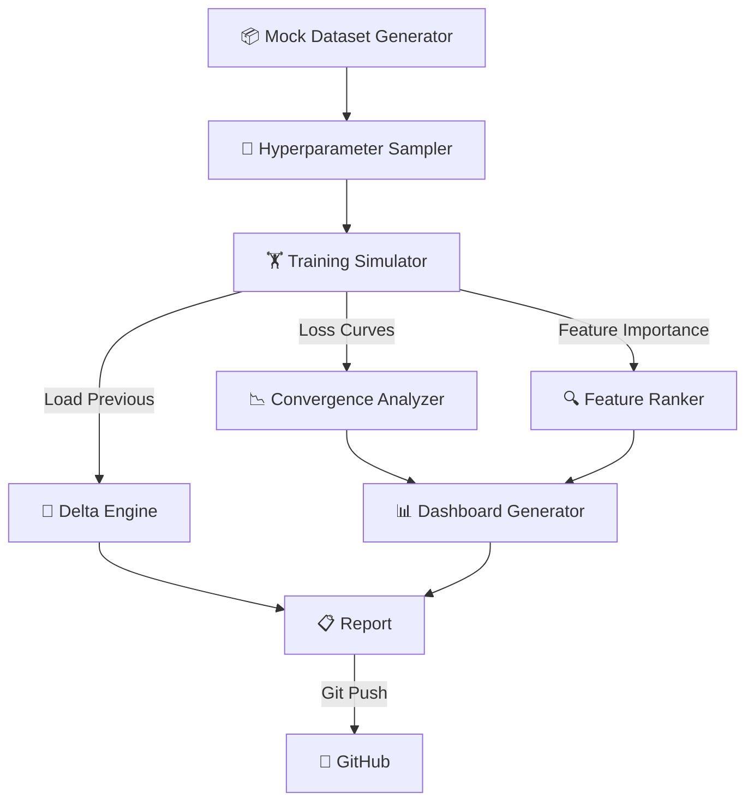

<div align="center">

# 🧠 ML Experiments

[](https://github.com/Atharv279/ml-experiments/actions/workflows/daily_run.yml)


**Automated LightGBM hyperparameter tuning with loss curve visualization and day-over-day performance tracking.**

</div>

---

## Architecture



## Experiments

| Name | Type | Metric | Features |
|------|------|--------|----------|
| **Churn Prediction** | Binary Classification | AUC | 12 |
| **Price Regression** | Continuous | RMSE | 20 |
| **Fraud Detection** | Binary Classification | AUC | 15 |
| **Demand Forecast** | Continuous | MAE | 18 |

## Live Dashboard Preview

> Loss curves + feature importance for each experiment


## Output Structure

```
logs/
├── YYYY-MM-DD.json          # Full trial data + loss curves
├── YYYY-MM-DD.md            # Markdown report with delta
├── YYYY-MM-DD_dashboard.png # Loss curves + feature importance
└── YYYY-MM-DD_trend.png     # 14-day score trend
```

## Quick Start

```bash
pip install -r dev-requirements.txt
python main.py
```
