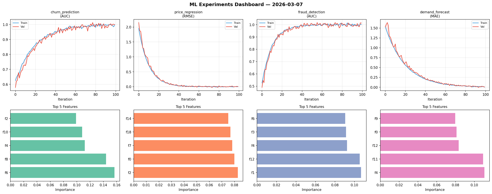

# ML Experiments Report — 2026-03-07

**Run ID:** `bd47afd5f9` | **Experiments:** 4 | **Trials:** 15

## churn_prediction (AUC)

**Best Score:** 0.9987 (Trial 2)

| Trial | Score | Overfit Gap | Time | LR | Trees | Leaves |
|-------|-------|-------------|------|-----|-------|--------|
| 1 | 0.9741 | 0.0235 | 124.32s | 0.1 | 500 | 63 |
| 2 ⭐ | 0.9987 | 0.0004 | 19.79s | 0.1 | 200 | 127 |
| 3 | 0.9788 | 0.0172 | 53.68s | 0.1 | 200 | 15 |

## price_regression (RMSE)

**Best Score:** 0.0017 (Trial 2)

| Trial | Score | Overfit Gap | Time | LR | Trees | Leaves |
|-------|-------|-------------|------|-----|-------|--------|
| 1 | 0.0713 | 0.0103 | 2.13s | 0.05 | 100 | 15 |
| 2 ⭐ | 0.0017 | 0.0043 | 77.55s | 0.2 | 1000 | 15 |
| 3 | 1.0193 | 0.1022 | 90.75s | 0.01 | 1000 | 63 |

## fraud_detection (AUC)

**Best Score:** 1.0134 (Trial 2)

| Trial | Score | Overfit Gap | Time | LR | Trees | Leaves |
|-------|-------|-------------|------|-----|-------|--------|
| 1 | 0.9886 | 0.024 | 27.51s | 0.2 | 100 | 63 |
| 2 ⭐ | 1.0134 | 0.0131 | 22.86s | 0.2 | 200 | 127 |
| 3 | 0.7623 | 0.0331 | 21.5s | 0.01 | 200 | 127 |
| 4 | 0.6692 | 0.0583 | 277.88s | 0.01 | 1000 | 15 |
| 5 | 1.002 | 0.0102 | 130.96s | 0.2 | 500 | 15 |

## demand_forecast (MAE)

**Best Score:** 0.008 (Trial 4)

| Trial | Score | Overfit Gap | Time | LR | Trees | Leaves |
|-------|-------|-------------|------|-----|-------|--------|
| 1 | 0.0802 | 0.0012 | 29.78s | 0.05 | 500 | 63 |
| 2 | 0.6812 | 0.0922 | 15.82s | 0.01 | 100 | 31 |
| 3 | 0.0627 | 0.0 | 154.39s | 0.05 | 1000 | 127 |
| 4 ⭐ | 0.008 | 0.0066 | 59.93s | 0.1 | 200 | 15 |
