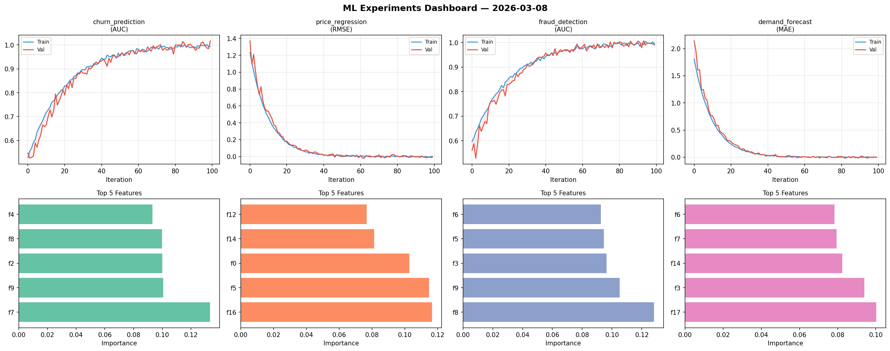
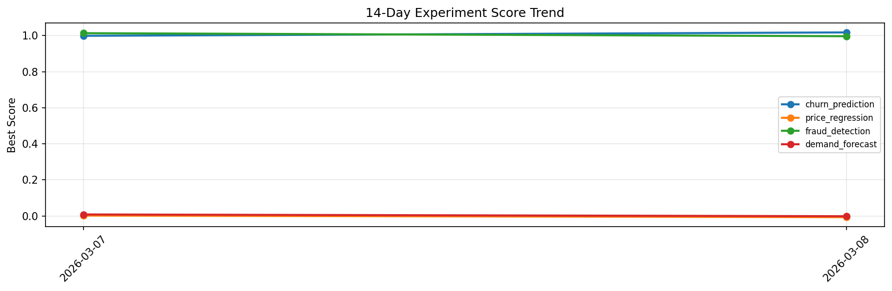

# ML Experiments Report — 2026-03-08

**Run ID:** `7844e483e9` | **Experiments:** 4 | **Trials:** 18

## Delta vs Yesterday

| Experiment | Today | Yesterday | Change |
|-----------|-------|-----------|--------|
| churn_prediction | 1.0177 | 0.9987 | 📈 1.9% |
| price_regression | -0.0072 | 0.0017 | 📉 -523.5% |
| fraud_detection | 0.9966 | 1.0134 | 📉 -1.7% |
| demand_forecast | -0.0019 | 0.008 | 📉 -123.8% |

## churn_prediction (AUC)

**Best Score:** 1.0177 (Trial 1)

| Trial | Score | Overfit Gap | Time | LR | Trees | Leaves |
|-------|-------|-------------|------|-----|-------|--------|
| 1 ⭐ | 1.0177 | 0.0245 | 194.09s | 0.1 | 1000 | 31 |
| 2 | 0.9998 | 0.0081 | 3.56s | 0.1 | 100 | 63 |
| 3 | 0.9595 | 0.002 | 6.91s | 0.05 | 100 | 31 |
| 4 | 0.993 | 0.0045 | 6.44s | 0.1 | 200 | 63 |
| 5 | 1.0032 | 0.0109 | 11.97s | 0.2 | 200 | 31 |
| 6 | 0.9952 | 0.0025 | 9.47s | 0.2 | 100 | 15 |

## price_regression (RMSE)

**Best Score:** -0.0072 (Trial 3)

| Trial | Score | Overfit Gap | Time | LR | Trees | Leaves |
|-------|-------|-------------|------|-----|-------|--------|
| 1 | 0.0019 | 0.0001 | 252.16s | 0.1 | 1000 | 127 |
| 2 | 0.3675 | 0.0408 | 58.0s | 0.01 | 200 | 63 |
| 3 ⭐ | -0.0072 | 0.0091 | 131.01s | 0.2 | 500 | 127 |

## fraud_detection (AUC)

**Best Score:** 0.9966 (Trial 4)

| Trial | Score | Overfit Gap | Time | LR | Trees | Leaves |
|-------|-------|-------------|------|-----|-------|--------|
| 1 | 0.9935 | 0.002 | 111.27s | 0.1 | 1000 | 31 |
| 2 | 0.9806 | 0.0176 | 126.85s | 0.2 | 1000 | 31 |
| 3 | 0.9779 | 0.0071 | 25.75s | 0.05 | 200 | 63 |
| 4 ⭐ | 0.9966 | 0.0072 | 31.4s | 0.1 | 200 | 63 |

## demand_forecast (MAE)

**Best Score:** -0.0019 (Trial 5)

| Trial | Score | Overfit Gap | Time | LR | Trees | Leaves |
|-------|-------|-------------|------|-----|-------|--------|
| 1 | 0.1462 | 0.004 | 69.98s | 0.05 | 500 | 31 |
| 2 | 0.4458 | 0.0304 | 18.83s | 0.01 | 200 | 127 |
| 3 | 0.8978 | 0.0196 | 265.85s | 0.01 | 1000 | 127 |
| 4 | 1.1026 | 0.1789 | 11.9s | 0.01 | 1000 | 127 |
| 5 ⭐ | -0.0019 | 0.0015 | 41.13s | 0.2 | 200 | 127 |
