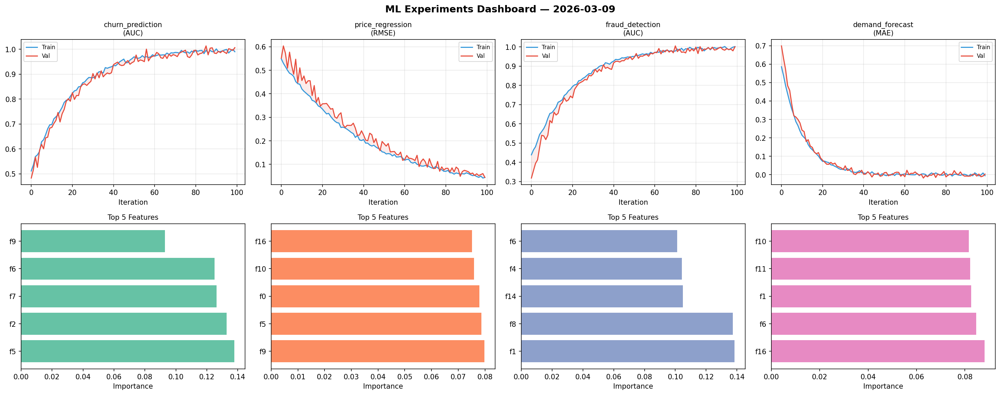
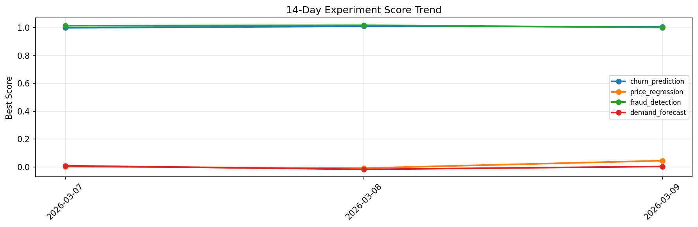

# ML Experiments Report — 2026-03-09

**Run ID:** `a9a1971be5` | **Experiments:** 4 | **Trials:** 22

## Delta vs Yesterday

| Experiment | Today | Yesterday | Change |
|-----------|-------|-----------|--------|
| churn_prediction | 1.0068 | 1.01 | 📉 -0.3% |
| price_regression | 0.0444 | -0.0089 | 📈 598.9% |
| fraud_detection | 1.0011 | 1.0171 | 📉 -1.6% |
| demand_forecast | 0.0028 | -0.0181 | 📈 115.5% |

## churn_prediction (AUC)

**Best Score:** 1.0068 (Trial 1)

| Trial | Score | Overfit Gap | Time | LR | Trees | Leaves |
|-------|-------|-------------|------|-----|-------|--------|
| 1 ⭐ | 1.0068 | 0.0166 | 31.63s | 0.1 | 500 | 15 |
| 2 | 0.9717 | 0.0054 | 214.24s | 0.05 | 1000 | 63 |
| 3 | 0.9851 | 0.0169 | 44.98s | 0.2 | 200 | 15 |
| 4 | 0.9359 | 0.0118 | 146.57s | 0.05 | 500 | 63 |
| 5 | 1.0059 | 0.013 | 0.69s | 0.1 | 100 | 15 |
| 6 | 0.5976 | 0.0408 | 267.33s | 0.01 | 1000 | 31 |

## price_regression (RMSE)

**Best Score:** 0.0444 (Trial 5)

| Trial | Score | Overfit Gap | Time | LR | Trees | Leaves |
|-------|-------|-------------|------|-----|-------|--------|
| 1 | 0.0818 | 0.0187 | 3.16s | 0.05 | 100 | 31 |
| 2 | 0.1348 | 0.0181 | 2.5s | 0.05 | 100 | 63 |
| 3 | 0.1111 | 0.0215 | 6.15s | 0.05 | 500 | 31 |
| 4 | 0.6481 | 0.0725 | 65.44s | 0.01 | 500 | 127 |
| 5 ⭐ | 0.0444 | 0.0001 | 18.93s | 0.05 | 200 | 31 |
| 6 | 0.1516 | 0.0249 | 50.26s | 0.05 | 1000 | 63 |

## fraud_detection (AUC)

**Best Score:** 1.0011 (Trial 1)

| Trial | Score | Overfit Gap | Time | LR | Trees | Leaves |
|-------|-------|-------------|------|-----|-------|--------|
| 1 ⭐ | 1.0011 | 0.001 | 28.84s | 0.1 | 100 | 63 |
| 2 | 0.7171 | 0.0292 | 58.49s | 0.01 | 500 | 127 |
| 3 | 0.9631 | 0.0119 | 9.65s | 0.05 | 100 | 63 |
| 4 | 0.7638 | 0.0209 | 104.56s | 0.01 | 500 | 31 |

## demand_forecast (MAE)

**Best Score:** 0.0028 (Trial 3)

| Trial | Score | Overfit Gap | Time | LR | Trees | Leaves |
|-------|-------|-------------|------|-----|-------|--------|
| 1 | 0.6904 | 0.0327 | 88.85s | 0.01 | 500 | 63 |
| 2 | 0.0054 | 0.0129 | 8.46s | 0.2 | 1000 | 15 |
| 3 ⭐ | 0.0028 | 0.0085 | 17.2s | 0.2 | 100 | 127 |
| 4 | 0.0132 | 0.0046 | 29.41s | 0.1 | 100 | 63 |
| 5 | 0.0171 | 0.0029 | 31.76s | 0.1 | 200 | 31 |
| 6 | 0.0079 | 0.0014 | 59.95s | 0.1 | 500 | 63 |
