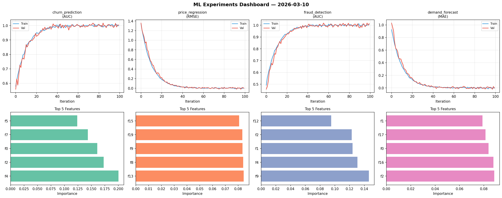
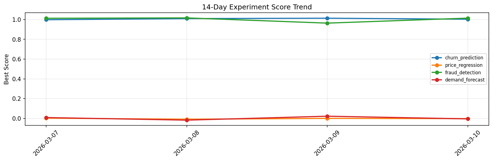

# ML Experiments Report — 2026-03-10

**Run ID:** `20d017d48d` | **Experiments:** 4 | **Trials:** 21

## Delta vs Yesterday

| Experiment | Today | Yesterday | Change |
|-----------|-------|-----------|--------|
| churn_prediction | 1.0038 | 1.014 | 📉 -1.0% |
| price_regression | -0.0027 | -0.0004 | 📉 -230.0% |
| fraud_detection | 1.0148 | 0.9643 | 📈 5.2% |
| demand_forecast | -0.0054 | 0.0217 | 📉 -124.9% |

## churn_prediction (AUC)

**Best Score:** 1.0038 (Trial 2)

| Trial | Score | Overfit Gap | Time | LR | Trees | Leaves |
|-------|-------|-------------|------|-----|-------|--------|
| 1 | 0.9859 | 0.0058 | 4.96s | 0.2 | 200 | 15 |
| 2 ⭐ | 1.0038 | 0.0053 | 140.08s | 0.2 | 500 | 127 |
| 3 | 1.0 | 0.0006 | 104.75s | 0.1 | 500 | 127 |
| 4 | 0.9325 | 0.0243 | 105.18s | 0.05 | 500 | 15 |
| 5 | 0.7361 | 0.0036 | 53.52s | 0.01 | 500 | 15 |

## price_regression (RMSE)

**Best Score:** -0.0027 (Trial 4)

| Trial | Score | Overfit Gap | Time | LR | Trees | Leaves |
|-------|-------|-------------|------|-----|-------|--------|
| 1 | 0.0726 | 0.0082 | 26.24s | 0.05 | 500 | 15 |
| 2 | 0.0175 | 0.0017 | 94.49s | 0.1 | 500 | 63 |
| 3 | 0.0969 | 0.0258 | 21.73s | 0.05 | 500 | 15 |
| 4 ⭐ | -0.0027 | 0.0051 | 76.58s | 0.2 | 500 | 63 |
| 5 | 0.1535 | 0.0099 | 14.16s | 0.05 | 100 | 31 |
| 6 | 0.0162 | 0.0146 | 132.16s | 0.1 | 500 | 63 |

## fraud_detection (AUC)

**Best Score:** 1.0148 (Trial 4)

| Trial | Score | Overfit Gap | Time | LR | Trees | Leaves |
|-------|-------|-------------|------|-----|-------|--------|
| 1 | 0.9618 | 0.007 | 46.89s | 0.05 | 200 | 127 |
| 2 | 1.0017 | 0.0044 | 9.02s | 0.2 | 100 | 31 |
| 3 | 0.738 | 0.0249 | 24.55s | 0.01 | 200 | 15 |
| 4 ⭐ | 1.0148 | 0.0102 | 23.52s | 0.2 | 500 | 63 |
| 5 | 0.995 | 0.0078 | 31.47s | 0.1 | 200 | 15 |
| 6 | 0.5925 | 0.0829 | 116.33s | 0.01 | 500 | 15 |

## demand_forecast (MAE)

**Best Score:** -0.0054 (Trial 2)

| Trial | Score | Overfit Gap | Time | LR | Trees | Leaves |
|-------|-------|-------------|------|-----|-------|--------|
| 1 | 0.1284 | 0.0159 | 7.09s | 0.05 | 100 | 63 |
| 2 ⭐ | -0.0054 | 0.0081 | 38.39s | 0.2 | 1000 | 63 |
| 3 | 0.0041 | 0.0014 | 91.32s | 0.1 | 1000 | 31 |
| 4 | -0.001 | 0.006 | 27.08s | 0.2 | 100 | 15 |
