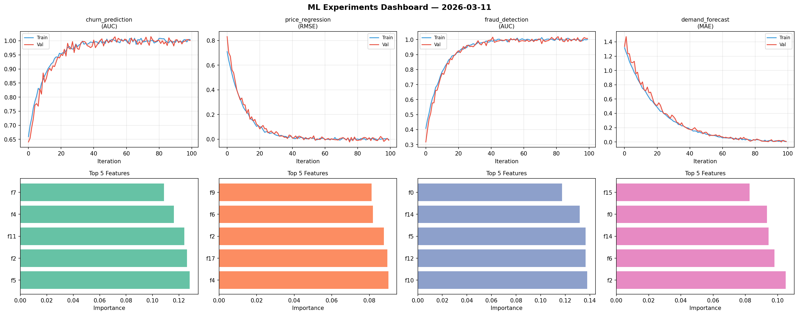
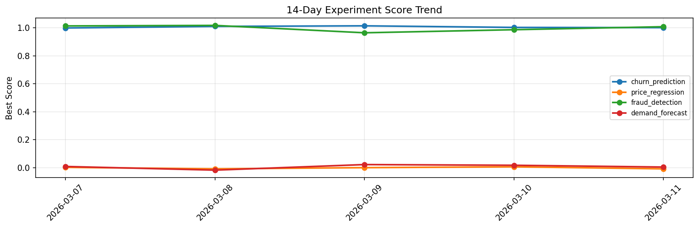

# ML Experiments Report — 2026-03-11

**Run ID:** `260158ee07` | **Experiments:** 4 | **Trials:** 18

## Delta vs Yesterday

| Experiment | Today | Yesterday | Change |
|-----------|-------|-----------|--------|
| churn_prediction | 1.0011 | 1.0027 | 📉 -0.2% |
| price_regression | -0.0089 | 0.0056 | 📉 -258.9% |
| fraud_detection | 1.0078 | 0.9863 | 📈 2.2% |
| demand_forecast | 0.0039 | 0.0167 | 📉 -76.6% |

## churn_prediction (AUC)

**Best Score:** 1.0011 (Trial 2)

| Trial | Score | Overfit Gap | Time | LR | Trees | Leaves |
|-------|-------|-------------|------|-----|-------|--------|
| 1 | 0.9944 | 0.0026 | 38.3s | 0.2 | 200 | 127 |
| 2 ⭐ | 1.0011 | 0.0035 | 75.48s | 0.2 | 500 | 15 |
| 3 | 0.7006 | 0.0271 | 14.18s | 0.01 | 100 | 15 |
| 4 | 0.9936 | 0.0006 | 100.61s | 0.2 | 1000 | 63 |
| 5 | 0.9927 | 0.0053 | 21.75s | 0.2 | 100 | 127 |
| 6 | 0.9991 | 0.0036 | 38.97s | 0.1 | 1000 | 63 |

## price_regression (RMSE)

**Best Score:** -0.0089 (Trial 4)

| Trial | Score | Overfit Gap | Time | LR | Trees | Leaves |
|-------|-------|-------------|------|-----|-------|--------|
| 1 | 0.0132 | 0.0173 | 166.53s | 0.2 | 1000 | 15 |
| 2 | 0.1592 | 0.0095 | 251.41s | 0.05 | 1000 | 31 |
| 3 | -0.0049 | 0.0111 | 35.14s | 0.2 | 1000 | 63 |
| 4 ⭐ | -0.0089 | 0.0064 | 102.65s | 0.2 | 500 | 31 |

## fraud_detection (AUC)

**Best Score:** 1.0078 (Trial 2)

| Trial | Score | Overfit Gap | Time | LR | Trees | Leaves |
|-------|-------|-------------|------|-----|-------|--------|
| 1 | 0.7632 | 0.0378 | 284.59s | 0.01 | 1000 | 15 |
| 2 ⭐ | 1.0078 | 0.0077 | 34.84s | 0.2 | 200 | 15 |
| 3 | 0.6391 | 0.0125 | 23.9s | 0.01 | 500 | 15 |
| 4 | 1.0054 | 0.0067 | 35.74s | 0.2 | 200 | 127 |

## demand_forecast (MAE)

**Best Score:** 0.0039 (Trial 2)

| Trial | Score | Overfit Gap | Time | LR | Trees | Leaves |
|-------|-------|-------------|------|-----|-------|--------|
| 1 | 0.1175 | 0.0136 | 272.51s | 0.05 | 1000 | 127 |
| 2 ⭐ | 0.0039 | 0.0055 | 113.09s | 0.1 | 1000 | 63 |
| 3 | 0.0092 | 0.0105 | 14.22s | 0.1 | 100 | 15 |
| 4 | 0.0053 | 0.0074 | 140.18s | 0.2 | 500 | 15 |
