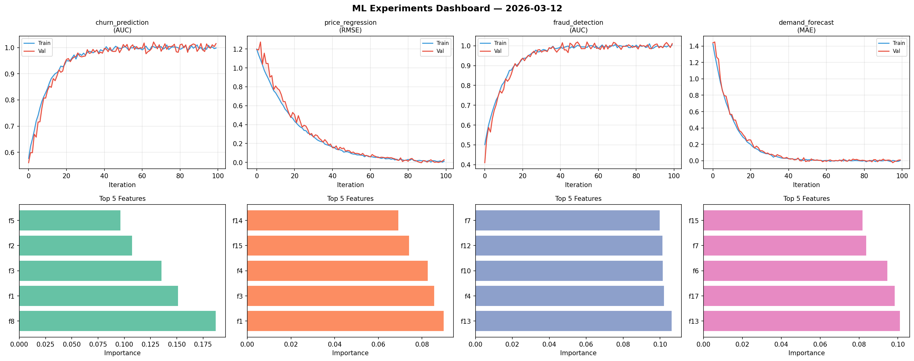
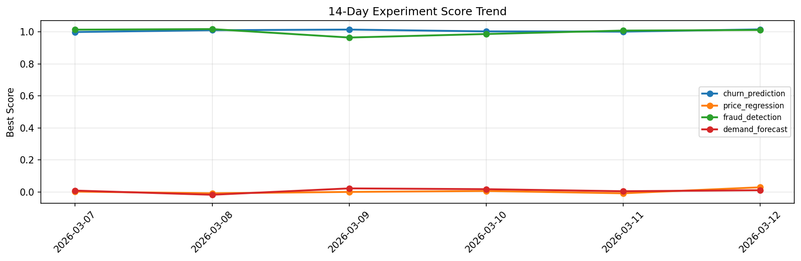

# ML Experiments Report — 2026-03-12

**Run ID:** `9ab9edfe31` | **Experiments:** 4 | **Trials:** 17

## Delta vs Yesterday

| Experiment | Today | Yesterday | Change |
|-----------|-------|-----------|--------|
| churn_prediction | 1.0153 | 1.0011 | 📈 1.4% |
| price_regression | 0.0285 | -0.0089 | 📈 420.2% |
| fraud_detection | 1.0114 | 1.0078 | 📈 0.4% |
| demand_forecast | 0.0102 | 0.0039 | 📈 161.5% |

## churn_prediction (AUC)

**Best Score:** 1.0153 (Trial 6)

| Trial | Score | Overfit Gap | Time | LR | Trees | Leaves |
|-------|-------|-------------|------|-----|-------|--------|
| 1 | 0.9912 | 0.0102 | 15.01s | 0.2 | 200 | 63 |
| 2 | 0.9885 | 0.0054 | 19.72s | 0.1 | 500 | 63 |
| 3 | 0.9882 | 0.0186 | 7.17s | 0.2 | 100 | 63 |
| 4 | 0.7591 | 0.0291 | 53.53s | 0.01 | 500 | 15 |
| 5 | 0.6568 | 0.0208 | 25.8s | 0.01 | 100 | 63 |
| 6 ⭐ | 1.0153 | 0.0172 | 22.08s | 0.2 | 500 | 63 |

## price_regression (RMSE)

**Best Score:** 0.0285 (Trial 5)

| Trial | Score | Overfit Gap | Time | LR | Trees | Leaves |
|-------|-------|-------------|------|-----|-------|--------|
| 1 | 0.0894 | 0.0199 | 47.13s | 0.05 | 200 | 15 |
| 2 | 1.3263 | 0.1105 | 11.81s | 0.01 | 200 | 31 |
| 3 | 0.1606 | 0.0117 | 8.22s | 0.05 | 100 | 31 |
| 4 | 0.6695 | 0.0841 | 32.14s | 0.01 | 200 | 15 |
| 5 ⭐ | 0.0285 | 0.0163 | 117.61s | 0.1 | 1000 | 31 |

## fraud_detection (AUC)

**Best Score:** 1.0114 (Trial 3)

| Trial | Score | Overfit Gap | Time | LR | Trees | Leaves |
|-------|-------|-------------|------|-----|-------|--------|
| 1 | 0.9855 | 0.0242 | 28.93s | 0.2 | 100 | 127 |
| 2 | 0.9984 | 0.0012 | 119.43s | 0.2 | 500 | 63 |
| 3 ⭐ | 1.0114 | 0.0065 | 252.82s | 0.2 | 1000 | 15 |

## demand_forecast (MAE)

**Best Score:** 0.0102 (Trial 1)

| Trial | Score | Overfit Gap | Time | LR | Trees | Leaves |
|-------|-------|-------------|------|-----|-------|--------|
| 1 ⭐ | 0.0102 | 0.0072 | 160.3s | 0.2 | 1000 | 31 |
| 2 | 0.026 | 0.017 | 212.15s | 0.1 | 1000 | 15 |
| 3 | 0.9132 | 0.136 | 48.79s | 0.01 | 200 | 127 |
