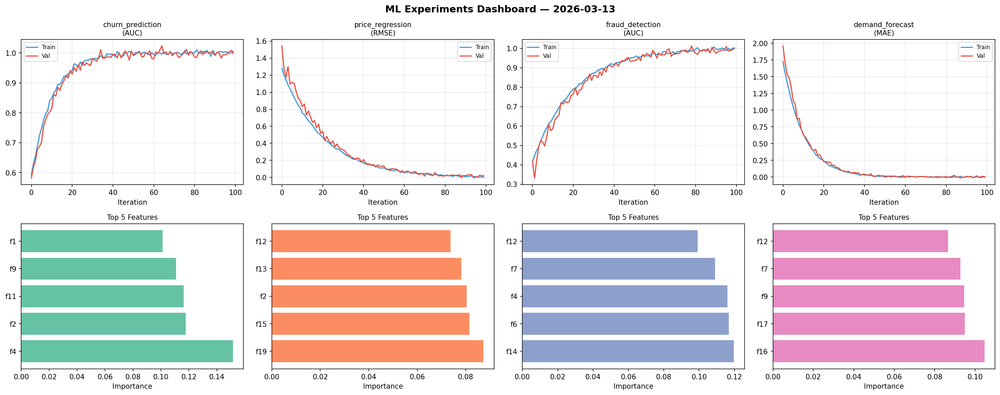
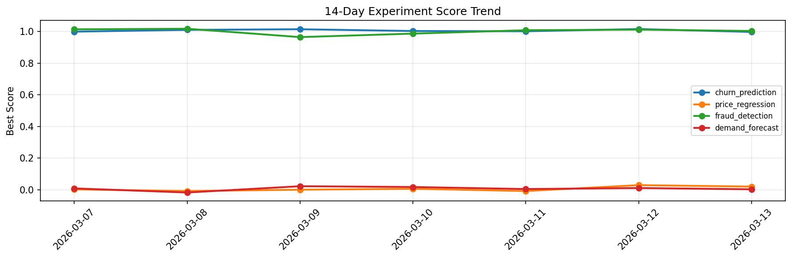

# ML Experiments Report — 2026-03-13

**Run ID:** `acb0530a4a` | **Experiments:** 4 | **Trials:** 14

## Delta vs Yesterday

| Experiment | Today | Yesterday | Change |
|-----------|-------|-----------|--------|
| churn_prediction | 0.9969 | 1.0153 | 📉 -1.8% |
| price_regression | 0.0194 | 0.0285 | 📉 -31.9% |
| fraud_detection | 1.0031 | 1.0114 | 📉 -0.8% |
| demand_forecast | 0.0024 | 0.0102 | 📉 -76.5% |

## churn_prediction (AUC)

**Best Score:** 0.9969 (Trial 3)

| Trial | Score | Overfit Gap | Time | LR | Trees | Leaves |
|-------|-------|-------------|------|-----|-------|--------|
| 1 | 0.787 | 0.0146 | 10.14s | 0.01 | 500 | 31 |
| 2 | 0.6777 | 0.0089 | 25.69s | 0.01 | 100 | 31 |
| 3 ⭐ | 0.9969 | 0.0091 | 2.65s | 0.2 | 100 | 63 |

## price_regression (RMSE)

**Best Score:** 0.0194 (Trial 1)

| Trial | Score | Overfit Gap | Time | LR | Trees | Leaves |
|-------|-------|-------------|------|-----|-------|--------|
| 1 ⭐ | 0.0194 | 0.0185 | 15.33s | 0.1 | 100 | 15 |
| 2 | 0.0238 | 0.0268 | 74.45s | 0.1 | 500 | 63 |
| 3 | 0.6547 | 0.0071 | 28.49s | 0.01 | 500 | 15 |

## fraud_detection (AUC)

**Best Score:** 1.0031 (Trial 3)

| Trial | Score | Overfit Gap | Time | LR | Trees | Leaves |
|-------|-------|-------------|------|-----|-------|--------|
| 1 | 0.9965 | 0.0012 | 187.35s | 0.2 | 1000 | 31 |
| 2 | 0.6895 | 0.024 | 106.16s | 0.01 | 1000 | 31 |
| 3 ⭐ | 1.0031 | 0.0054 | 45.45s | 0.1 | 200 | 31 |
| 4 | 0.9722 | 0.0163 | 22.91s | 0.05 | 500 | 31 |
| 5 | 0.9676 | 0.0067 | 33.98s | 0.05 | 200 | 31 |

## demand_forecast (MAE)

**Best Score:** 0.0024 (Trial 1)

| Trial | Score | Overfit Gap | Time | LR | Trees | Leaves |
|-------|-------|-------------|------|-----|-------|--------|
| 1 ⭐ | 0.0024 | 0.0059 | 135.39s | 0.2 | 1000 | 127 |
| 2 | 1.0584 | 0.0865 | 18.51s | 0.01 | 100 | 31 |
| 3 | 0.8673 | 0.0121 | 28.23s | 0.01 | 200 | 31 |
