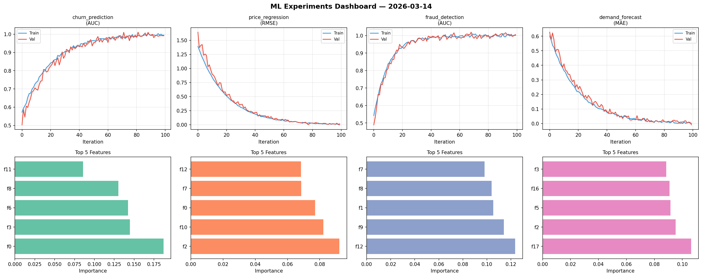
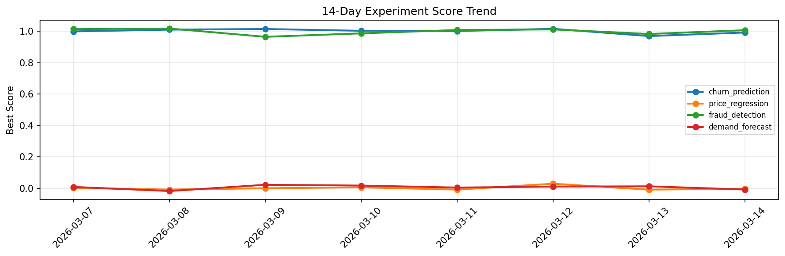

# ML Experiments Report — 2026-03-14

**Run ID:** `fc76ae3cae` | **Experiments:** 4 | **Trials:** 17

## Delta vs Yesterday

| Experiment | Today | Yesterday | Change |
|-----------|-------|-----------|--------|
| churn_prediction | 0.9917 | 0.9691 | 📈 2.3% |
| price_regression | -0.0031 | -0.0092 | 📈 66.3% |
| fraud_detection | 1.0064 | 0.9824 | 📈 2.4% |
| demand_forecast | -0.0086 | 0.0119 | 📉 -172.3% |

## churn_prediction (AUC)

**Best Score:** 0.9917 (Trial 4)

| Trial | Score | Overfit Gap | Time | LR | Trees | Leaves |
|-------|-------|-------------|------|-----|-------|--------|
| 1 | 0.5946 | 0.0593 | 125.91s | 0.01 | 500 | 63 |
| 2 | 0.9656 | 0.0044 | 4.26s | 0.05 | 100 | 31 |
| 3 | 0.7433 | 0.0302 | 138.6s | 0.01 | 1000 | 63 |
| 4 ⭐ | 0.9917 | 0.0032 | 29.88s | 0.1 | 200 | 15 |

## price_regression (RMSE)

**Best Score:** -0.0031 (Trial 2)

| Trial | Score | Overfit Gap | Time | LR | Trees | Leaves |
|-------|-------|-------------|------|-----|-------|--------|
| 1 | 0.1328 | 0.0177 | 188.72s | 0.05 | 1000 | 127 |
| 2 ⭐ | -0.0031 | 0.0186 | 37.25s | 0.1 | 200 | 31 |
| 3 | 1.0177 | 0.1571 | 16.23s | 0.01 | 100 | 63 |
| 4 | 0.8564 | 0.087 | 8.37s | 0.01 | 1000 | 15 |
| 5 | 0.0187 | 0.0136 | 83.76s | 0.1 | 1000 | 63 |

## fraud_detection (AUC)

**Best Score:** 1.0064 (Trial 3)

| Trial | Score | Overfit Gap | Time | LR | Trees | Leaves |
|-------|-------|-------------|------|-----|-------|--------|
| 1 | 0.7694 | 0.0329 | 58.45s | 0.01 | 200 | 15 |
| 2 | 0.9938 | 0.0077 | 11.21s | 0.2 | 100 | 127 |
| 3 ⭐ | 1.0064 | 0.0056 | 28.68s | 0.2 | 200 | 31 |
| 4 | 0.9919 | 0.0128 | 234.52s | 0.2 | 1000 | 31 |

## demand_forecast (MAE)

**Best Score:** -0.0086 (Trial 3)

| Trial | Score | Overfit Gap | Time | LR | Trees | Leaves |
|-------|-------|-------------|------|-----|-------|--------|
| 1 | 0.0724 | 0.0029 | 96.99s | 0.05 | 500 | 63 |
| 2 | 1.346 | 0.1604 | 87.42s | 0.01 | 500 | 31 |
| 3 ⭐ | -0.0086 | 0.0112 | 28.73s | 0.1 | 200 | 127 |
| 4 | 0.0182 | 0.0062 | 6.14s | 0.1 | 100 | 15 |
