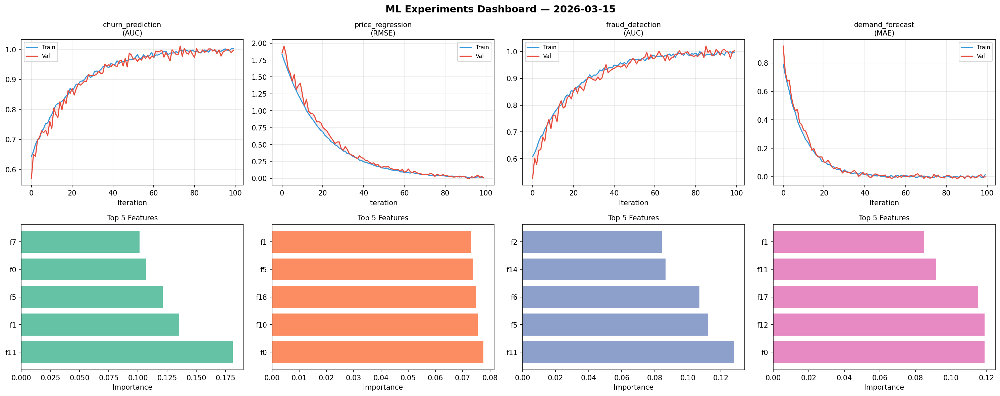
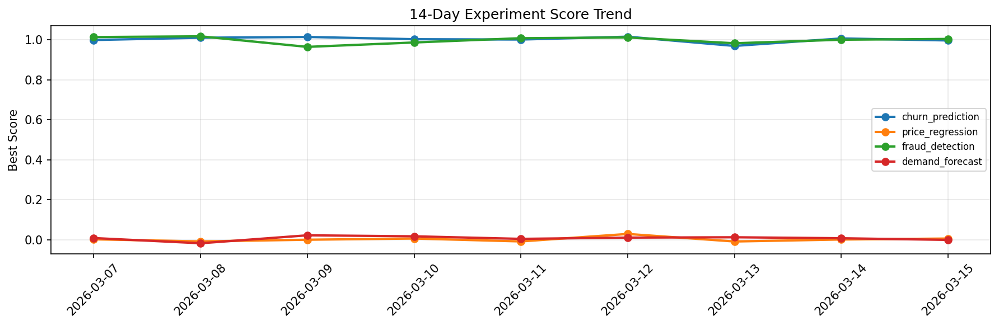

# ML Experiments Report — 2026-03-15

**Run ID:** `8872afdfa8` | **Experiments:** 4 | **Trials:** 14

## Delta vs Yesterday

| Experiment | Today | Yesterday | Change |
|-----------|-------|-----------|--------|
| churn_prediction | 0.9965 | 1.0065 | 📉 -1.0% |
| price_regression | 0.0055 | 0.0007 | 📈 480.0% |
| fraud_detection | 1.004 | 1.0002 | 📈 0.4% |
| demand_forecast | -0.0013 | 0.007 | 📉 -118.6% |

## churn_prediction (AUC)

**Best Score:** 0.9965 (Trial 2)

| Trial | Score | Overfit Gap | Time | LR | Trees | Leaves |
|-------|-------|-------------|------|-----|-------|--------|
| 1 | 0.9943 | 0.0023 | 93.14s | 0.1 | 500 | 127 |
| 2 ⭐ | 0.9965 | 0.0068 | 47.49s | 0.1 | 200 | 63 |
| 3 | 0.7559 | 0.0212 | 41.15s | 0.01 | 200 | 31 |

## price_regression (RMSE)

**Best Score:** 0.0055 (Trial 1)

| Trial | Score | Overfit Gap | Time | LR | Trees | Leaves |
|-------|-------|-------------|------|-----|-------|--------|
| 1 ⭐ | 0.0055 | 0.0084 | 13.25s | 0.1 | 500 | 31 |
| 2 | 0.6306 | 0.0496 | 84.14s | 0.01 | 500 | 31 |
| 3 | 1.4002 | 0.1943 | 68.0s | 0.01 | 500 | 15 |

## fraud_detection (AUC)

**Best Score:** 1.004 (Trial 1)

| Trial | Score | Overfit Gap | Time | LR | Trees | Leaves |
|-------|-------|-------------|------|-----|-------|--------|
| 1 ⭐ | 1.004 | 0.0066 | 1.72s | 0.1 | 200 | 15 |
| 2 | 1.004 | 0.0017 | 50.41s | 0.2 | 1000 | 31 |
| 3 | 0.982 | 0.0093 | 10.55s | 0.05 | 500 | 63 |
| 4 | 0.9893 | 0.0105 | 9.71s | 0.2 | 200 | 31 |
| 5 | 1.0003 | 0.0079 | 131.46s | 0.1 | 1000 | 63 |

## demand_forecast (MAE)

**Best Score:** -0.0013 (Trial 3)

| Trial | Score | Overfit Gap | Time | LR | Trees | Leaves |
|-------|-------|-------------|------|-----|-------|--------|
| 1 | 0.005 | 0.0052 | 12.32s | 0.1 | 200 | 31 |
| 2 | 0.8018 | 0.0268 | 6.22s | 0.01 | 100 | 63 |
| 3 ⭐ | -0.0013 | 0.0149 | 8.22s | 0.2 | 100 | 63 |
