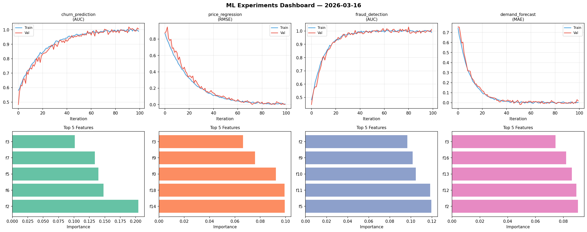
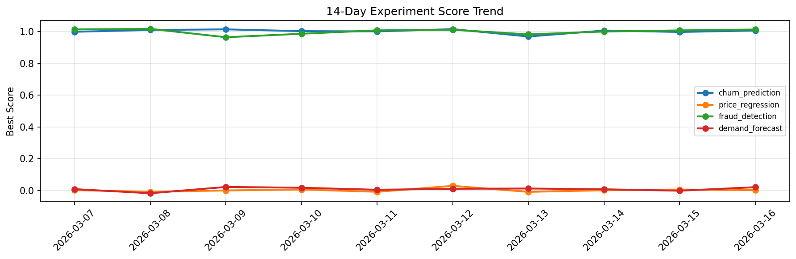

# ML Experiments Report — 2026-03-16

**Run ID:** `3c5f13ffe9` | **Experiments:** 4 | **Trials:** 16

## Delta vs Yesterday

| Experiment | Today | Yesterday | Change |
|-----------|-------|-----------|--------|
| churn_prediction | 1.0065 | 0.9974 | 📈 0.9% |
| price_regression | 0.0012 | 0.0053 | 📉 -77.4% |
| fraud_detection | 1.0131 | 1.0074 | 📈 0.6% |
| demand_forecast | 0.0202 | -0.002 | 📈 1110.0% |

## churn_prediction (AUC)

**Best Score:** 1.0065 (Trial 5)

| Trial | Score | Overfit Gap | Time | LR | Trees | Leaves |
|-------|-------|-------------|------|-----|-------|--------|
| 1 | 0.9886 | 0.0067 | 5.36s | 0.2 | 200 | 127 |
| 2 | 0.6507 | 0.0156 | 141.35s | 0.01 | 500 | 63 |
| 3 | 0.7893 | 0.0154 | 7.56s | 0.01 | 500 | 63 |
| 4 | 0.9371 | 0.0262 | 21.4s | 0.05 | 200 | 63 |
| 5 ⭐ | 1.0065 | 0.0178 | 97.11s | 0.1 | 500 | 63 |

## price_regression (RMSE)

**Best Score:** 0.0012 (Trial 4)

| Trial | Score | Overfit Gap | Time | LR | Trees | Leaves |
|-------|-------|-------------|------|-----|-------|--------|
| 1 | 0.1515 | 0.0166 | 38.02s | 0.05 | 500 | 127 |
| 2 | 1.4347 | 0.2408 | 7.12s | 0.01 | 100 | 15 |
| 3 | 0.0073 | 0.0007 | 130.13s | 0.1 | 1000 | 15 |
| 4 ⭐ | 0.0012 | 0.0077 | 3.38s | 0.1 | 200 | 15 |

## fraud_detection (AUC)

**Best Score:** 1.0131 (Trial 2)

| Trial | Score | Overfit Gap | Time | LR | Trees | Leaves |
|-------|-------|-------------|------|-----|-------|--------|
| 1 | 0.9457 | 0.0074 | 22.63s | 0.05 | 500 | 63 |
| 2 ⭐ | 1.0131 | 0.0241 | 72.59s | 0.2 | 1000 | 31 |
| 3 | 0.9503 | 0.0191 | 6.56s | 0.05 | 200 | 15 |
| 4 | 0.766 | 0.0284 | 9.92s | 0.01 | 500 | 15 |

## demand_forecast (MAE)

**Best Score:** 0.0202 (Trial 1)

| Trial | Score | Overfit Gap | Time | LR | Trees | Leaves |
|-------|-------|-------------|------|-----|-------|--------|
| 1 ⭐ | 0.0202 | 0.0174 | 146.97s | 0.2 | 500 | 15 |
| 2 | 0.179 | 0.0075 | 11.2s | 0.05 | 200 | 63 |
| 3 | 1.2085 | 0.0819 | 27.14s | 0.01 | 100 | 31 |
