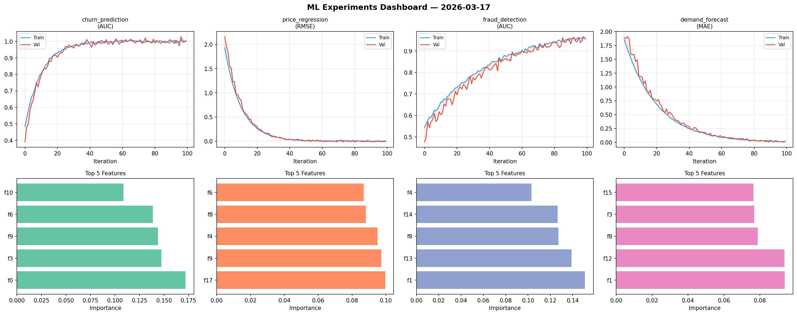
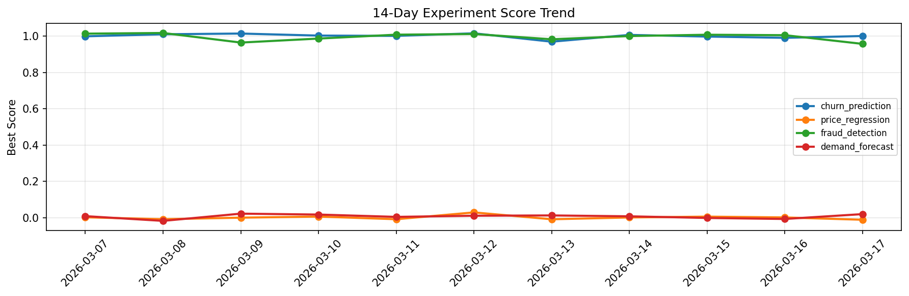

# ML Experiments Report — 2026-03-17

**Run ID:** `a2d79884ce` | **Experiments:** 4 | **Trials:** 19

## Delta vs Yesterday

| Experiment | Today | Yesterday | Change |
|-----------|-------|-----------|--------|
| churn_prediction | 1.0004 | 0.9904 | 📈 1.0% |
| price_regression | -0.0119 | 0.0008 | 📉 -1270.0% |
| fraud_detection | 0.957 | 1.005 | 📉 -4.8% |
| demand_forecast | 0.0192 | -0.0076 | 📈 352.6% |

## churn_prediction (AUC)

**Best Score:** 1.0004 (Trial 2)

| Trial | Score | Overfit Gap | Time | LR | Trees | Leaves |
|-------|-------|-------------|------|-----|-------|--------|
| 1 | 0.9345 | 0.0125 | 67.81s | 0.05 | 1000 | 127 |
| 2 ⭐ | 1.0004 | 0.0055 | 11.68s | 0.2 | 100 | 63 |
| 3 | 0.9512 | 0.0179 | 24.72s | 0.05 | 100 | 15 |
| 4 | 0.7038 | 0.0351 | 109.09s | 0.01 | 500 | 31 |

## price_regression (RMSE)

**Best Score:** -0.0119 (Trial 2)

| Trial | Score | Overfit Gap | Time | LR | Trees | Leaves |
|-------|-------|-------------|------|-----|-------|--------|
| 1 | 0.017 | 0.0052 | 109.8s | 0.1 | 500 | 31 |
| 2 ⭐ | -0.0119 | 0.0201 | 139.6s | 0.2 | 500 | 127 |
| 3 | 0.5675 | 0.0871 | 122.29s | 0.01 | 500 | 127 |
| 4 | 0.0184 | 0.0014 | 264.27s | 0.1 | 1000 | 127 |
| 5 | 0.0071 | 0.003 | 13.4s | 0.1 | 100 | 15 |

## fraud_detection (AUC)

**Best Score:** 0.957 (Trial 2)

| Trial | Score | Overfit Gap | Time | LR | Trees | Leaves |
|-------|-------|-------------|------|-----|-------|--------|
| 1 | 0.6122 | 0.0229 | 187.96s | 0.01 | 1000 | 15 |
| 2 ⭐ | 0.957 | 0.002 | 5.43s | 0.05 | 1000 | 15 |
| 3 | 0.6525 | 0.0272 | 173.52s | 0.01 | 1000 | 15 |
| 4 | 0.701 | 0.0215 | 8.36s | 0.01 | 200 | 31 |

## demand_forecast (MAE)

**Best Score:** 0.0192 (Trial 1)

| Trial | Score | Overfit Gap | Time | LR | Trees | Leaves |
|-------|-------|-------------|------|-----|-------|--------|
| 1 ⭐ | 0.0192 | 0.002 | 46.22s | 0.1 | 1000 | 15 |
| 2 | 0.6981 | 0.0495 | 197.91s | 0.01 | 1000 | 127 |
| 3 | 0.9414 | 0.0469 | 25.43s | 0.01 | 100 | 31 |
| 4 | 0.8233 | 0.1167 | 10.44s | 0.01 | 200 | 15 |
| 5 | 1.144 | 0.1877 | 122.02s | 0.01 | 500 | 63 |
| 6 | 0.0678 | 0.0086 | 44.01s | 0.05 | 1000 | 63 |
