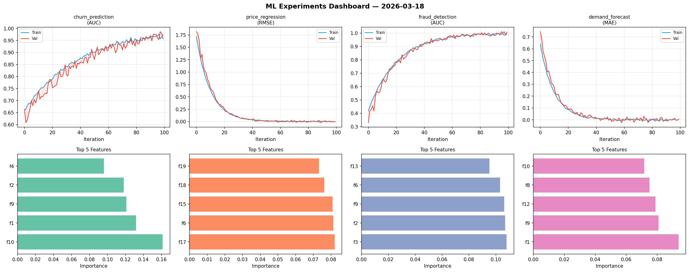
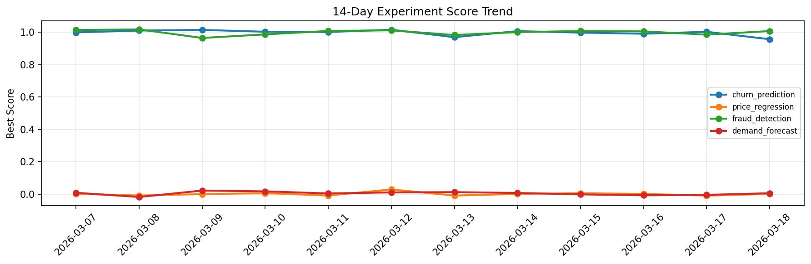

# ML Experiments Report — 2026-03-18

**Run ID:** `4109076e69` | **Experiments:** 4 | **Trials:** 18

## Delta vs Yesterday

| Experiment | Today | Yesterday | Change |
|-----------|-------|-----------|--------|
| churn_prediction | 0.9565 | 1.0024 | 📉 -4.6% |
| price_regression | 0.001 | -0.0094 | 📈 110.6% |
| fraud_detection | 1.0068 | 0.9849 | 📈 2.2% |
| demand_forecast | 0.0052 | -0.0049 | 📈 206.1% |

## churn_prediction (AUC)

**Best Score:** 0.9565 (Trial 4)

| Trial | Score | Overfit Gap | Time | LR | Trees | Leaves |
|-------|-------|-------------|------|-----|-------|--------|
| 1 | 0.9273 | 0.0314 | 45.21s | 0.05 | 200 | 127 |
| 2 | 0.9413 | 0.0183 | 32.33s | 0.05 | 500 | 127 |
| 3 | 0.6841 | 0.0194 | 27.58s | 0.01 | 100 | 15 |
| 4 ⭐ | 0.9565 | 0.0162 | 33.12s | 0.05 | 200 | 15 |
| 5 | 0.9472 | 0.0121 | 10.85s | 0.05 | 100 | 63 |
| 6 | 0.7482 | 0.0112 | 6.18s | 0.01 | 100 | 15 |

## price_regression (RMSE)

**Best Score:** 0.001 (Trial 3)

| Trial | Score | Overfit Gap | Time | LR | Trees | Leaves |
|-------|-------|-------------|------|-----|-------|--------|
| 1 | 0.1503 | 0.0331 | 22.4s | 0.05 | 100 | 127 |
| 2 | 0.0898 | 0.0063 | 25.11s | 0.05 | 200 | 15 |
| 3 ⭐ | 0.001 | 0.0073 | 60.95s | 0.2 | 1000 | 127 |
| 4 | 0.0172 | 0.0205 | 107.71s | 0.2 | 500 | 31 |
| 5 | 0.0688 | 0.0035 | 131.39s | 0.05 | 1000 | 31 |
| 6 | 0.3376 | 0.0256 | 15.11s | 0.01 | 200 | 63 |

## fraud_detection (AUC)

**Best Score:** 1.0068 (Trial 1)

| Trial | Score | Overfit Gap | Time | LR | Trees | Leaves |
|-------|-------|-------------|------|-----|-------|--------|
| 1 ⭐ | 1.0068 | 0.0164 | 263.29s | 0.1 | 1000 | 15 |
| 2 | 0.994 | 0.012 | 255.14s | 0.1 | 1000 | 127 |
| 3 | 0.9987 | 0.0049 | 64.46s | 0.1 | 500 | 63 |

## demand_forecast (MAE)

**Best Score:** 0.0052 (Trial 2)

| Trial | Score | Overfit Gap | Time | LR | Trees | Leaves |
|-------|-------|-------------|------|-----|-------|--------|
| 1 | 0.0473 | 0.0121 | 0.91s | 0.05 | 100 | 127 |
| 2 ⭐ | 0.0052 | 0.0005 | 5.86s | 0.2 | 100 | 127 |
| 3 | 0.0162 | 0.0081 | 87.75s | 0.1 | 500 | 31 |
