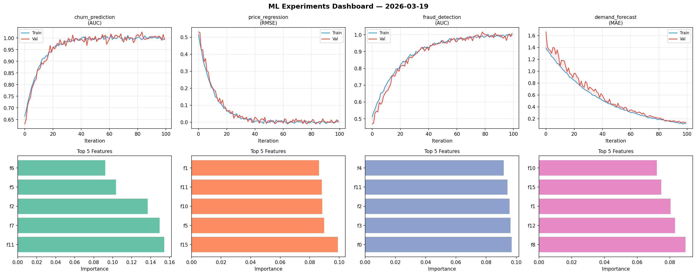
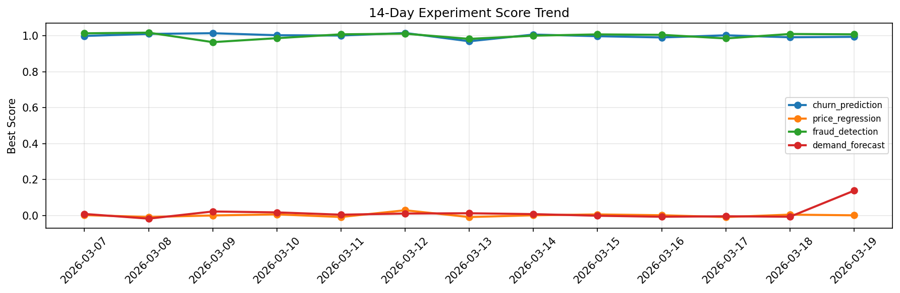

# ML Experiments Report — 2026-03-19

**Run ID:** `c1e73757a2` | **Experiments:** 4 | **Trials:** 16

## Delta vs Yesterday

| Experiment | Today | Yesterday | Change |
|-----------|-------|-----------|--------|
| churn_prediction | 0.9938 | 0.9913 | 📈 0.3% |
| price_regression | 0.0004 | 0.0042 | 📉 -90.5% |
| fraud_detection | 1.0078 | 1.0097 | 📉 -0.2% |
| demand_forecast | 0.1375 | -0.0075 | 📈 1933.3% |

## churn_prediction (AUC)

**Best Score:** 0.9938 (Trial 1)

| Trial | Score | Overfit Gap | Time | LR | Trees | Leaves |
|-------|-------|-------------|------|-----|-------|--------|
| 1 ⭐ | 0.9938 | 0.0003 | 55.58s | 0.2 | 500 | 15 |
| 2 | 0.9615 | 0.0 | 116.51s | 0.05 | 500 | 127 |
| 3 | 0.6874 | 0.01 | 1.2s | 0.01 | 200 | 127 |
| 4 | 0.965 | 0.0054 | 51.25s | 0.05 | 200 | 127 |

## price_regression (RMSE)

**Best Score:** 0.0004 (Trial 1)

| Trial | Score | Overfit Gap | Time | LR | Trees | Leaves |
|-------|-------|-------------|------|-----|-------|--------|
| 1 ⭐ | 0.0004 | 0.0082 | 179.07s | 0.2 | 1000 | 15 |
| 2 | 0.1161 | 0.0045 | 144.75s | 0.05 | 500 | 63 |
| 3 | 0.0971 | 0.0031 | 234.37s | 0.05 | 1000 | 63 |
| 4 | 0.0172 | 0.0174 | 9.63s | 0.2 | 200 | 127 |

## fraud_detection (AUC)

**Best Score:** 1.0078 (Trial 4)

| Trial | Score | Overfit Gap | Time | LR | Trees | Leaves |
|-------|-------|-------------|------|-----|-------|--------|
| 1 | 0.957 | 0.0045 | 2.86s | 0.05 | 200 | 63 |
| 2 | 0.9912 | 0.002 | 34.16s | 0.1 | 500 | 127 |
| 3 | 1.0034 | 0.0005 | 1.37s | 0.2 | 100 | 127 |
| 4 ⭐ | 1.0078 | 0.0135 | 47.91s | 0.1 | 200 | 15 |

## demand_forecast (MAE)

**Best Score:** 0.1375 (Trial 1)

| Trial | Score | Overfit Gap | Time | LR | Trees | Leaves |
|-------|-------|-------------|------|-----|-------|--------|
| 1 ⭐ | 0.1375 | 0.0225 | 112.89s | 0.05 | 1000 | 63 |
| 2 | 1.013 | 0.0991 | 198.77s | 0.01 | 1000 | 63 |
| 3 | 0.1534 | 0.018 | 26.15s | 0.05 | 200 | 63 |
| 4 | 0.1436 | 0.0009 | 57.36s | 0.05 | 200 | 63 |
