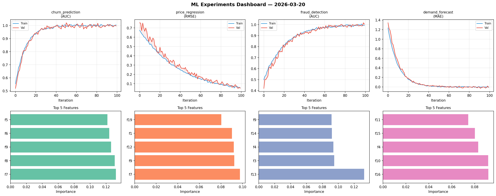
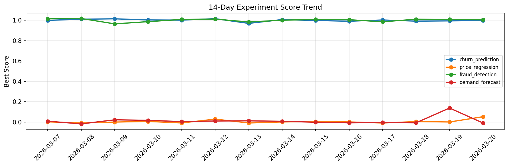

# ML Experiments Report — 2026-03-20

**Run ID:** `114884eb54` | **Experiments:** 4 | **Trials:** 15

## Delta vs Yesterday

| Experiment | Today | Yesterday | Change |
|-----------|-------|-----------|--------|
| churn_prediction | 0.9967 | 0.9938 | 📈 0.3% |
| price_regression | 0.0521 | 0.0004 | 📈 5170.0% |
| fraud_detection | 1.0046 | 1.0078 | 📉 -0.3% |
| demand_forecast | -0.0096 | 0.1375 | 📉 -107.0% |

## churn_prediction (AUC)

**Best Score:** 0.9967 (Trial 1)

| Trial | Score | Overfit Gap | Time | LR | Trees | Leaves |
|-------|-------|-------------|------|-----|-------|--------|
| 1 ⭐ | 0.9967 | 0.0079 | 21.68s | 0.2 | 100 | 15 |
| 2 | 0.9872 | 0.0098 | 95.12s | 0.2 | 1000 | 63 |
| 3 | 0.9711 | 0.0209 | 128.44s | 0.05 | 500 | 15 |

## price_regression (RMSE)

**Best Score:** 0.0521 (Trial 1)

| Trial | Score | Overfit Gap | Time | LR | Trees | Leaves |
|-------|-------|-------------|------|-----|-------|--------|
| 1 ⭐ | 0.0521 | 0.0036 | 14.08s | 0.05 | 200 | 31 |
| 2 | 0.6598 | 0.0586 | 108.88s | 0.01 | 500 | 31 |
| 3 | 0.0648 | 0.0028 | 6.28s | 0.05 | 100 | 127 |

## fraud_detection (AUC)

**Best Score:** 1.0046 (Trial 3)

| Trial | Score | Overfit Gap | Time | LR | Trees | Leaves |
|-------|-------|-------------|------|-----|-------|--------|
| 1 | 0.9622 | 0.0041 | 43.89s | 0.05 | 200 | 63 |
| 2 | 0.6307 | 0.0063 | 4.28s | 0.01 | 200 | 63 |
| 3 ⭐ | 1.0046 | 0.0135 | 46.06s | 0.1 | 200 | 127 |
| 4 | 0.9599 | 0.0025 | 36.49s | 0.05 | 500 | 31 |

## demand_forecast (MAE)

**Best Score:** -0.0096 (Trial 2)

| Trial | Score | Overfit Gap | Time | LR | Trees | Leaves |
|-------|-------|-------------|------|-----|-------|--------|
| 1 | 0.4755 | 0.0618 | 197.69s | 0.01 | 1000 | 31 |
| 2 ⭐ | -0.0096 | 0.0087 | 27.18s | 0.2 | 200 | 31 |
| 3 | 1.4349 | 0.2341 | 8.02s | 0.01 | 100 | 15 |
| 4 | 0.092 | 0.0036 | 7.96s | 0.05 | 1000 | 31 |
| 5 | 0.1676 | 0.0121 | 55.74s | 0.05 | 200 | 63 |
