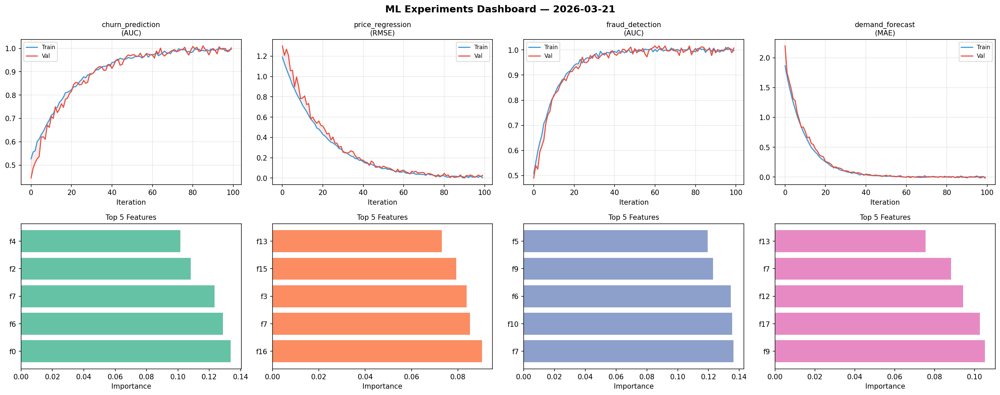
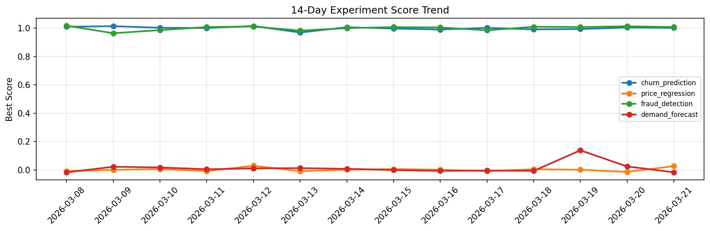

# ML Experiments Report — 2026-03-21

**Run ID:** `353d140f31` | **Experiments:** 4 | **Trials:** 20

## Delta vs Yesterday

| Experiment | Today | Yesterday | Change |
|-----------|-------|-----------|--------|
| churn_prediction | 1.002 | 1.0044 | 📉 -0.2% |
| price_regression | 0.026 | -0.0148 | 📈 275.7% |
| fraud_detection | 1.0075 | 1.0132 | 📉 -0.6% |
| demand_forecast | -0.0174 | 0.0237 | 📉 -173.4% |

## churn_prediction (AUC)

**Best Score:** 1.002 (Trial 1)

| Trial | Score | Overfit Gap | Time | LR | Trees | Leaves |
|-------|-------|-------------|------|-----|-------|--------|
| 1 ⭐ | 1.002 | 0.0057 | 6.87s | 0.1 | 200 | 63 |
| 2 | 0.9442 | 0.0242 | 50.47s | 0.05 | 200 | 31 |
| 3 | 0.9918 | 0.0052 | 24.44s | 0.1 | 200 | 31 |
| 4 | 0.627 | 0.0416 | 67.9s | 0.01 | 500 | 63 |
| 5 | 0.9825 | 0.0189 | 27.6s | 0.1 | 200 | 31 |
| 6 | 0.9581 | 0.0093 | 24.46s | 0.05 | 500 | 15 |

## price_regression (RMSE)

**Best Score:** 0.026 (Trial 4)

| Trial | Score | Overfit Gap | Time | LR | Trees | Leaves |
|-------|-------|-------------|------|-----|-------|--------|
| 1 | 0.1087 | 0.0117 | 102.52s | 0.05 | 1000 | 31 |
| 2 | 1.1051 | 0.088 | 23.49s | 0.01 | 100 | 127 |
| 3 | 1.2502 | 0.1999 | 119.18s | 0.01 | 1000 | 31 |
| 4 ⭐ | 0.026 | 0.023 | 177.86s | 0.1 | 1000 | 127 |

## fraud_detection (AUC)

**Best Score:** 1.0075 (Trial 2)

| Trial | Score | Overfit Gap | Time | LR | Trees | Leaves |
|-------|-------|-------------|------|-----|-------|--------|
| 1 | 1.0061 | 0.0068 | 28.54s | 0.1 | 200 | 63 |
| 2 ⭐ | 1.0075 | 0.0112 | 31.28s | 0.2 | 200 | 127 |
| 3 | 0.9926 | 0.0256 | 2.25s | 0.05 | 100 | 127 |
| 4 | 0.9787 | 0.013 | 297.97s | 0.1 | 1000 | 31 |
| 5 | 0.7134 | 0.0086 | 186.64s | 0.01 | 1000 | 63 |
| 6 | 0.7132 | 0.0393 | 51.87s | 0.01 | 200 | 31 |

## demand_forecast (MAE)

**Best Score:** -0.0174 (Trial 3)

| Trial | Score | Overfit Gap | Time | LR | Trees | Leaves |
|-------|-------|-------------|------|-----|-------|--------|
| 1 | 0.0576 | 0.0001 | 49.95s | 0.05 | 200 | 15 |
| 2 | -0.0062 | 0.0023 | 19.72s | 0.2 | 100 | 15 |
| 3 ⭐ | -0.0174 | 0.0139 | 179.45s | 0.2 | 1000 | 15 |
| 4 | 0.0553 | 0.0165 | 46.44s | 0.05 | 500 | 31 |
