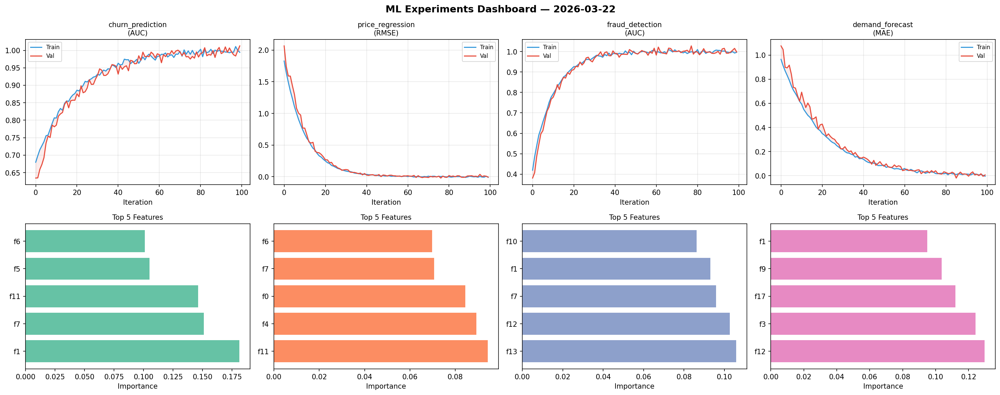
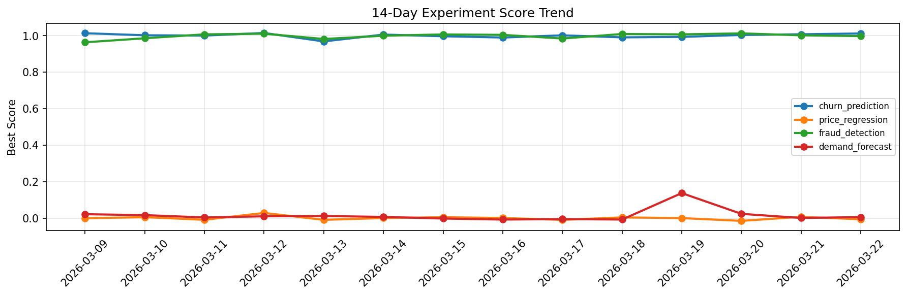

# ML Experiments Report — 2026-03-22

**Run ID:** `c039ebb3fd` | **Experiments:** 4 | **Trials:** 17

## Delta vs Yesterday

| Experiment | Today | Yesterday | Change |
|-----------|-------|-----------|--------|
| churn_prediction | 1.0127 | 1.0081 | 📈 0.5% |
| price_regression | -0.0062 | 0.0073 | 📉 -184.9% |
| fraud_detection | 0.9981 | 1.0025 | 📉 -0.4% |
| demand_forecast | 0.0059 | 0.0011 | 📈 436.4% |

## churn_prediction (AUC)

**Best Score:** 1.0127 (Trial 2)

| Trial | Score | Overfit Gap | Time | LR | Trees | Leaves |
|-------|-------|-------------|------|-----|-------|--------|
| 1 | 0.9806 | 0.0013 | 22.36s | 0.05 | 100 | 63 |
| 2 ⭐ | 1.0127 | 0.0184 | 43.99s | 0.1 | 200 | 63 |
| 3 | 0.9995 | 0.0067 | 6.98s | 0.1 | 100 | 31 |
| 4 | 0.9317 | 0.0101 | 117.85s | 0.05 | 500 | 15 |

## price_regression (RMSE)

**Best Score:** -0.0062 (Trial 4)

| Trial | Score | Overfit Gap | Time | LR | Trees | Leaves |
|-------|-------|-------------|------|-----|-------|--------|
| 1 | 0.1214 | 0.0204 | 31.53s | 0.05 | 200 | 15 |
| 2 | 0.009 | 0.001 | 36.37s | 0.1 | 1000 | 127 |
| 3 | 0.1723 | 0.0302 | 25.68s | 0.05 | 100 | 31 |
| 4 ⭐ | -0.0062 | 0.0038 | 102.41s | 0.2 | 1000 | 15 |
| 5 | 1.0804 | 0.1504 | 1.21s | 0.01 | 200 | 63 |
| 6 | 0.0854 | 0.0038 | 10.55s | 0.05 | 100 | 127 |

## fraud_detection (AUC)

**Best Score:** 0.9981 (Trial 1)

| Trial | Score | Overfit Gap | Time | LR | Trees | Leaves |
|-------|-------|-------------|------|-----|-------|--------|
| 1 ⭐ | 0.9981 | 0.0015 | 129.62s | 0.2 | 1000 | 15 |
| 2 | 0.7497 | 0.0364 | 3.89s | 0.01 | 100 | 31 |
| 3 | 0.7552 | 0.0377 | 7.17s | 0.01 | 100 | 127 |

## demand_forecast (MAE)

**Best Score:** 0.0059 (Trial 3)

| Trial | Score | Overfit Gap | Time | LR | Trees | Leaves |
|-------|-------|-------------|------|-----|-------|--------|
| 1 | 0.0063 | 0.002 | 47.44s | 0.1 | 500 | 15 |
| 2 | 0.0156 | 0.016 | 1.59s | 0.1 | 100 | 63 |
| 3 ⭐ | 0.0059 | 0.011 | 85.85s | 0.1 | 500 | 31 |
| 4 | 0.0195 | 0.0122 | 9.31s | 0.1 | 1000 | 127 |
