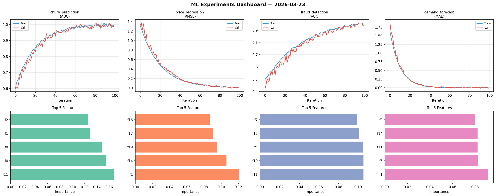
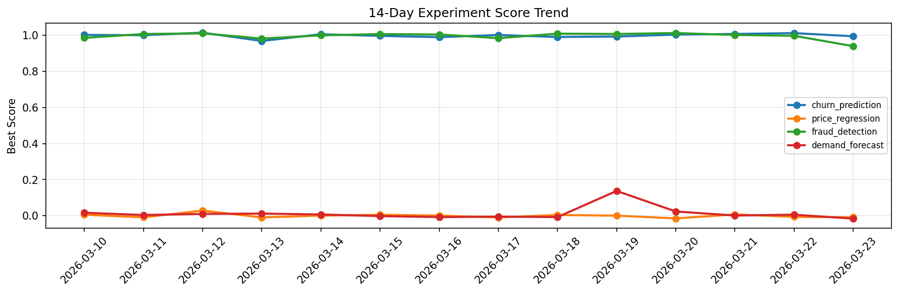

# ML Experiments Report — 2026-03-23

**Run ID:** `fe21f70fcd` | **Experiments:** 4 | **Trials:** 19

## Delta vs Yesterday

| Experiment | Today | Yesterday | Change |
|-----------|-------|-----------|--------|
| churn_prediction | 0.9954 | 1.0127 | 📉 -1.7% |
| price_regression | -0.0086 | -0.0062 | 📉 -38.7% |
| fraud_detection | 0.9404 | 0.9981 | 📉 -5.8% |
| demand_forecast | -0.0161 | 0.0059 | 📉 -372.9% |

## churn_prediction (AUC)

**Best Score:** 0.9954 (Trial 4)

| Trial | Score | Overfit Gap | Time | LR | Trees | Leaves |
|-------|-------|-------------|------|-----|-------|--------|
| 1 | 0.986 | 0.0112 | 9.77s | 0.1 | 100 | 63 |
| 2 | 0.7363 | 0.0083 | 26.25s | 0.01 | 100 | 63 |
| 3 | 0.9943 | 0.007 | 5.32s | 0.1 | 200 | 31 |
| 4 ⭐ | 0.9954 | 0.0063 | 47.68s | 0.1 | 200 | 63 |

## price_regression (RMSE)

**Best Score:** -0.0086 (Trial 2)

| Trial | Score | Overfit Gap | Time | LR | Trees | Leaves |
|-------|-------|-------------|------|-----|-------|--------|
| 1 | 0.1232 | 0.0179 | 115.4s | 0.05 | 500 | 127 |
| 2 ⭐ | -0.0086 | 0.0084 | 36.31s | 0.1 | 500 | 15 |
| 3 | 0.0011 | 0.0064 | 73.46s | 0.2 | 1000 | 15 |
| 4 | 0.0056 | 0.0041 | 58.45s | 0.1 | 500 | 127 |
| 5 | 0.8166 | 0.0973 | 7.86s | 0.01 | 200 | 15 |

## fraud_detection (AUC)

**Best Score:** 0.9404 (Trial 3)

| Trial | Score | Overfit Gap | Time | LR | Trees | Leaves |
|-------|-------|-------------|------|-----|-------|--------|
| 1 | 0.6084 | 0.0577 | 66.49s | 0.01 | 500 | 15 |
| 2 | 0.7191 | 0.0282 | 18.81s | 0.01 | 100 | 127 |
| 3 ⭐ | 0.9404 | 0.0194 | 18.15s | 0.05 | 200 | 31 |
| 4 | 0.7174 | 0.0127 | 244.6s | 0.01 | 1000 | 63 |

## demand_forecast (MAE)

**Best Score:** -0.0161 (Trial 4)

| Trial | Score | Overfit Gap | Time | LR | Trees | Leaves |
|-------|-------|-------------|------|-----|-------|--------|
| 1 | 0.0079 | 0.0021 | 8.11s | 0.1 | 200 | 31 |
| 2 | 0.6504 | 0.0814 | 142.49s | 0.01 | 500 | 15 |
| 3 | 0.023 | 0.0144 | 44.91s | 0.1 | 200 | 31 |
| 4 ⭐ | -0.0161 | 0.0105 | 23.9s | 0.2 | 100 | 63 |
| 5 | 0.0035 | 0.0157 | 16.74s | 0.1 | 1000 | 63 |
| 6 | 0.4911 | 0.0824 | 33.52s | 0.01 | 200 | 31 |
