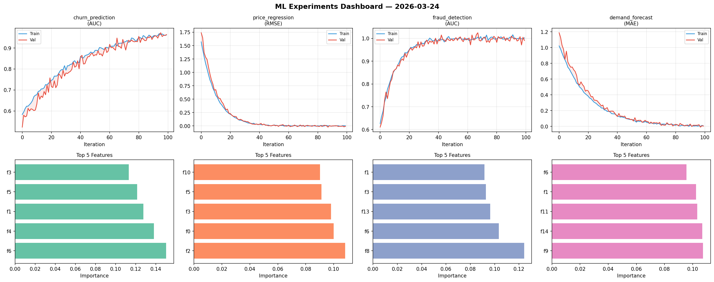
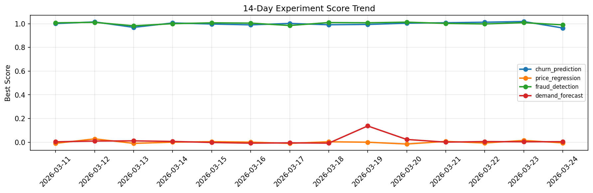

# ML Experiments Report — 2026-03-24

**Run ID:** `2f873111a3` | **Experiments:** 4 | **Trials:** 16

## Delta vs Yesterday

| Experiment | Today | Yesterday | Change |
|-----------|-------|-----------|--------|
| churn_prediction | 0.9638 | 1.0186 | 📉 -5.4% |
| price_regression | -0.0054 | 0.0155 | 📉 -134.8% |
| fraud_detection | 0.9905 | 1.0088 | 📉 -1.8% |
| demand_forecast | 0.0049 | 0.004 | 📈 22.5% |

## churn_prediction (AUC)

**Best Score:** 0.9638 (Trial 3)

| Trial | Score | Overfit Gap | Time | LR | Trees | Leaves |
|-------|-------|-------------|------|-----|-------|--------|
| 1 | 0.9523 | 0.0034 | 145.62s | 0.05 | 1000 | 31 |
| 2 | 0.7049 | 0.0157 | 15.77s | 0.01 | 100 | 31 |
| 3 ⭐ | 0.9638 | 0.0013 | 219.79s | 0.05 | 1000 | 127 |
| 4 | 0.9603 | 0.0163 | 2.69s | 0.05 | 100 | 15 |

## price_regression (RMSE)

**Best Score:** -0.0054 (Trial 3)

| Trial | Score | Overfit Gap | Time | LR | Trees | Leaves |
|-------|-------|-------------|------|-----|-------|--------|
| 1 | 0.1698 | 0.0281 | 31.48s | 0.05 | 200 | 15 |
| 2 | 0.0056 | 0.0134 | 11.57s | 0.2 | 200 | 63 |
| 3 ⭐ | -0.0054 | 0.0068 | 18.12s | 0.2 | 500 | 63 |
| 4 | 0.9025 | 0.0666 | 166.98s | 0.01 | 1000 | 31 |
| 5 | 0.0057 | 0.0023 | 19.4s | 0.2 | 200 | 127 |

## fraud_detection (AUC)

**Best Score:** 0.9905 (Trial 3)

| Trial | Score | Overfit Gap | Time | LR | Trees | Leaves |
|-------|-------|-------------|------|-----|-------|--------|
| 1 | 0.7641 | 0.0114 | 2.68s | 0.01 | 100 | 15 |
| 2 | 0.7462 | 0.0546 | 123.82s | 0.01 | 500 | 31 |
| 3 ⭐ | 0.9905 | 0.0118 | 146.18s | 0.2 | 500 | 63 |
| 4 | 0.8049 | 0.0169 | 23.04s | 0.01 | 100 | 15 |

## demand_forecast (MAE)

**Best Score:** 0.0049 (Trial 1)

| Trial | Score | Overfit Gap | Time | LR | Trees | Leaves |
|-------|-------|-------------|------|-----|-------|--------|
| 1 ⭐ | 0.0049 | 0.002 | 23.83s | 0.1 | 100 | 31 |
| 2 | 1.2796 | 0.1862 | 249.47s | 0.01 | 1000 | 31 |
| 3 | 0.1541 | 0.0131 | 17.12s | 0.05 | 200 | 63 |
