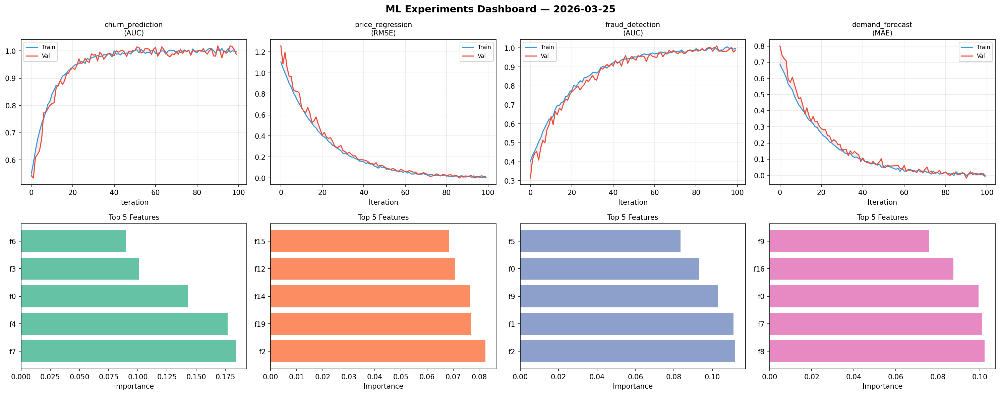
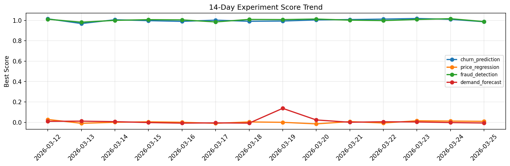

# ML Experiments Report — 2026-03-25

**Run ID:** `a74ec24b35` | **Experiments:** 4 | **Trials:** 20

## Delta vs Yesterday

| Experiment | Today | Yesterday | Change |
|-----------|-------|-----------|--------|
| churn_prediction | 0.9868 | 1.0104 | 📉 -2.3% |
| price_regression | 0.0101 | 0.0125 | 📉 -19.2% |
| fraud_detection | 0.9885 | 1.0166 | 📉 -2.8% |
| demand_forecast | -0.0062 | -0.0019 | 📉 -226.3% |

## churn_prediction (AUC)

**Best Score:** 0.9868 (Trial 5)

| Trial | Score | Overfit Gap | Time | LR | Trees | Leaves |
|-------|-------|-------------|------|-----|-------|--------|
| 1 | 0.9839 | 0.0182 | 212.51s | 0.2 | 1000 | 31 |
| 2 | 0.6205 | 0.0306 | 136.97s | 0.01 | 1000 | 63 |
| 3 | 0.61 | 0.0288 | 25.67s | 0.01 | 100 | 15 |
| 4 | 0.9543 | 0.007 | 23.32s | 0.05 | 200 | 63 |
| 5 ⭐ | 0.9868 | 0.0114 | 289.0s | 0.2 | 1000 | 127 |

## price_regression (RMSE)

**Best Score:** 0.0101 (Trial 3)

| Trial | Score | Overfit Gap | Time | LR | Trees | Leaves |
|-------|-------|-------------|------|-----|-------|--------|
| 1 | 0.0104 | 0.0112 | 52.47s | 0.1 | 200 | 31 |
| 2 | 0.6434 | 0.0408 | 11.72s | 0.01 | 100 | 31 |
| 3 ⭐ | 0.0101 | 0.0085 | 40.28s | 0.1 | 200 | 15 |
| 4 | 0.782 | 0.0712 | 190.52s | 0.01 | 1000 | 127 |

## fraud_detection (AUC)

**Best Score:** 0.9885 (Trial 2)

| Trial | Score | Overfit Gap | Time | LR | Trees | Leaves |
|-------|-------|-------------|------|-----|-------|--------|
| 1 | 0.7065 | 0.0201 | 40.79s | 0.01 | 500 | 15 |
| 2 ⭐ | 0.9885 | 0.0093 | 152.4s | 0.1 | 1000 | 63 |
| 3 | 0.9503 | 0.0112 | 10.38s | 0.05 | 100 | 127 |
| 4 | 0.785 | 0.0159 | 26.38s | 0.01 | 100 | 63 |
| 5 | 0.6002 | 0.078 | 31.69s | 0.01 | 1000 | 31 |

## demand_forecast (MAE)

**Best Score:** -0.0062 (Trial 2)

| Trial | Score | Overfit Gap | Time | LR | Trees | Leaves |
|-------|-------|-------------|------|-----|-------|--------|
| 1 | 0.0102 | 0.0054 | 34.95s | 0.2 | 500 | 127 |
| 2 ⭐ | -0.0062 | 0.0046 | 31.83s | 0.1 | 500 | 63 |
| 3 | 1.2141 | 0.1345 | 66.41s | 0.01 | 1000 | 63 |
| 4 | 0.3246 | 0.0085 | 2.65s | 0.01 | 100 | 15 |
| 5 | 0.0165 | 0.0158 | 50.71s | 0.2 | 200 | 31 |
| 6 | 0.0532 | 0.0001 | 25.79s | 0.05 | 100 | 127 |
