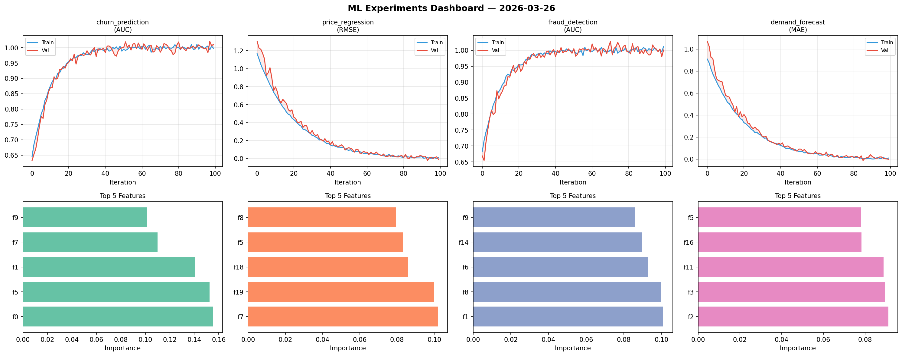
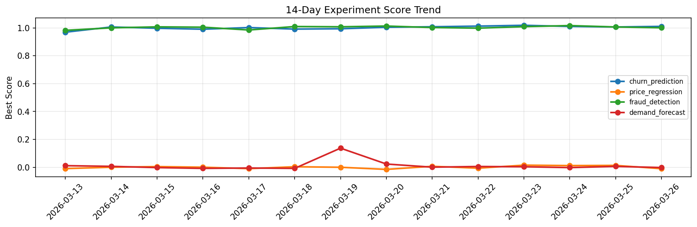

# ML Experiments Report — 2026-03-26

**Run ID:** `065e0eaabd` | **Experiments:** 4 | **Trials:** 15

## Delta vs Yesterday

| Experiment | Today | Yesterday | Change |
|-----------|-------|-----------|--------|
| churn_prediction | 1.0108 | 1.0065 | 📈 0.4% |
| price_regression | -0.0098 | 0.0138 | 📉 -171.0% |
| fraud_detection | 1.0006 | 1.0066 | 📉 -0.6% |
| demand_forecast | -0.0015 | 0.0065 | 📉 -123.1% |

## churn_prediction (AUC)

**Best Score:** 1.0108 (Trial 2)

| Trial | Score | Overfit Gap | Time | LR | Trees | Leaves |
|-------|-------|-------------|------|-----|-------|--------|
| 1 | 0.9524 | 0.008 | 22.31s | 0.05 | 100 | 127 |
| 2 ⭐ | 1.0108 | 0.013 | 24.6s | 0.2 | 100 | 31 |
| 3 | 0.9818 | 0.0139 | 24.77s | 0.2 | 100 | 63 |

## price_regression (RMSE)

**Best Score:** -0.0098 (Trial 1)

| Trial | Score | Overfit Gap | Time | LR | Trees | Leaves |
|-------|-------|-------------|------|-----|-------|--------|
| 1 ⭐ | -0.0098 | 0.0184 | 14.45s | 0.1 | 100 | 31 |
| 2 | 0.0214 | 0.0249 | 13.21s | 0.1 | 100 | 15 |
| 3 | 0.1282 | 0.0035 | 6.89s | 0.05 | 200 | 31 |

## fraud_detection (AUC)

**Best Score:** 1.0006 (Trial 1)

| Trial | Score | Overfit Gap | Time | LR | Trees | Leaves |
|-------|-------|-------------|------|-----|-------|--------|
| 1 ⭐ | 1.0006 | 0.0111 | 27.46s | 0.2 | 100 | 15 |
| 2 | 0.9849 | 0.014 | 22.41s | 0.1 | 100 | 31 |
| 3 | 0.6528 | 0.0549 | 19.81s | 0.01 | 200 | 31 |
| 4 | 0.938 | 0.0054 | 29.54s | 0.05 | 200 | 15 |
| 5 | 0.9929 | 0.0154 | 44.73s | 0.2 | 200 | 63 |
| 6 | 0.9936 | 0.0106 | 64.76s | 0.1 | 500 | 63 |

## demand_forecast (MAE)

**Best Score:** -0.0015 (Trial 1)

| Trial | Score | Overfit Gap | Time | LR | Trees | Leaves |
|-------|-------|-------------|------|-----|-------|--------|
| 1 ⭐ | -0.0015 | 0.0117 | 122.33s | 0.1 | 500 | 31 |
| 2 | 0.0008 | 0.0144 | 17.72s | 0.1 | 500 | 127 |
| 3 | 0.1163 | 0.018 | 18.14s | 0.05 | 100 | 127 |
