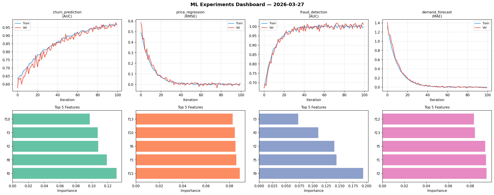
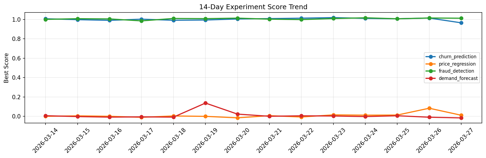

# ML Experiments Report — 2026-03-27

**Run ID:** `af8cb4eba4` | **Experiments:** 4 | **Trials:** 19

## Delta vs Yesterday

| Experiment | Today | Yesterday | Change |
|-----------|-------|-----------|--------|
| churn_prediction | 0.9649 | 1.014 | 📉 -4.8% |
| price_regression | 0.0119 | 0.0841 | 📉 -85.9% |
| fraud_detection | 1.0123 | 1.0145 | 📉 -0.2% |
| demand_forecast | -0.0156 | -0.0085 | 📉 -83.5% |

## churn_prediction (AUC)

**Best Score:** 0.9649 (Trial 3)

| Trial | Score | Overfit Gap | Time | LR | Trees | Leaves |
|-------|-------|-------------|------|-----|-------|--------|
| 1 | 0.7194 | 0.0032 | 42.35s | 0.01 | 200 | 15 |
| 2 | 0.737 | 0.0262 | 92.25s | 0.01 | 500 | 31 |
| 3 ⭐ | 0.9649 | 0.002 | 104.53s | 0.05 | 500 | 31 |

## price_regression (RMSE)

**Best Score:** 0.0119 (Trial 5)

| Trial | Score | Overfit Gap | Time | LR | Trees | Leaves |
|-------|-------|-------------|------|-----|-------|--------|
| 1 | 0.817 | 0.0946 | 17.85s | 0.01 | 200 | 63 |
| 2 | 1.0399 | 0.1556 | 278.68s | 0.01 | 1000 | 31 |
| 3 | 1.1606 | 0.0935 | 267.3s | 0.01 | 1000 | 127 |
| 4 | 0.0123 | 0.0116 | 4.13s | 0.2 | 100 | 31 |
| 5 ⭐ | 0.0119 | 0.0059 | 50.92s | 0.2 | 500 | 31 |
| 6 | 0.0942 | 0.002 | 32.68s | 0.05 | 500 | 15 |

## fraud_detection (AUC)

**Best Score:** 1.0123 (Trial 2)

| Trial | Score | Overfit Gap | Time | LR | Trees | Leaves |
|-------|-------|-------------|------|-----|-------|--------|
| 1 | 0.925 | 0.0415 | 16.15s | 0.05 | 100 | 127 |
| 2 ⭐ | 1.0123 | 0.018 | 174.55s | 0.2 | 1000 | 127 |
| 3 | 0.7726 | 0.0052 | 24.36s | 0.01 | 100 | 31 |
| 4 | 0.9874 | 0.0131 | 119.83s | 0.1 | 500 | 31 |
| 5 | 0.9491 | 0.0137 | 39.06s | 0.05 | 1000 | 31 |
| 6 | 1.0005 | 0.003 | 86.87s | 0.2 | 500 | 127 |

## demand_forecast (MAE)

**Best Score:** -0.0156 (Trial 4)

| Trial | Score | Overfit Gap | Time | LR | Trees | Leaves |
|-------|-------|-------------|------|-----|-------|--------|
| 1 | 0.5435 | 0.0343 | 37.75s | 0.01 | 200 | 15 |
| 2 | -0.0015 | 0.0014 | 294.57s | 0.2 | 1000 | 15 |
| 3 | -0.0046 | 0.0018 | 21.94s | 0.2 | 200 | 31 |
| 4 ⭐ | -0.0156 | 0.0171 | 270.89s | 0.2 | 1000 | 63 |
