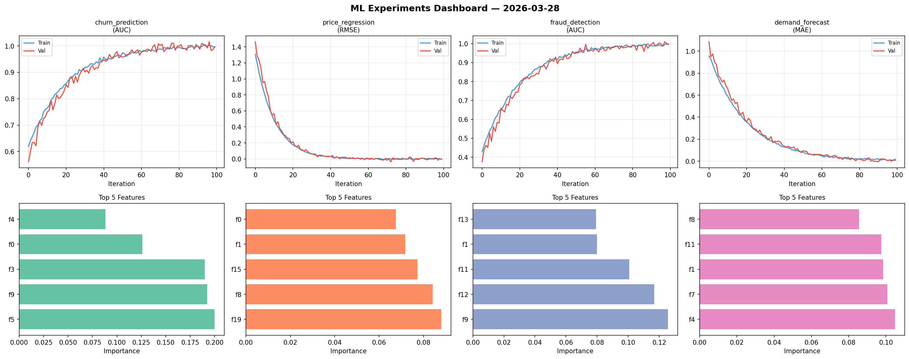
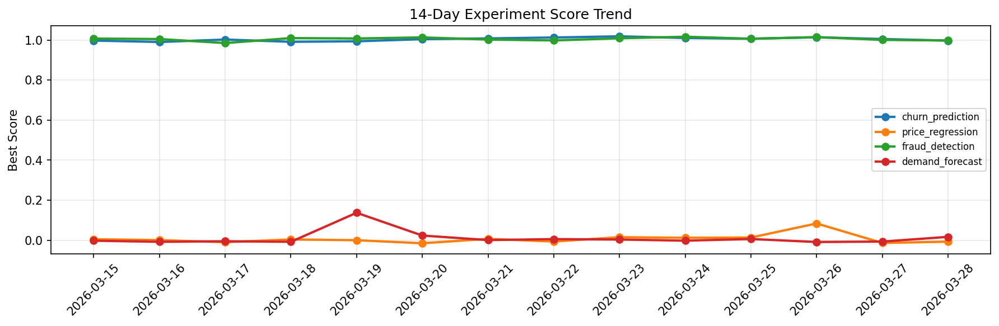

# ML Experiments Report — 2026-03-28

**Run ID:** `25504048df` | **Experiments:** 4 | **Trials:** 19

## Delta vs Yesterday

| Experiment | Today | Yesterday | Change |
|-----------|-------|-----------|--------|
| churn_prediction | 0.9972 | 1.0051 | 📉 -0.8% |
| price_regression | -0.0068 | -0.0133 | 📈 48.9% |
| fraud_detection | 0.9979 | 1.0008 | 📉 -0.3% |
| demand_forecast | 0.0172 | -0.0064 | 📈 368.7% |

## churn_prediction (AUC)

**Best Score:** 0.9972 (Trial 3)

| Trial | Score | Overfit Gap | Time | LR | Trees | Leaves |
|-------|-------|-------------|------|-----|-------|--------|
| 1 | 0.9904 | 0.0116 | 97.44s | 0.2 | 500 | 31 |
| 2 | 0.6687 | 0.022 | 31.25s | 0.01 | 200 | 63 |
| 3 ⭐ | 0.9972 | 0.0013 | 26.96s | 0.1 | 100 | 63 |
| 4 | 0.9502 | 0.0086 | 107.7s | 0.05 | 1000 | 63 |

## price_regression (RMSE)

**Best Score:** -0.0068 (Trial 2)

| Trial | Score | Overfit Gap | Time | LR | Trees | Leaves |
|-------|-------|-------------|------|-----|-------|--------|
| 1 | 0.6233 | 0.0303 | 71.43s | 0.01 | 1000 | 63 |
| 2 ⭐ | -0.0068 | 0.0022 | 248.57s | 0.2 | 1000 | 31 |
| 3 | 0.0095 | 0.0082 | 239.97s | 0.2 | 1000 | 15 |
| 4 | 0.8879 | 0.0286 | 138.22s | 0.01 | 1000 | 127 |
| 5 | 0.0746 | 0.0151 | 0.55s | 0.05 | 100 | 63 |
| 6 | 0.0106 | 0.009 | 281.45s | 0.1 | 1000 | 127 |

## fraud_detection (AUC)

**Best Score:** 0.9979 (Trial 3)

| Trial | Score | Overfit Gap | Time | LR | Trees | Leaves |
|-------|-------|-------------|------|-----|-------|--------|
| 1 | 0.6235 | 0.0279 | 2.14s | 0.01 | 200 | 31 |
| 2 | 0.9462 | 0.0027 | 6.55s | 0.05 | 200 | 31 |
| 3 ⭐ | 0.9979 | 0.0019 | 61.93s | 0.1 | 500 | 31 |
| 4 | 0.6804 | 0.0131 | 27.76s | 0.01 | 200 | 127 |
| 5 | 0.9811 | 0.0296 | 42.78s | 0.2 | 200 | 63 |

## demand_forecast (MAE)

**Best Score:** 0.0172 (Trial 4)

| Trial | Score | Overfit Gap | Time | LR | Trees | Leaves |
|-------|-------|-------------|------|-----|-------|--------|
| 1 | 0.1393 | 0.0029 | 111.57s | 0.05 | 500 | 31 |
| 2 | 0.124 | 0.0128 | 128.56s | 0.05 | 1000 | 31 |
| 3 | 0.6807 | 0.1014 | 95.45s | 0.01 | 500 | 15 |
| 4 ⭐ | 0.0172 | 0.0098 | 57.13s | 0.1 | 500 | 31 |
