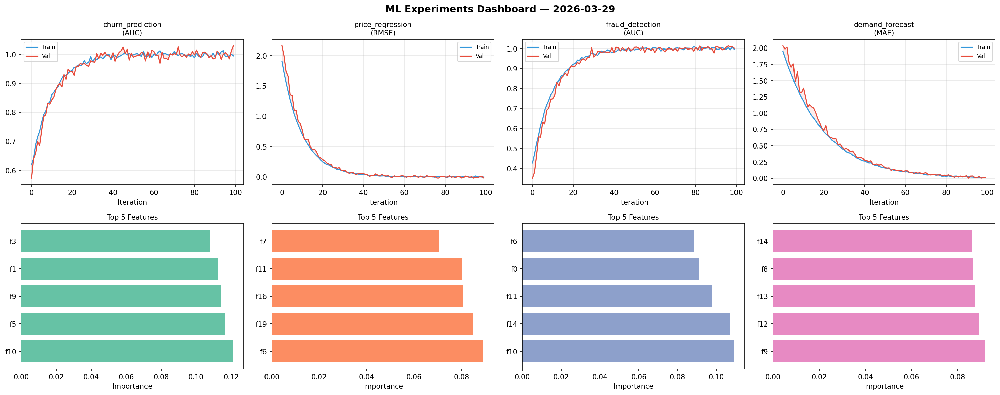
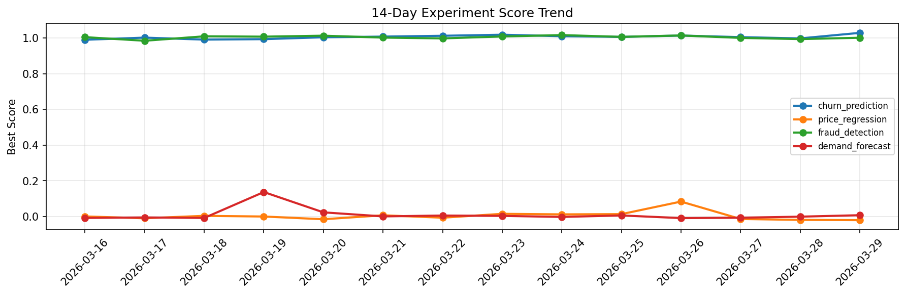

# ML Experiments Report — 2026-03-29

**Run ID:** `664f2d68ce` | **Experiments:** 4 | **Trials:** 21

## Delta vs Yesterday

| Experiment | Today | Yesterday | Change |
|-----------|-------|-----------|--------|
| churn_prediction | 1.029 | 0.998 | 📈 3.1% |
| price_regression | -0.0198 | -0.0185 | 📉 -7.0% |
| fraud_detection | 1.0017 | 0.9942 | 📈 0.8% |
| demand_forecast | 0.0078 | -0.0004 | 📈 820.0% |

## churn_prediction (AUC)

**Best Score:** 1.029 (Trial 6)

| Trial | Score | Overfit Gap | Time | LR | Trees | Leaves |
|-------|-------|-------------|------|-----|-------|--------|
| 1 | 0.7792 | 0.0274 | 24.3s | 0.01 | 100 | 15 |
| 2 | 0.9972 | 0.0019 | 26.53s | 0.1 | 200 | 127 |
| 3 | 0.9521 | 0.0071 | 30.52s | 0.05 | 200 | 63 |
| 4 | 0.9687 | 0.0002 | 145.34s | 0.05 | 1000 | 15 |
| 5 | 1.001 | 0.0063 | 32.77s | 0.1 | 200 | 127 |
| 6 ⭐ | 1.029 | 0.0339 | 27.66s | 0.2 | 100 | 127 |

## price_regression (RMSE)

**Best Score:** -0.0198 (Trial 1)

| Trial | Score | Overfit Gap | Time | LR | Trees | Leaves |
|-------|-------|-------------|------|-----|-------|--------|
| 1 ⭐ | -0.0198 | 0.0173 | 92.87s | 0.2 | 500 | 127 |
| 2 | 0.6343 | 0.061 | 262.31s | 0.01 | 1000 | 15 |
| 3 | 0.4764 | 0.0354 | 56.84s | 0.01 | 1000 | 63 |
| 4 | 0.2012 | 0.0354 | 39.92s | 0.05 | 200 | 15 |
| 5 | 0.0216 | 0.0138 | 39.09s | 0.1 | 1000 | 15 |

## fraud_detection (AUC)

**Best Score:** 1.0017 (Trial 4)

| Trial | Score | Overfit Gap | Time | LR | Trees | Leaves |
|-------|-------|-------------|------|-----|-------|--------|
| 1 | 0.9989 | 0.0027 | 29.44s | 0.1 | 100 | 127 |
| 2 | 0.9564 | 0.015 | 12.47s | 0.05 | 200 | 15 |
| 3 | 0.9493 | 0.0106 | 21.11s | 0.05 | 100 | 63 |
| 4 ⭐ | 1.0017 | 0.0063 | 290.2s | 0.2 | 1000 | 15 |
| 5 | 0.5652 | 0.081 | 195.61s | 0.01 | 1000 | 127 |
| 6 | 0.6808 | 0.0376 | 1.12s | 0.01 | 100 | 63 |

## demand_forecast (MAE)

**Best Score:** 0.0078 (Trial 1)

| Trial | Score | Overfit Gap | Time | LR | Trees | Leaves |
|-------|-------|-------------|------|-----|-------|--------|
| 1 ⭐ | 0.0078 | 0.0018 | 4.39s | 0.1 | 100 | 15 |
| 2 | 0.1431 | 0.0154 | 230.04s | 0.05 | 1000 | 15 |
| 3 | 0.9018 | 0.0821 | 133.82s | 0.01 | 1000 | 31 |
| 4 | 0.1543 | 0.0391 | 36.59s | 0.05 | 500 | 127 |
