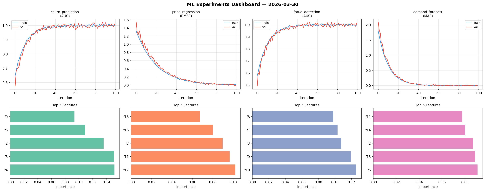
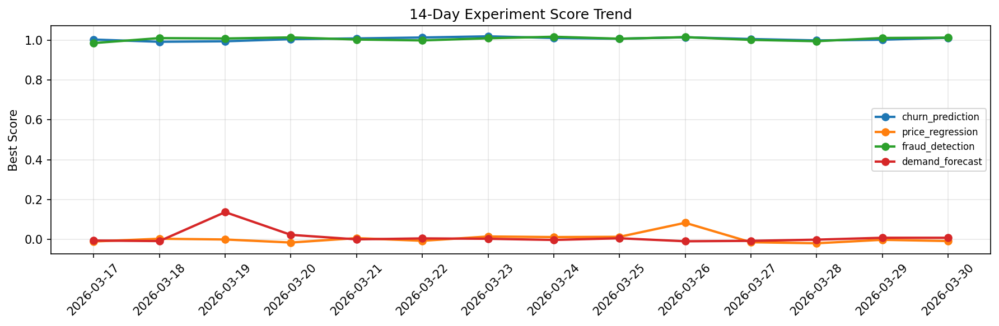

# ML Experiments Report — 2026-03-30

**Run ID:** `d354df1883` | **Experiments:** 4 | **Trials:** 22

## Delta vs Yesterday

| Experiment | Today | Yesterday | Change |
|-----------|-------|-----------|--------|
| churn_prediction | 1.0113 | 1.0016 | 📈 1.0% |
| price_regression | -0.0074 | -0.0011 | 📉 -572.7% |
| fraud_detection | 1.012 | 1.0103 | 📈 0.2% |
| demand_forecast | 0.009 | 0.009 | 📉 0.0% |

## churn_prediction (AUC)

**Best Score:** 1.0113 (Trial 2)

| Trial | Score | Overfit Gap | Time | LR | Trees | Leaves |
|-------|-------|-------------|------|-----|-------|--------|
| 1 | 0.7955 | 0.0012 | 70.16s | 0.01 | 500 | 63 |
| 2 ⭐ | 1.0113 | 0.0115 | 62.97s | 0.2 | 500 | 127 |
| 3 | 0.9793 | 0.0147 | 24.48s | 0.1 | 200 | 127 |
| 4 | 0.9928 | 0.0138 | 274.09s | 0.2 | 1000 | 15 |
| 5 | 1.0022 | 0.0135 | 2.74s | 0.1 | 200 | 63 |
| 6 | 0.9912 | 0.0053 | 29.29s | 0.2 | 200 | 63 |

## price_regression (RMSE)

**Best Score:** -0.0074 (Trial 3)

| Trial | Score | Overfit Gap | Time | LR | Trees | Leaves |
|-------|-------|-------------|------|-----|-------|--------|
| 1 | 0.1433 | 0.0148 | 96.82s | 0.05 | 1000 | 31 |
| 2 | 0.4693 | 0.0788 | 10.17s | 0.01 | 200 | 15 |
| 3 ⭐ | -0.0074 | 0.0245 | 17.3s | 0.1 | 200 | 63 |
| 4 | 0.0313 | 0.0147 | 55.44s | 0.05 | 500 | 63 |
| 5 | 1.0744 | 0.0072 | 15.49s | 0.01 | 500 | 63 |
| 6 | 0.1532 | 0.0029 | 139.53s | 0.05 | 500 | 127 |

## fraud_detection (AUC)

**Best Score:** 1.012 (Trial 1)

| Trial | Score | Overfit Gap | Time | LR | Trees | Leaves |
|-------|-------|-------------|------|-----|-------|--------|
| 1 ⭐ | 1.012 | 0.0147 | 263.99s | 0.2 | 1000 | 127 |
| 2 | 0.9894 | 0.0083 | 221.03s | 0.2 | 1000 | 15 |
| 3 | 0.992 | 0.0119 | 257.92s | 0.2 | 1000 | 31 |
| 4 | 1.0081 | 0.0064 | 19.62s | 0.2 | 200 | 127 |
| 5 | 0.6558 | 0.0238 | 34.12s | 0.01 | 500 | 127 |
| 6 | 1.0 | 0.0116 | 69.06s | 0.1 | 500 | 31 |

## demand_forecast (MAE)

**Best Score:** 0.009 (Trial 4)

| Trial | Score | Overfit Gap | Time | LR | Trees | Leaves |
|-------|-------|-------------|------|-----|-------|--------|
| 1 | 0.1508 | 0.0207 | 19.69s | 0.05 | 500 | 15 |
| 2 | 0.0132 | 0.0058 | 1.15s | 0.1 | 100 | 63 |
| 3 | 0.1113 | 0.0171 | 10.02s | 0.05 | 200 | 63 |
| 4 ⭐ | 0.009 | 0.0148 | 159.11s | 0.2 | 1000 | 127 |
