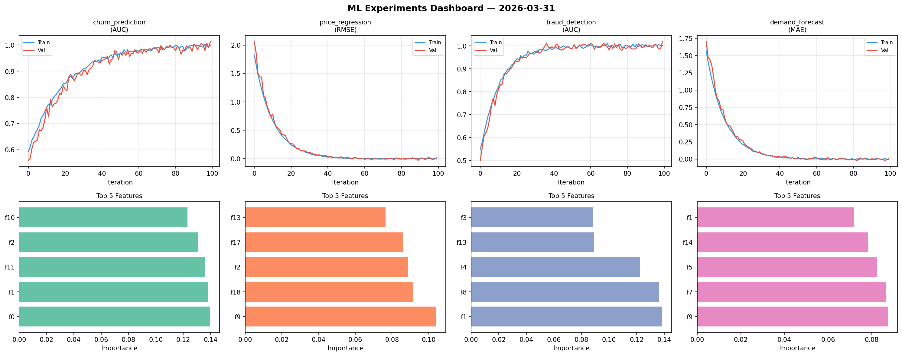
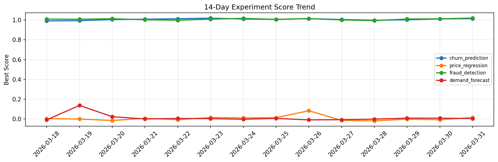

# ML Experiments Report — 2026-03-31

**Run ID:** `62c01ab64f` | **Experiments:** 4 | **Trials:** 16

## Delta vs Yesterday

| Experiment | Today | Yesterday | Change |
|-----------|-------|-----------|--------|
| churn_prediction | 1.0141 | 1.0113 | 📈 0.3% |
| price_regression | 0.0151 | -0.0074 | 📈 304.1% |
| fraud_detection | 1.0199 | 1.012 | 📈 0.8% |
| demand_forecast | 0.0054 | 0.009 | 📉 -40.0% |

## churn_prediction (AUC)

**Best Score:** 1.0141 (Trial 3)

| Trial | Score | Overfit Gap | Time | LR | Trees | Leaves |
|-------|-------|-------------|------|-----|-------|--------|
| 1 | 0.6174 | 0.0528 | 202.45s | 0.01 | 1000 | 63 |
| 2 | 0.9982 | 0.0045 | 4.66s | 0.2 | 100 | 63 |
| 3 ⭐ | 1.0141 | 0.0155 | 50.71s | 0.1 | 200 | 63 |
| 4 | 0.9494 | 0.0241 | 57.64s | 0.05 | 200 | 63 |
| 5 | 0.7384 | 0.0271 | 38.07s | 0.01 | 200 | 127 |

## price_regression (RMSE)

**Best Score:** 0.0151 (Trial 2)

| Trial | Score | Overfit Gap | Time | LR | Trees | Leaves |
|-------|-------|-------------|------|-----|-------|--------|
| 1 | 0.1708 | 0.0076 | 12.73s | 0.05 | 100 | 31 |
| 2 ⭐ | 0.0151 | 0.0208 | 36.23s | 0.2 | 500 | 127 |
| 3 | 1.2652 | 0.1376 | 107.88s | 0.01 | 500 | 63 |

## fraud_detection (AUC)

**Best Score:** 1.0199 (Trial 1)

| Trial | Score | Overfit Gap | Time | LR | Trees | Leaves |
|-------|-------|-------------|------|-----|-------|--------|
| 1 ⭐ | 1.0199 | 0.0179 | 155.75s | 0.2 | 1000 | 127 |
| 2 | 0.6374 | 0.0267 | 25.22s | 0.01 | 100 | 127 |
| 3 | 0.959 | 0.0013 | 28.3s | 0.05 | 100 | 15 |
| 4 | 1.0181 | 0.0191 | 6.08s | 0.2 | 100 | 15 |
| 5 | 0.7226 | 0.0005 | 8.96s | 0.01 | 100 | 31 |

## demand_forecast (MAE)

**Best Score:** 0.0054 (Trial 1)

| Trial | Score | Overfit Gap | Time | LR | Trees | Leaves |
|-------|-------|-------------|------|-----|-------|--------|
| 1 ⭐ | 0.0054 | 0.0139 | 110.39s | 0.2 | 500 | 15 |
| 2 | 0.0069 | 0.0043 | 111.2s | 0.2 | 1000 | 31 |
| 3 | 0.021 | 0.0061 | 1.85s | 0.1 | 100 | 31 |
