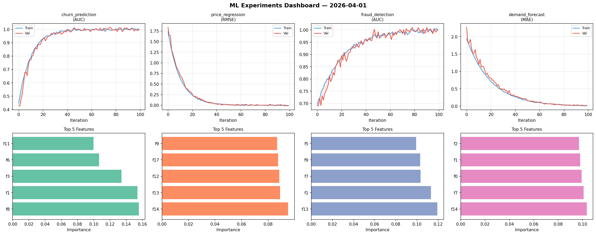
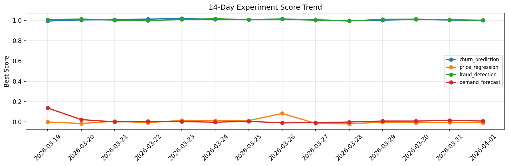

# ML Experiments Report — 2026-04-01

**Run ID:** `08dab402b1` | **Experiments:** 4 | **Trials:** 20

## Delta vs Yesterday

| Experiment | Today | Yesterday | Change |
|-----------|-------|-----------|--------|
| churn_prediction | 1.0004 | 1.0033 | 📉 -0.3% |
| price_regression | -0.0072 | -0.0056 | 📉 -28.6% |
| fraud_detection | 1.0017 | 1.0053 | 📉 -0.4% |
| demand_forecast | 0.0097 | 0.0166 | 📉 -41.6% |

## churn_prediction (AUC)

**Best Score:** 1.0004 (Trial 6)

| Trial | Score | Overfit Gap | Time | LR | Trees | Leaves |
|-------|-------|-------------|------|-----|-------|--------|
| 1 | 0.9449 | 0.0066 | 49.45s | 0.05 | 1000 | 127 |
| 2 | 0.9992 | 0.0056 | 29.3s | 0.1 | 100 | 31 |
| 3 | 0.9491 | 0.0229 | 299.71s | 0.05 | 1000 | 127 |
| 4 | 0.755 | 0.0247 | 65.81s | 0.01 | 1000 | 31 |
| 5 | 0.9829 | 0.0144 | 122.21s | 0.1 | 500 | 127 |
| 6 ⭐ | 1.0004 | 0.0052 | 13.87s | 0.2 | 200 | 63 |

## price_regression (RMSE)

**Best Score:** -0.0072 (Trial 2)

| Trial | Score | Overfit Gap | Time | LR | Trees | Leaves |
|-------|-------|-------------|------|-----|-------|--------|
| 1 | 0.0024 | 0.0058 | 250.18s | 0.2 | 1000 | 63 |
| 2 ⭐ | -0.0072 | 0.0037 | 227.08s | 0.2 | 1000 | 63 |
| 3 | 0.0686 | 0.0028 | 47.55s | 0.05 | 200 | 63 |
| 4 | 0.0005 | 0.0097 | 37.6s | 0.1 | 200 | 15 |
| 5 | 0.0224 | 0.0175 | 59.4s | 0.1 | 200 | 31 |

## fraud_detection (AUC)

**Best Score:** 1.0017 (Trial 3)

| Trial | Score | Overfit Gap | Time | LR | Trees | Leaves |
|-------|-------|-------------|------|-----|-------|--------|
| 1 | 0.9956 | 0.0044 | 40.46s | 0.1 | 1000 | 63 |
| 2 | 0.6315 | 0.0142 | 284.51s | 0.01 | 1000 | 63 |
| 3 ⭐ | 1.0017 | 0.0033 | 53.89s | 0.1 | 200 | 15 |

## demand_forecast (MAE)

**Best Score:** 0.0097 (Trial 6)

| Trial | Score | Overfit Gap | Time | LR | Trees | Leaves |
|-------|-------|-------------|------|-----|-------|--------|
| 1 | 1.3381 | 0.1927 | 28.48s | 0.01 | 100 | 127 |
| 2 | 0.0104 | 0.0041 | 25.78s | 0.1 | 100 | 31 |
| 3 | 0.0113 | 0.0129 | 234.39s | 0.2 | 1000 | 31 |
| 4 | 0.0106 | 0.0078 | 50.02s | 0.2 | 1000 | 15 |
| 5 | 0.0541 | 0.0029 | 56.18s | 0.05 | 200 | 15 |
| 6 ⭐ | 0.0097 | 0.0104 | 13.68s | 0.1 | 100 | 31 |
