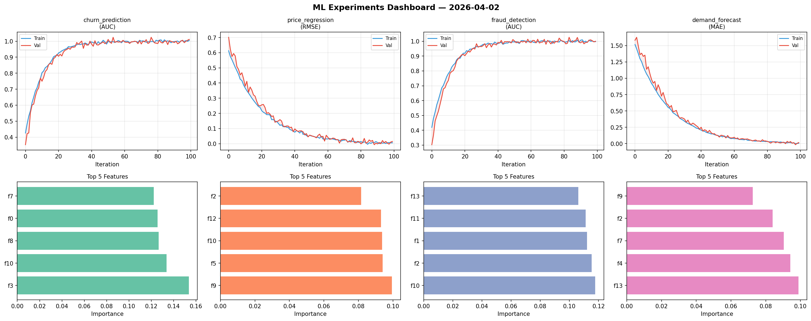
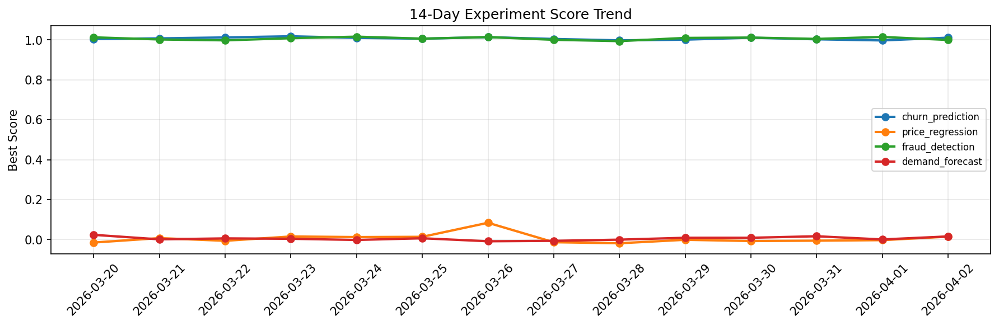

# ML Experiments Report — 2026-04-02

**Run ID:** `3817295ce5` | **Experiments:** 4 | **Trials:** 20

## Delta vs Yesterday

| Experiment | Today | Yesterday | Change |
|-----------|-------|-----------|--------|
| churn_prediction | 1.0115 | 0.9977 | 📈 1.4% |
| price_regression | 0.0147 | -0.0029 | 📈 606.9% |
| fraud_detection | 1.0001 | 1.0152 | 📉 -1.5% |
| demand_forecast | 0.0157 | 0.0006 | 📈 1510.0% |

## churn_prediction (AUC)

**Best Score:** 1.0115 (Trial 5)

| Trial | Score | Overfit Gap | Time | LR | Trees | Leaves |
|-------|-------|-------------|------|-----|-------|--------|
| 1 | 0.7605 | 0.0194 | 37.9s | 0.01 | 200 | 31 |
| 2 | 0.9724 | 0.0012 | 16.94s | 0.05 | 100 | 15 |
| 3 | 0.7841 | 0.0272 | 39.42s | 0.01 | 200 | 31 |
| 4 | 0.9519 | 0.0044 | 127.54s | 0.05 | 500 | 31 |
| 5 ⭐ | 1.0115 | 0.0067 | 20.33s | 0.2 | 100 | 31 |
| 6 | 0.6171 | 0.0431 | 5.08s | 0.01 | 100 | 15 |

## price_regression (RMSE)

**Best Score:** 0.0147 (Trial 1)

| Trial | Score | Overfit Gap | Time | LR | Trees | Leaves |
|-------|-------|-------------|------|-----|-------|--------|
| 1 ⭐ | 0.0147 | 0.0089 | 54.91s | 0.1 | 500 | 63 |
| 2 | 0.0977 | 0.0057 | 105.48s | 0.05 | 500 | 15 |
| 3 | 0.0187 | 0.0153 | 176.7s | 0.1 | 1000 | 31 |

## fraud_detection (AUC)

**Best Score:** 1.0001 (Trial 2)

| Trial | Score | Overfit Gap | Time | LR | Trees | Leaves |
|-------|-------|-------------|------|-----|-------|--------|
| 1 | 0.9914 | 0.0053 | 134.79s | 0.1 | 500 | 15 |
| 2 ⭐ | 1.0001 | 0.0026 | 5.2s | 0.2 | 100 | 127 |
| 3 | 0.6824 | 0.0535 | 8.57s | 0.01 | 200 | 31 |
| 4 | 0.739 | 0.0251 | 143.4s | 0.01 | 500 | 127 |
| 5 | 0.9912 | 0.0091 | 8.93s | 0.1 | 500 | 63 |

## demand_forecast (MAE)

**Best Score:** 0.0157 (Trial 3)

| Trial | Score | Overfit Gap | Time | LR | Trees | Leaves |
|-------|-------|-------------|------|-----|-------|--------|
| 1 | 0.4591 | 0.0696 | 15.59s | 0.01 | 100 | 31 |
| 2 | 0.4683 | 0.0644 | 55.73s | 0.01 | 200 | 15 |
| 3 ⭐ | 0.0157 | 0.0105 | 30.87s | 0.1 | 200 | 15 |
| 4 | 0.1074 | 0.0087 | 35.83s | 0.05 | 1000 | 15 |
| 5 | 1.1121 | 0.0649 | 8.16s | 0.01 | 100 | 127 |
| 6 | 0.0845 | 0.005 | 95.29s | 0.05 | 500 | 127 |
