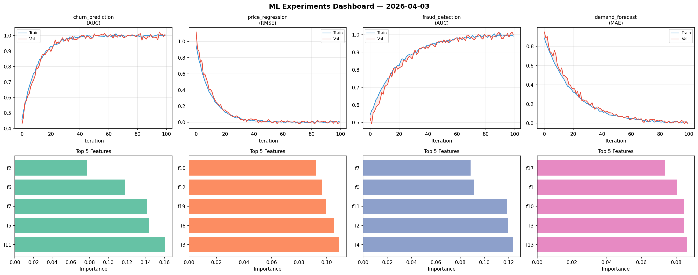
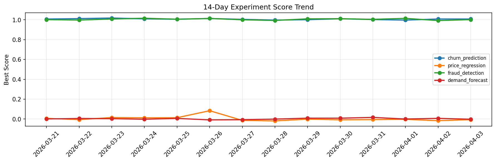

# ML Experiments Report — 2026-04-03

**Run ID:** `84e36c2f67` | **Experiments:** 4 | **Trials:** 20

## Delta vs Yesterday

| Experiment | Today | Yesterday | Change |
|-----------|-------|-----------|--------|
| churn_prediction | 1.0085 | 1.0087 | 📉 -0.0% |
| price_regression | -0.0062 | -0.0164 | 📈 62.2% |
| fraud_detection | 1.0025 | 0.993 | 📈 1.0% |
| demand_forecast | -0.0016 | 0.007 | 📉 -122.9% |

## churn_prediction (AUC)

**Best Score:** 1.0085 (Trial 3)

| Trial | Score | Overfit Gap | Time | LR | Trees | Leaves |
|-------|-------|-------------|------|-----|-------|--------|
| 1 | 0.7568 | 0.0077 | 203.07s | 0.01 | 1000 | 127 |
| 2 | 0.7644 | 0.0108 | 7.26s | 0.01 | 200 | 15 |
| 3 ⭐ | 1.0085 | 0.0089 | 2.78s | 0.2 | 200 | 127 |

## price_regression (RMSE)

**Best Score:** -0.0062 (Trial 2)

| Trial | Score | Overfit Gap | Time | LR | Trees | Leaves |
|-------|-------|-------------|------|-----|-------|--------|
| 1 | 0.0159 | 0.0035 | 28.17s | 0.1 | 200 | 127 |
| 2 ⭐ | -0.0062 | 0.0173 | 28.2s | 0.2 | 200 | 15 |
| 3 | 0.0159 | 0.0124 | 217.38s | 0.2 | 1000 | 15 |
| 4 | 0.1403 | 0.0025 | 99.41s | 0.05 | 500 | 127 |
| 5 | 1.0932 | 0.128 | 121.07s | 0.01 | 500 | 63 |

## fraud_detection (AUC)

**Best Score:** 1.0025 (Trial 4)

| Trial | Score | Overfit Gap | Time | LR | Trees | Leaves |
|-------|-------|-------------|------|-----|-------|--------|
| 1 | 0.9791 | 0.029 | 16.63s | 0.2 | 200 | 15 |
| 2 | 0.6788 | 0.027 | 136.04s | 0.01 | 500 | 63 |
| 3 | 0.944 | 0.0175 | 45.3s | 0.05 | 1000 | 63 |
| 4 ⭐ | 1.0025 | 0.0105 | 27.09s | 0.1 | 200 | 15 |
| 5 | 0.9805 | 0.0297 | 56.2s | 0.2 | 200 | 127 |
| 6 | 0.6625 | 0.0197 | 46.17s | 0.01 | 200 | 15 |

## demand_forecast (MAE)

**Best Score:** -0.0016 (Trial 5)

| Trial | Score | Overfit Gap | Time | LR | Trees | Leaves |
|-------|-------|-------------|------|-----|-------|--------|
| 1 | 0.1657 | 0.0138 | 155.86s | 0.05 | 1000 | 127 |
| 2 | 0.0124 | 0.0067 | 2.19s | 0.1 | 100 | 127 |
| 3 | 1.1728 | 0.1004 | 138.26s | 0.01 | 1000 | 127 |
| 4 | 0.9212 | 0.0445 | 184.8s | 0.01 | 1000 | 127 |
| 5 ⭐ | -0.0016 | 0.0111 | 14.41s | 0.1 | 100 | 63 |
| 6 | 0.0992 | 0.0022 | 53.06s | 0.05 | 200 | 31 |
