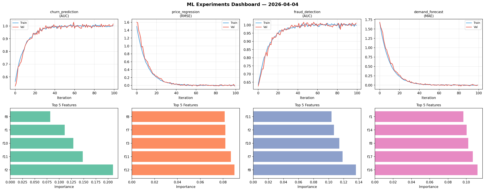
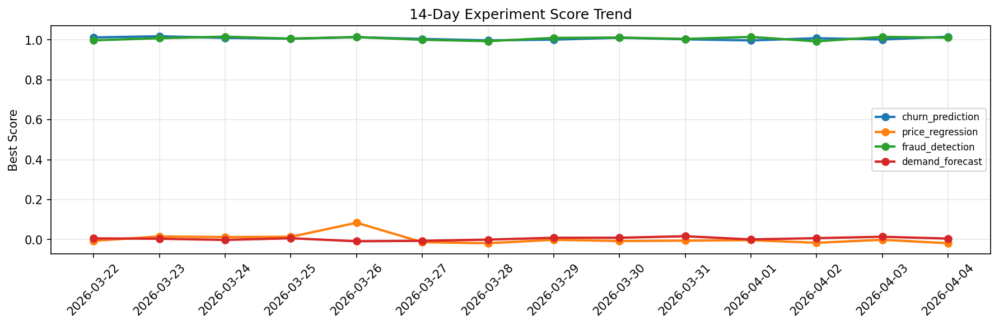

# ML Experiments Report — 2026-04-04

**Run ID:** `264f104481` | **Experiments:** 4 | **Trials:** 16

## Delta vs Yesterday

| Experiment | Today | Yesterday | Change |
|-----------|-------|-----------|--------|
| churn_prediction | 1.016 | 1.0023 | 📈 1.4% |
| price_regression | -0.0186 | -0.0012 | 📉 -1450.0% |
| fraud_detection | 1.0116 | 1.0155 | 📉 -0.4% |
| demand_forecast | 0.0048 | 0.014 | 📉 -65.7% |

## churn_prediction (AUC)

**Best Score:** 1.016 (Trial 1)

| Trial | Score | Overfit Gap | Time | LR | Trees | Leaves |
|-------|-------|-------------|------|-----|-------|--------|
| 1 ⭐ | 1.016 | 0.0132 | 8.74s | 0.2 | 200 | 127 |
| 2 | 0.9942 | 0.0151 | 20.31s | 0.2 | 100 | 15 |
| 3 | 1.0082 | 0.0227 | 0.53s | 0.1 | 100 | 127 |
| 4 | 0.7412 | 0.0361 | 275.14s | 0.01 | 1000 | 127 |
| 5 | 0.7952 | 0.0003 | 52.79s | 0.01 | 500 | 31 |
| 6 | 0.9793 | 0.0212 | 4.69s | 0.1 | 200 | 127 |

## price_regression (RMSE)

**Best Score:** -0.0186 (Trial 3)

| Trial | Score | Overfit Gap | Time | LR | Trees | Leaves |
|-------|-------|-------------|------|-----|-------|--------|
| 1 | 0.0189 | 0.0153 | 124.07s | 0.2 | 500 | 15 |
| 2 | 0.1788 | 0.0326 | 9.7s | 0.05 | 100 | 127 |
| 3 ⭐ | -0.0186 | 0.0174 | 7.58s | 0.2 | 200 | 63 |
| 4 | 0.1372 | 0.0361 | 14.31s | 0.05 | 100 | 63 |

## fraud_detection (AUC)

**Best Score:** 1.0116 (Trial 1)

| Trial | Score | Overfit Gap | Time | LR | Trees | Leaves |
|-------|-------|-------------|------|-----|-------|--------|
| 1 ⭐ | 1.0116 | 0.0144 | 46.85s | 0.2 | 200 | 15 |
| 2 | 0.8044 | 0.0003 | 80.41s | 0.01 | 500 | 15 |
| 3 | 1.0038 | 0.0087 | 16.38s | 0.1 | 500 | 63 |

## demand_forecast (MAE)

**Best Score:** 0.0048 (Trial 3)

| Trial | Score | Overfit Gap | Time | LR | Trees | Leaves |
|-------|-------|-------------|------|-----|-------|--------|
| 1 | 0.1763 | 0.0444 | 195.24s | 0.05 | 1000 | 127 |
| 2 | 0.0102 | 0.0158 | 123.07s | 0.2 | 1000 | 15 |
| 3 ⭐ | 0.0048 | 0.0079 | 54.14s | 0.2 | 500 | 63 |
