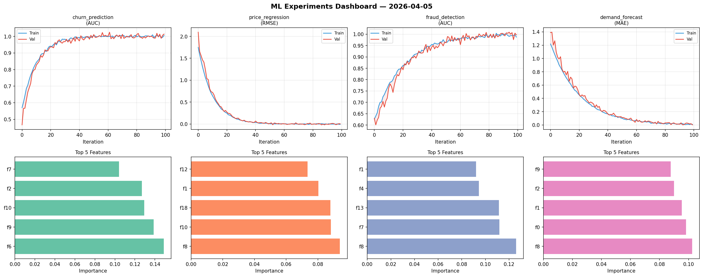
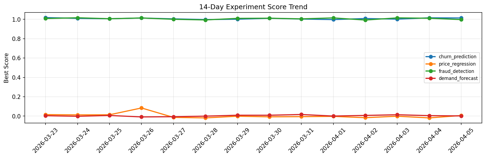

# ML Experiments Report — 2026-04-05

**Run ID:** `a2f84ca609` | **Experiments:** 4 | **Trials:** 19

## Delta vs Yesterday

| Experiment | Today | Yesterday | Change |
|-----------|-------|-----------|--------|
| churn_prediction | 1.0143 | 1.016 | 📉 -0.2% |
| price_regression | 0.006 | -0.0186 | 📈 132.3% |
| fraud_detection | 0.9976 | 1.0116 | 📉 -1.4% |
| demand_forecast | 0.0019 | 0.0048 | 📉 -60.4% |

## churn_prediction (AUC)

**Best Score:** 1.0143 (Trial 5)

| Trial | Score | Overfit Gap | Time | LR | Trees | Leaves |
|-------|-------|-------------|------|-----|-------|--------|
| 1 | 1.0045 | 0.0024 | 77.12s | 0.2 | 500 | 63 |
| 2 | 0.9927 | 0.0037 | 21.11s | 0.2 | 100 | 63 |
| 3 | 0.9855 | 0.0165 | 67.86s | 0.2 | 1000 | 15 |
| 4 | 0.9999 | 0.008 | 11.99s | 0.2 | 100 | 31 |
| 5 ⭐ | 1.0143 | 0.0086 | 34.3s | 0.2 | 200 | 15 |

## price_regression (RMSE)

**Best Score:** 0.006 (Trial 1)

| Trial | Score | Overfit Gap | Time | LR | Trees | Leaves |
|-------|-------|-------------|------|-----|-------|--------|
| 1 ⭐ | 0.006 | 0.0146 | 10.61s | 0.2 | 100 | 31 |
| 2 | 0.0991 | 0.0068 | 55.61s | 0.05 | 200 | 127 |
| 3 | 0.118 | 0.0109 | 39.95s | 0.05 | 500 | 31 |

## fraud_detection (AUC)

**Best Score:** 0.9976 (Trial 1)

| Trial | Score | Overfit Gap | Time | LR | Trees | Leaves |
|-------|-------|-------------|------|-----|-------|--------|
| 1 ⭐ | 0.9976 | 0.0105 | 214.6s | 0.1 | 1000 | 31 |
| 2 | 0.6499 | 0.0322 | 35.26s | 0.01 | 200 | 31 |
| 3 | 0.9934 | 0.0045 | 267.22s | 0.1 | 1000 | 63 |
| 4 | 0.6954 | 0.0023 | 25.83s | 0.01 | 100 | 15 |
| 5 | 0.9657 | 0.0019 | 15.62s | 0.05 | 100 | 31 |

## demand_forecast (MAE)

**Best Score:** 0.0019 (Trial 1)

| Trial | Score | Overfit Gap | Time | LR | Trees | Leaves |
|-------|-------|-------------|------|-----|-------|--------|
| 1 ⭐ | 0.0019 | 0.0076 | 51.39s | 0.1 | 1000 | 31 |
| 2 | 0.1105 | 0.0063 | 10.9s | 0.05 | 500 | 15 |
| 3 | 0.0094 | 0.0141 | 4.72s | 0.2 | 100 | 31 |
| 4 | 0.0489 | 0.009 | 12.56s | 0.05 | 100 | 31 |
| 5 | 0.0223 | 0.0088 | 63.7s | 0.1 | 1000 | 31 |
| 6 | 0.1727 | 0.0119 | 17.98s | 0.05 | 100 | 127 |
