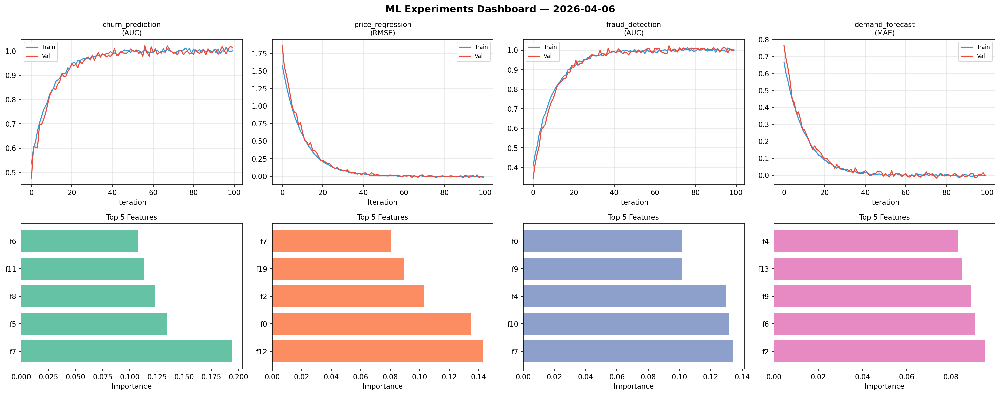
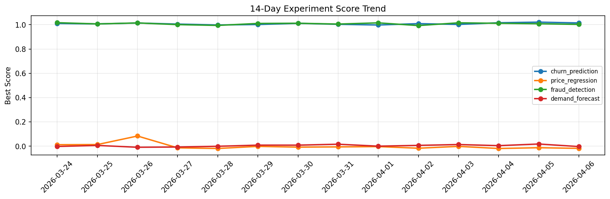

# ML Experiments Report — 2026-04-06

**Run ID:** `5b815fb8a0` | **Experiments:** 4 | **Trials:** 18

## Delta vs Yesterday

| Experiment | Today | Yesterday | Change |
|-----------|-------|-----------|--------|
| churn_prediction | 1.0145 | 1.0212 | 📉 -0.7% |
| price_regression | -0.0176 | -0.0122 | 📉 -44.3% |
| fraud_detection | 1.0025 | 1.0079 | 📉 -0.5% |
| demand_forecast | -0.0027 | 0.0183 | 📉 -114.8% |

## churn_prediction (AUC)

**Best Score:** 1.0145 (Trial 3)

| Trial | Score | Overfit Gap | Time | LR | Trees | Leaves |
|-------|-------|-------------|------|-----|-------|--------|
| 1 | 0.7894 | 0.0149 | 229.61s | 0.01 | 1000 | 31 |
| 2 | 0.7303 | 0.0585 | 120.91s | 0.01 | 1000 | 127 |
| 3 ⭐ | 1.0145 | 0.0144 | 23.16s | 0.2 | 100 | 127 |
| 4 | 0.967 | 0.0024 | 14.52s | 0.05 | 100 | 31 |

## price_regression (RMSE)

**Best Score:** -0.0176 (Trial 2)

| Trial | Score | Overfit Gap | Time | LR | Trees | Leaves |
|-------|-------|-------------|------|-----|-------|--------|
| 1 | 0.0236 | 0.0204 | 101.13s | 0.1 | 500 | 63 |
| 2 ⭐ | -0.0176 | 0.0194 | 127.81s | 0.2 | 1000 | 127 |
| 3 | 0.0025 | 0.0091 | 24.76s | 0.1 | 100 | 15 |
| 4 | -0.0119 | 0.0124 | 4.34s | 0.2 | 500 | 127 |

## fraud_detection (AUC)

**Best Score:** 1.0025 (Trial 5)

| Trial | Score | Overfit Gap | Time | LR | Trees | Leaves |
|-------|-------|-------------|------|-----|-------|--------|
| 1 | 1.0003 | 0.0042 | 12.06s | 0.2 | 200 | 15 |
| 2 | 0.9939 | 0.0051 | 161.65s | 0.1 | 1000 | 15 |
| 3 | 0.9852 | 0.0014 | 50.65s | 0.1 | 500 | 63 |
| 4 | 0.975 | 0.018 | 27.96s | 0.05 | 100 | 63 |
| 5 ⭐ | 1.0025 | 0.0037 | 268.84s | 0.2 | 1000 | 127 |
| 6 | 0.6355 | 0.0557 | 146.74s | 0.01 | 500 | 63 |

## demand_forecast (MAE)

**Best Score:** -0.0027 (Trial 4)

| Trial | Score | Overfit Gap | Time | LR | Trees | Leaves |
|-------|-------|-------------|------|-----|-------|--------|
| 1 | 0.0797 | 0.0115 | 16.77s | 0.05 | 100 | 63 |
| 2 | 0.9899 | 0.0649 | 70.25s | 0.01 | 500 | 15 |
| 3 | 0.7318 | 0.1024 | 14.09s | 0.01 | 200 | 31 |
| 4 ⭐ | -0.0027 | 0.0024 | 28.37s | 0.2 | 200 | 127 |
