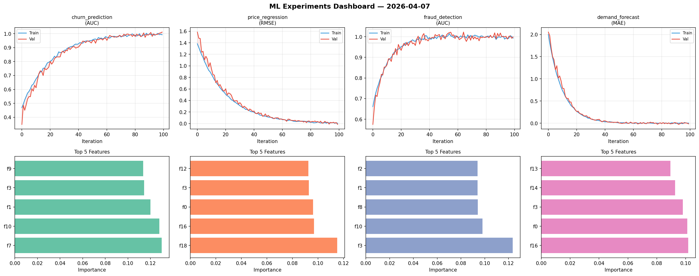
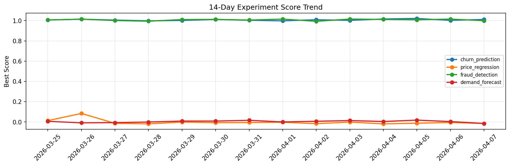

# ML Experiments Report — 2026-04-07

**Run ID:** `5c4a38d6b9` | **Experiments:** 4 | **Trials:** 15

## Delta vs Yesterday

| Experiment | Today | Yesterday | Change |
|-----------|-------|-----------|--------|
| churn_prediction | 1.0115 | 1.0022 | 📈 0.9% |
| price_regression | -0.0147 | -0.0051 | 📉 -188.2% |
| fraud_detection | 0.999 | 1.0151 | 📉 -1.6% |
| demand_forecast | -0.0146 | 0.0042 | 📉 -447.6% |

## churn_prediction (AUC)

**Best Score:** 1.0115 (Trial 1)

| Trial | Score | Overfit Gap | Time | LR | Trees | Leaves |
|-------|-------|-------------|------|-----|-------|--------|
| 1 ⭐ | 1.0115 | 0.0191 | 23.95s | 0.1 | 100 | 31 |
| 2 | 0.9896 | 0.0126 | 46.13s | 0.2 | 1000 | 127 |
| 3 | 0.9839 | 0.008 | 23.34s | 0.1 | 100 | 31 |
| 4 | 0.7432 | 0.034 | 284.65s | 0.01 | 1000 | 31 |

## price_regression (RMSE)

**Best Score:** -0.0147 (Trial 5)

| Trial | Score | Overfit Gap | Time | LR | Trees | Leaves |
|-------|-------|-------------|------|-----|-------|--------|
| 1 | 0.5833 | 0.0323 | 16.43s | 0.01 | 200 | 63 |
| 2 | -0.0082 | 0.0266 | 17.23s | 0.1 | 100 | 31 |
| 3 | 0.0029 | 0.0064 | 18.93s | 0.2 | 1000 | 127 |
| 4 | 0.0088 | 0.0127 | 41.0s | 0.2 | 500 | 127 |
| 5 ⭐ | -0.0147 | 0.0211 | 272.86s | 0.1 | 1000 | 63 |

## fraud_detection (AUC)

**Best Score:** 0.999 (Trial 2)

| Trial | Score | Overfit Gap | Time | LR | Trees | Leaves |
|-------|-------|-------------|------|-----|-------|--------|
| 1 | 0.7126 | 0.0062 | 26.81s | 0.01 | 500 | 15 |
| 2 ⭐ | 0.999 | 0.0059 | 145.21s | 0.2 | 500 | 63 |
| 3 | 0.9581 | 0.0088 | 10.07s | 0.05 | 200 | 63 |

## demand_forecast (MAE)

**Best Score:** -0.0146 (Trial 1)

| Trial | Score | Overfit Gap | Time | LR | Trees | Leaves |
|-------|-------|-------------|------|-----|-------|--------|
| 1 ⭐ | -0.0146 | 0.0181 | 11.61s | 0.2 | 200 | 31 |
| 2 | 0.8713 | 0.1184 | 1.69s | 0.01 | 100 | 63 |
| 3 | 0.1413 | 0.0067 | 6.66s | 0.05 | 100 | 63 |
