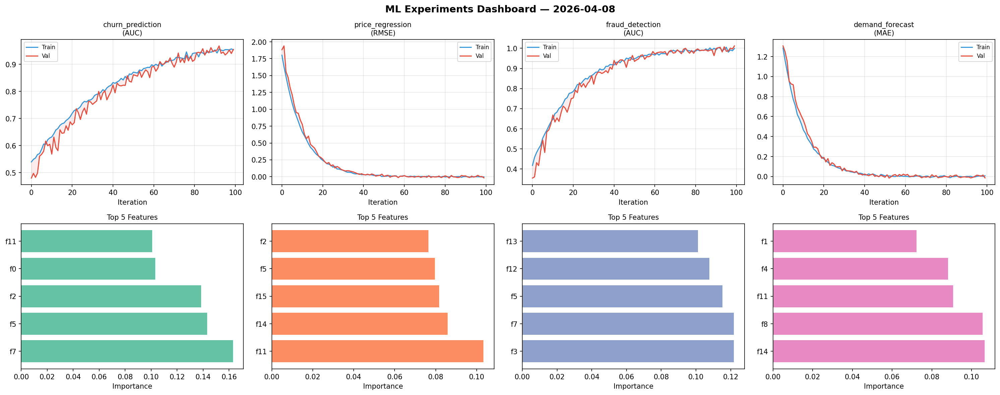
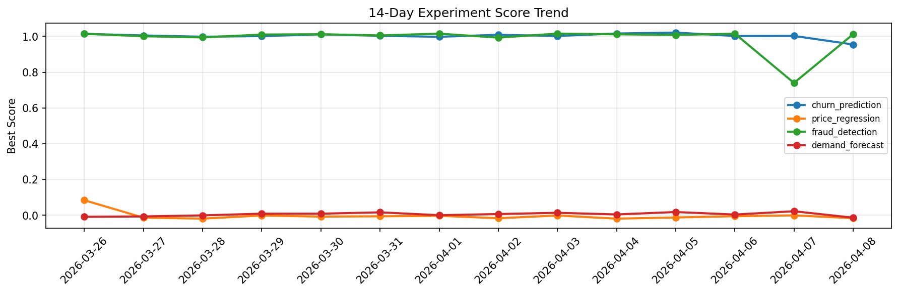

# ML Experiments Report — 2026-04-08

**Run ID:** `57cfe9b1e3` | **Experiments:** 4 | **Trials:** 22

## Delta vs Yesterday

| Experiment | Today | Yesterday | Change |
|-----------|-------|-----------|--------|
| churn_prediction | 0.9547 | 1.0025 | 📉 -4.8% |
| price_regression | -0.0162 | -0.0004 | 📉 -1580.0% |
| fraud_detection | 1.012 | 0.7397 | 📈 36.8% |
| demand_forecast | -0.0134 | 0.0227 | 📉 -159.0% |

## churn_prediction (AUC)

**Best Score:** 0.9547 (Trial 4)

| Trial | Score | Overfit Gap | Time | LR | Trees | Leaves |
|-------|-------|-------------|------|-----|-------|--------|
| 1 | 0.6866 | 0.0203 | 90.8s | 0.01 | 1000 | 63 |
| 2 | 0.751 | 0.0006 | 22.25s | 0.01 | 500 | 63 |
| 3 | 0.5629 | 0.0771 | 21.14s | 0.01 | 100 | 63 |
| 4 ⭐ | 0.9547 | 0.0014 | 43.0s | 0.05 | 500 | 63 |

## price_regression (RMSE)

**Best Score:** -0.0162 (Trial 6)

| Trial | Score | Overfit Gap | Time | LR | Trees | Leaves |
|-------|-------|-------------|------|-----|-------|--------|
| 1 | 0.0023 | 0.0077 | 23.25s | 0.1 | 200 | 15 |
| 2 | 0.0025 | 0.0074 | 78.56s | 0.2 | 1000 | 15 |
| 3 | 0.0157 | 0.0014 | 87.34s | 0.1 | 1000 | 127 |
| 4 | 0.0645 | 0.0008 | 10.41s | 0.05 | 100 | 15 |
| 5 | 0.1436 | 0.026 | 59.31s | 0.05 | 200 | 31 |
| 6 ⭐ | -0.0162 | 0.0144 | 106.84s | 0.2 | 500 | 31 |

## fraud_detection (AUC)

**Best Score:** 1.012 (Trial 3)

| Trial | Score | Overfit Gap | Time | LR | Trees | Leaves |
|-------|-------|-------------|------|-----|-------|--------|
| 1 | 0.9705 | 0.0084 | 18.78s | 0.05 | 100 | 127 |
| 2 | 1.0077 | 0.0005 | 59.31s | 0.2 | 200 | 15 |
| 3 ⭐ | 1.012 | 0.0128 | 276.48s | 0.1 | 1000 | 31 |
| 4 | 0.9369 | 0.013 | 260.8s | 0.05 | 1000 | 63 |
| 5 | 0.9952 | 0.006 | 9.92s | 0.2 | 100 | 31 |
| 6 | 0.9983 | 0.0061 | 25.59s | 0.1 | 100 | 127 |

## demand_forecast (MAE)

**Best Score:** -0.0134 (Trial 5)

| Trial | Score | Overfit Gap | Time | LR | Trees | Leaves |
|-------|-------|-------------|------|-----|-------|--------|
| 1 | 1.0327 | 0.1012 | 17.86s | 0.01 | 100 | 63 |
| 2 | 0.3861 | 0.051 | 117.8s | 0.01 | 500 | 63 |
| 3 | 0.0127 | 0.0036 | 45.39s | 0.1 | 200 | 31 |
| 4 | 0.0184 | 0.0085 | 4.71s | 0.1 | 100 | 31 |
| 5 ⭐ | -0.0134 | 0.0212 | 283.95s | 0.2 | 1000 | 127 |
| 6 | 0.0662 | 0.0053 | 22.41s | 0.05 | 1000 | 15 |
