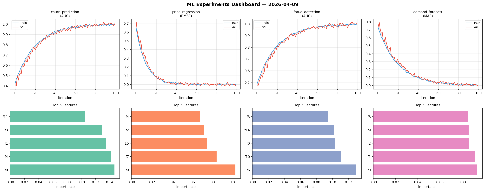
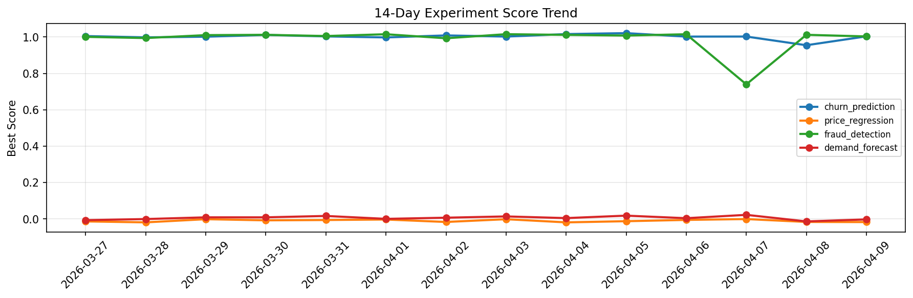

# ML Experiments Report — 2026-04-09

**Run ID:** `328b791f1b` | **Experiments:** 4 | **Trials:** 17

## Delta vs Yesterday

| Experiment | Today | Yesterday | Change |
|-----------|-------|-----------|--------|
| churn_prediction | 1.0035 | 0.9547 | 📈 5.1% |
| price_regression | -0.0169 | -0.0162 | 📉 -4.3% |
| fraud_detection | 1.0031 | 1.012 | 📉 -0.9% |
| demand_forecast | -0.0023 | -0.0134 | 📈 82.8% |

## churn_prediction (AUC)

**Best Score:** 1.0035 (Trial 5)

| Trial | Score | Overfit Gap | Time | LR | Trees | Leaves |
|-------|-------|-------------|------|-----|-------|--------|
| 1 | 0.9943 | 0.0047 | 220.03s | 0.1 | 1000 | 63 |
| 2 | 0.5859 | 0.081 | 22.24s | 0.01 | 500 | 15 |
| 3 | 0.9828 | 0.0126 | 10.66s | 0.1 | 1000 | 63 |
| 4 | 0.9945 | 0.009 | 47.7s | 0.2 | 500 | 127 |
| 5 ⭐ | 1.0035 | 0.0115 | 45.51s | 0.1 | 1000 | 63 |

## price_regression (RMSE)

**Best Score:** -0.0169 (Trial 2)

| Trial | Score | Overfit Gap | Time | LR | Trees | Leaves |
|-------|-------|-------------|------|-----|-------|--------|
| 1 | 0.5392 | 0.0059 | 98.83s | 0.01 | 500 | 15 |
| 2 ⭐ | -0.0169 | 0.0136 | 21.67s | 0.2 | 100 | 127 |
| 3 | 0.9575 | 0.0695 | 16.41s | 0.01 | 100 | 127 |
| 4 | 0.0859 | 0.0308 | 29.28s | 0.05 | 200 | 31 |
| 5 | -0.0028 | 0.0078 | 44.13s | 0.2 | 1000 | 127 |
| 6 | 0.0273 | 0.0124 | 88.5s | 0.1 | 1000 | 31 |

## fraud_detection (AUC)

**Best Score:** 1.0031 (Trial 1)

| Trial | Score | Overfit Gap | Time | LR | Trees | Leaves |
|-------|-------|-------------|------|-----|-------|--------|
| 1 ⭐ | 1.0031 | 0.0109 | 17.66s | 0.1 | 100 | 31 |
| 2 | 0.9934 | 0.0009 | 172.81s | 0.1 | 1000 | 31 |
| 3 | 0.994 | 0.0007 | 3.07s | 0.1 | 200 | 63 |

## demand_forecast (MAE)

**Best Score:** -0.0023 (Trial 3)

| Trial | Score | Overfit Gap | Time | LR | Trees | Leaves |
|-------|-------|-------------|------|-----|-------|--------|
| 1 | 0.6236 | 0.0405 | 285.07s | 0.01 | 1000 | 31 |
| 2 | 0.2012 | 0.0456 | 16.19s | 0.05 | 500 | 15 |
| 3 ⭐ | -0.0023 | 0.0073 | 40.47s | 0.1 | 1000 | 31 |
