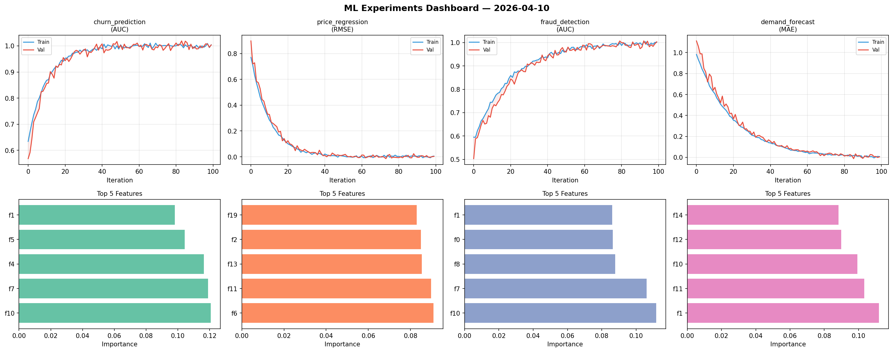
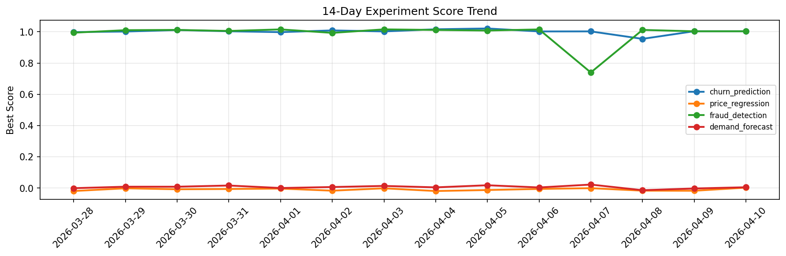

# ML Experiments Report — 2026-04-10

**Run ID:** `466be81931` | **Experiments:** 4 | **Trials:** 21

## Delta vs Yesterday

| Experiment | Today | Yesterday | Change |
|-----------|-------|-----------|--------|
| churn_prediction | 1.0035 | 1.0035 | 📉 0.0% |
| price_regression | 0.0031 | -0.0169 | 📈 118.3% |
| fraud_detection | 1.0032 | 1.0031 | 📉 0.0% |
| demand_forecast | 0.0055 | -0.0023 | 📈 339.1% |

## churn_prediction (AUC)

**Best Score:** 1.0035 (Trial 6)

| Trial | Score | Overfit Gap | Time | LR | Trees | Leaves |
|-------|-------|-------------|------|-----|-------|--------|
| 1 | 0.6311 | 0.0043 | 111.19s | 0.01 | 500 | 63 |
| 2 | 0.8055 | 0.0081 | 9.05s | 0.01 | 100 | 15 |
| 3 | 0.6669 | 0.0157 | 245.0s | 0.01 | 1000 | 15 |
| 4 | 0.6443 | 0.0398 | 40.39s | 0.01 | 1000 | 63 |
| 5 | 0.9855 | 0.0116 | 31.82s | 0.05 | 200 | 31 |
| 6 ⭐ | 1.0035 | 0.0007 | 48.95s | 0.2 | 200 | 63 |

## price_regression (RMSE)

**Best Score:** 0.0031 (Trial 2)

| Trial | Score | Overfit Gap | Time | LR | Trees | Leaves |
|-------|-------|-------------|------|-----|-------|--------|
| 1 | 0.0033 | 0.0057 | 98.61s | 0.2 | 1000 | 63 |
| 2 ⭐ | 0.0031 | 0.0021 | 65.15s | 0.2 | 1000 | 63 |
| 3 | 0.1206 | 0.0085 | 1.04s | 0.05 | 100 | 31 |
| 4 | 0.064 | 0.0094 | 7.64s | 0.05 | 100 | 127 |
| 5 | 1.0299 | 0.1636 | 11.86s | 0.01 | 200 | 127 |

## fraud_detection (AUC)

**Best Score:** 1.0032 (Trial 1)

| Trial | Score | Overfit Gap | Time | LR | Trees | Leaves |
|-------|-------|-------------|------|-----|-------|--------|
| 1 ⭐ | 1.0032 | 0.0024 | 204.22s | 0.1 | 1000 | 31 |
| 2 | 0.9483 | 0.0192 | 198.0s | 0.05 | 1000 | 31 |
| 3 | 0.9797 | 0.0186 | 253.44s | 0.1 | 1000 | 31 |
| 4 | 0.6671 | 0.0221 | 49.95s | 0.01 | 500 | 63 |
| 5 | 0.9623 | 0.0085 | 16.35s | 0.05 | 200 | 31 |

## demand_forecast (MAE)

**Best Score:** 0.0055 (Trial 3)

| Trial | Score | Overfit Gap | Time | LR | Trees | Leaves |
|-------|-------|-------------|------|-----|-------|--------|
| 1 | 0.0339 | 0.0322 | 27.9s | 0.1 | 100 | 127 |
| 2 | 0.0056 | 0.0023 | 77.7s | 0.2 | 1000 | 127 |
| 3 ⭐ | 0.0055 | 0.0016 | 295.24s | 0.1 | 1000 | 15 |
| 4 | 0.895 | 0.0659 | 69.64s | 0.01 | 500 | 31 |
| 5 | 0.0753 | 0.0051 | 171.84s | 0.05 | 1000 | 127 |
