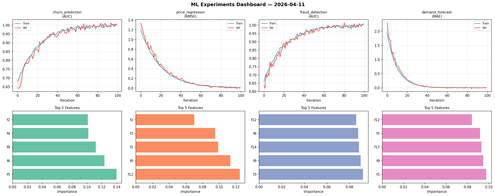
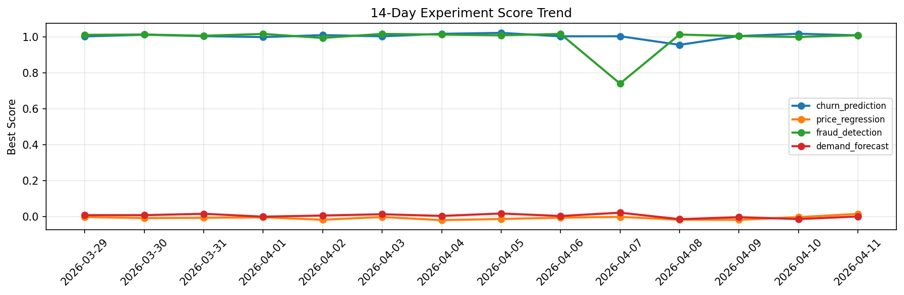

# ML Experiments Report — 2026-04-11

**Run ID:** `4111fcf5ca` | **Experiments:** 4 | **Trials:** 14

## Delta vs Yesterday

| Experiment | Today | Yesterday | Change |
|-----------|-------|-----------|--------|
| churn_prediction | 1.0072 | 1.0165 | 📉 -0.9% |
| price_regression | 0.016 | -0.002 | 📈 900.0% |
| fraud_detection | 1.0083 | 0.9984 | 📈 1.0% |
| demand_forecast | 0.0017 | -0.0127 | 📈 113.4% |

## churn_prediction (AUC)

**Best Score:** 1.0072 (Trial 1)

| Trial | Score | Overfit Gap | Time | LR | Trees | Leaves |
|-------|-------|-------------|------|-----|-------|--------|
| 1 ⭐ | 1.0072 | 0.007 | 192.56s | 0.1 | 1000 | 15 |
| 2 | 0.9923 | 0.0056 | 58.52s | 0.2 | 200 | 15 |
| 3 | 0.6335 | 0.0366 | 19.57s | 0.01 | 100 | 15 |

## price_regression (RMSE)

**Best Score:** 0.016 (Trial 1)

| Trial | Score | Overfit Gap | Time | LR | Trees | Leaves |
|-------|-------|-------------|------|-----|-------|--------|
| 1 ⭐ | 0.016 | 0.0169 | 51.37s | 0.1 | 200 | 15 |
| 2 | 0.1159 | 0.0198 | 58.39s | 0.05 | 500 | 31 |
| 3 | 0.7222 | 0.037 | 29.96s | 0.01 | 100 | 127 |

## fraud_detection (AUC)

**Best Score:** 1.0083 (Trial 1)

| Trial | Score | Overfit Gap | Time | LR | Trees | Leaves |
|-------|-------|-------------|------|-----|-------|--------|
| 1 ⭐ | 1.0083 | 0.0075 | 18.0s | 0.1 | 100 | 127 |
| 2 | 0.9732 | 0.0161 | 271.78s | 0.05 | 1000 | 127 |
| 3 | 0.7296 | 0.0541 | 137.76s | 0.01 | 1000 | 127 |

## demand_forecast (MAE)

**Best Score:** 0.0017 (Trial 4)

| Trial | Score | Overfit Gap | Time | LR | Trees | Leaves |
|-------|-------|-------------|------|-----|-------|--------|
| 1 | 1.2939 | 0.2114 | 73.43s | 0.01 | 500 | 31 |
| 2 | 0.1287 | 0.0112 | 41.92s | 0.05 | 500 | 31 |
| 3 | 0.0056 | 0.0036 | 26.55s | 0.2 | 100 | 31 |
| 4 ⭐ | 0.0017 | 0.0056 | 9.33s | 0.2 | 100 | 63 |
| 5 | 0.7764 | 0.1097 | 24.53s | 0.01 | 200 | 31 |
