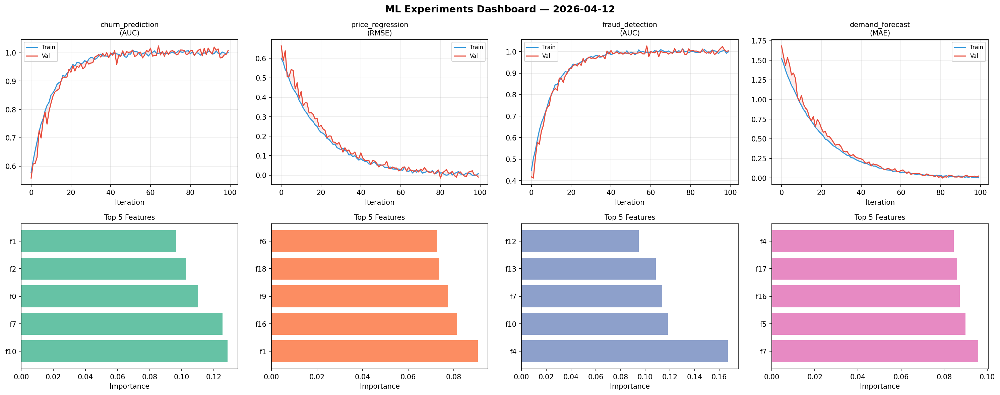
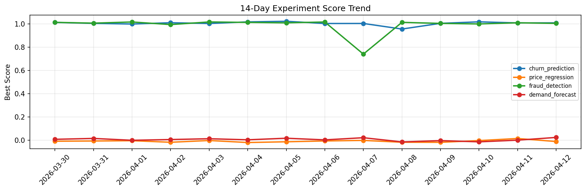

# ML Experiments Report — 2026-04-12

**Run ID:** `5a6256916c` | **Experiments:** 4 | **Trials:** 18

## Delta vs Yesterday

| Experiment | Today | Yesterday | Change |
|-----------|-------|-----------|--------|
| churn_prediction | 1.0077 | 1.0072 | 📉 0.0% |
| price_regression | -0.0101 | 0.016 | 📉 -163.1% |
| fraud_detection | 1.0033 | 1.0083 | 📉 -0.5% |
| demand_forecast | 0.0251 | 0.0017 | 📈 1376.5% |

## churn_prediction (AUC)

**Best Score:** 1.0077 (Trial 1)

| Trial | Score | Overfit Gap | Time | LR | Trees | Leaves |
|-------|-------|-------------|------|-----|-------|--------|
| 1 ⭐ | 1.0077 | 0.0066 | 247.01s | 0.2 | 1000 | 127 |
| 2 | 1.0029 | 0.0023 | 117.51s | 0.2 | 500 | 15 |
| 3 | 0.753 | 0.0215 | 41.23s | 0.01 | 1000 | 63 |
| 4 | 1.0036 | 0.0023 | 22.58s | 0.2 | 100 | 31 |
| 5 | 1.0003 | 0.011 | 56.47s | 0.1 | 200 | 15 |

## price_regression (RMSE)

**Best Score:** -0.0101 (Trial 1)

| Trial | Score | Overfit Gap | Time | LR | Trees | Leaves |
|-------|-------|-------------|------|-----|-------|--------|
| 1 ⭐ | -0.0101 | 0.0181 | 53.08s | 0.1 | 200 | 63 |
| 2 | -0.0017 | 0.0054 | 106.49s | 0.2 | 500 | 31 |
| 3 | 0.0025 | 0.0018 | 51.97s | 0.1 | 500 | 127 |
| 4 | 0.0001 | 0.008 | 11.49s | 0.2 | 100 | 127 |

## fraud_detection (AUC)

**Best Score:** 1.0033 (Trial 3)

| Trial | Score | Overfit Gap | Time | LR | Trees | Leaves |
|-------|-------|-------------|------|-----|-------|--------|
| 1 | 0.9884 | 0.0086 | 59.71s | 0.1 | 200 | 63 |
| 2 | 0.9311 | 0.0237 | 26.75s | 0.05 | 100 | 127 |
| 3 ⭐ | 1.0033 | 0.0042 | 273.14s | 0.2 | 1000 | 15 |

## demand_forecast (MAE)

**Best Score:** 0.0251 (Trial 2)

| Trial | Score | Overfit Gap | Time | LR | Trees | Leaves |
|-------|-------|-------------|------|-----|-------|--------|
| 1 | 0.7661 | 0.1032 | 82.22s | 0.01 | 1000 | 63 |
| 2 ⭐ | 0.0251 | 0.0218 | 13.75s | 0.1 | 100 | 31 |
| 3 | 0.459 | 0.0407 | 22.64s | 0.01 | 100 | 15 |
| 4 | 0.071 | 0.0019 | 41.77s | 0.05 | 200 | 127 |
| 5 | 1.0725 | 0.0555 | 102.47s | 0.01 | 500 | 15 |
| 6 | 0.1355 | 0.0051 | 86.79s | 0.05 | 500 | 31 |
