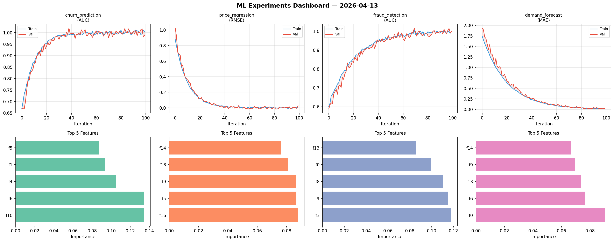
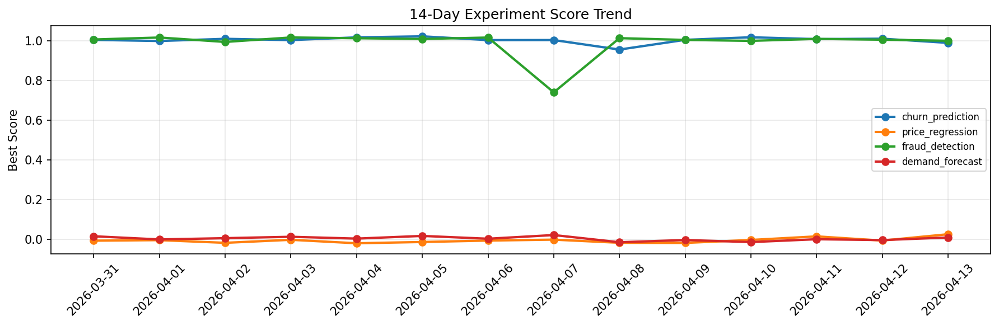

# ML Experiments Report — 2026-04-13

**Run ID:** `841fef1bb4` | **Experiments:** 4 | **Trials:** 18

## Delta vs Yesterday

| Experiment | Today | Yesterday | Change |
|-----------|-------|-----------|--------|
| churn_prediction | 0.9883 | 1.0094 | 📉 -2.1% |
| price_regression | 0.0268 | -0.0051 | 📈 625.5% |
| fraud_detection | 0.9988 | 1.0042 | 📉 -0.5% |
| demand_forecast | 0.0105 | -0.0027 | 📈 488.9% |

## churn_prediction (AUC)

**Best Score:** 0.9883 (Trial 5)

| Trial | Score | Overfit Gap | Time | LR | Trees | Leaves |
|-------|-------|-------------|------|-----|-------|--------|
| 1 | 0.9629 | 0.0026 | 28.65s | 0.05 | 100 | 127 |
| 2 | 0.968 | 0.0096 | 158.12s | 0.05 | 1000 | 63 |
| 3 | 0.9609 | 0.0194 | 12.32s | 0.05 | 200 | 31 |
| 4 | 0.9842 | 0.0186 | 255.85s | 0.1 | 1000 | 31 |
| 5 ⭐ | 0.9883 | 0.0154 | 1.89s | 0.2 | 200 | 31 |
| 6 | 0.9552 | 0.0123 | 34.35s | 0.05 | 200 | 15 |

## price_regression (RMSE)

**Best Score:** 0.0268 (Trial 3)

| Trial | Score | Overfit Gap | Time | LR | Trees | Leaves |
|-------|-------|-------------|------|-----|-------|--------|
| 1 | 0.073 | 0.0068 | 148.43s | 0.05 | 1000 | 63 |
| 2 | 0.0757 | 0.0053 | 15.63s | 0.05 | 200 | 127 |
| 3 ⭐ | 0.0268 | 0.0274 | 48.88s | 0.2 | 200 | 15 |

## fraud_detection (AUC)

**Best Score:** 0.9988 (Trial 1)

| Trial | Score | Overfit Gap | Time | LR | Trees | Leaves |
|-------|-------|-------------|------|-----|-------|--------|
| 1 ⭐ | 0.9988 | 0.0004 | 48.89s | 0.1 | 500 | 127 |
| 2 | 0.9927 | 0.0004 | 296.14s | 0.2 | 1000 | 63 |
| 3 | 0.9678 | 0.0118 | 40.0s | 0.05 | 200 | 15 |
| 4 | 0.5698 | 0.0707 | 52.77s | 0.01 | 1000 | 31 |
| 5 | 0.6072 | 0.048 | 16.11s | 0.01 | 100 | 127 |
| 6 | 0.9926 | 0.0035 | 29.38s | 0.1 | 100 | 127 |

## demand_forecast (MAE)

**Best Score:** 0.0105 (Trial 2)

| Trial | Score | Overfit Gap | Time | LR | Trees | Leaves |
|-------|-------|-------------|------|-----|-------|--------|
| 1 | 0.1227 | 0.0005 | 93.19s | 0.05 | 500 | 127 |
| 2 ⭐ | 0.0105 | 0.0 | 25.77s | 0.1 | 200 | 63 |
| 3 | 0.0183 | 0.0243 | 165.18s | 0.2 | 1000 | 127 |
