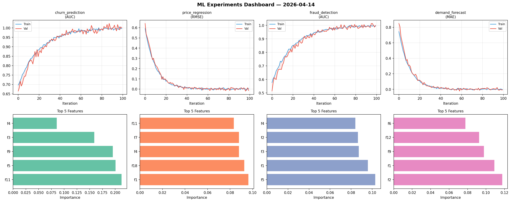
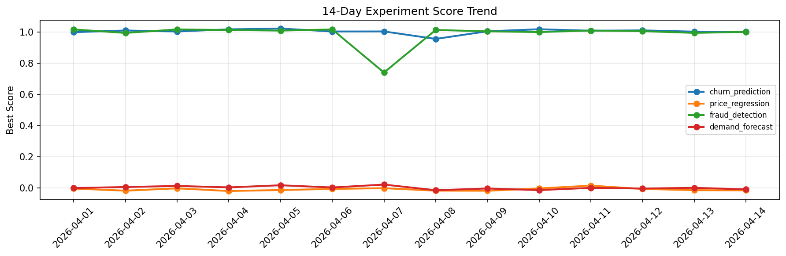

# ML Experiments Report — 2026-04-14

**Run ID:** `bdd985ce07` | **Experiments:** 4 | **Trials:** 15

## Delta vs Yesterday

| Experiment | Today | Yesterday | Change |
|-----------|-------|-----------|--------|
| churn_prediction | 1.0008 | 1.0012 | 📉 -0.0% |
| price_regression | -0.0142 | -0.0133 | 📉 -6.8% |
| fraud_detection | 0.9997 | 0.9932 | 📈 0.7% |
| demand_forecast | -0.0078 | 0.0021 | 📉 -471.4% |

## churn_prediction (AUC)

**Best Score:** 1.0008 (Trial 1)

| Trial | Score | Overfit Gap | Time | LR | Trees | Leaves |
|-------|-------|-------------|------|-----|-------|--------|
| 1 ⭐ | 1.0008 | 0.0037 | 130.62s | 0.1 | 1000 | 63 |
| 2 | 0.9519 | 0.0038 | 21.29s | 0.05 | 100 | 15 |
| 3 | 0.979 | 0.019 | 22.81s | 0.1 | 500 | 63 |
| 4 | 0.7521 | 0.012 | 5.86s | 0.01 | 200 | 31 |

## price_regression (RMSE)

**Best Score:** -0.0142 (Trial 4)

| Trial | Score | Overfit Gap | Time | LR | Trees | Leaves |
|-------|-------|-------------|------|-----|-------|--------|
| 1 | 0.0025 | 0.0088 | 129.01s | 0.2 | 500 | 127 |
| 2 | 0.0015 | 0.0008 | 43.95s | 0.2 | 200 | 127 |
| 3 | 0.4009 | 0.0666 | 86.8s | 0.01 | 1000 | 15 |
| 4 ⭐ | -0.0142 | 0.0222 | 24.88s | 0.2 | 100 | 31 |
| 5 | 0.073 | 0.01 | 90.9s | 0.05 | 500 | 15 |

## fraud_detection (AUC)

**Best Score:** 0.9997 (Trial 2)

| Trial | Score | Overfit Gap | Time | LR | Trees | Leaves |
|-------|-------|-------------|------|-----|-------|--------|
| 1 | 0.9976 | 0.0054 | 213.6s | 0.1 | 1000 | 31 |
| 2 ⭐ | 0.9997 | 0.006 | 13.76s | 0.1 | 100 | 15 |
| 3 | 0.6604 | 0.0284 | 30.59s | 0.01 | 200 | 63 |

## demand_forecast (MAE)

**Best Score:** -0.0078 (Trial 1)

| Trial | Score | Overfit Gap | Time | LR | Trees | Leaves |
|-------|-------|-------------|------|-----|-------|--------|
| 1 ⭐ | -0.0078 | 0.0044 | 2.11s | 0.2 | 200 | 63 |
| 2 | 0.0161 | 0.0006 | 2.87s | 0.1 | 100 | 127 |
| 3 | 0.023 | 0.0003 | 17.31s | 0.1 | 100 | 15 |
