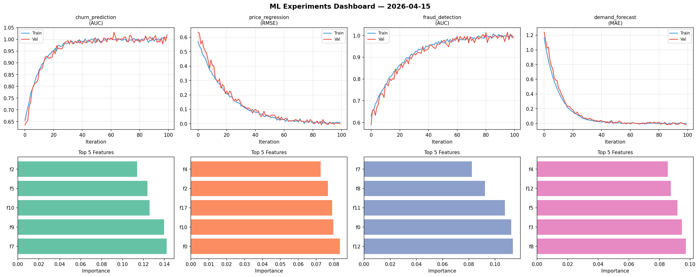
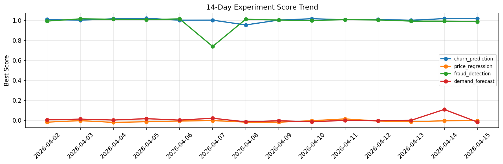

# ML Experiments Report — 2026-04-15

**Run ID:** `3c103eccf0` | **Experiments:** 4 | **Trials:** 16

## Delta vs Yesterday

| Experiment | Today | Yesterday | Change |
|-----------|-------|-----------|--------|
| churn_prediction | 1.0195 | 1.0179 | 📈 0.2% |
| price_regression | -0.0007 | -0.0025 | 📈 72.0% |
| fraud_detection | 0.9877 | 0.9924 | 📉 -0.5% |
| demand_forecast | -0.0152 | 0.1105 | 📉 -113.8% |

## churn_prediction (AUC)

**Best Score:** 1.0195 (Trial 1)

| Trial | Score | Overfit Gap | Time | LR | Trees | Leaves |
|-------|-------|-------------|------|-----|-------|--------|
| 1 ⭐ | 1.0195 | 0.0139 | 1.46s | 0.2 | 200 | 63 |
| 2 | 0.9927 | 0.0009 | 20.66s | 0.1 | 100 | 15 |
| 3 | 0.9574 | 0.0012 | 139.24s | 0.05 | 500 | 15 |
| 4 | 0.9479 | 0.0043 | 106.03s | 0.05 | 1000 | 63 |
| 5 | 0.9388 | 0.0012 | 25.88s | 0.05 | 200 | 63 |

## price_regression (RMSE)

**Best Score:** -0.0007 (Trial 4)

| Trial | Score | Overfit Gap | Time | LR | Trees | Leaves |
|-------|-------|-------------|------|-----|-------|--------|
| 1 | 0.0012 | 0.0012 | 18.31s | 0.1 | 1000 | 31 |
| 2 | 0.0508 | 0.017 | 8.03s | 0.05 | 100 | 63 |
| 3 | 0.0086 | 0.0018 | 21.57s | 0.1 | 100 | 15 |
| 4 ⭐ | -0.0007 | 0.0132 | 17.15s | 0.1 | 500 | 31 |

## fraud_detection (AUC)

**Best Score:** 0.9877 (Trial 3)

| Trial | Score | Overfit Gap | Time | LR | Trees | Leaves |
|-------|-------|-------------|------|-----|-------|--------|
| 1 | 0.7615 | 0.0212 | 27.85s | 0.01 | 100 | 63 |
| 2 | 0.9862 | 0.0119 | 129.7s | 0.2 | 1000 | 127 |
| 3 ⭐ | 0.9877 | 0.0074 | 9.66s | 0.1 | 200 | 127 |

## demand_forecast (MAE)

**Best Score:** -0.0152 (Trial 4)

| Trial | Score | Overfit Gap | Time | LR | Trees | Leaves |
|-------|-------|-------------|------|-----|-------|--------|
| 1 | 0.0982 | 0.0208 | 55.64s | 0.05 | 200 | 127 |
| 2 | 0.8328 | 0.0974 | 109.73s | 0.01 | 500 | 15 |
| 3 | 0.6375 | 0.0967 | 40.04s | 0.01 | 500 | 15 |
| 4 ⭐ | -0.0152 | 0.0189 | 219.19s | 0.2 | 1000 | 31 |
