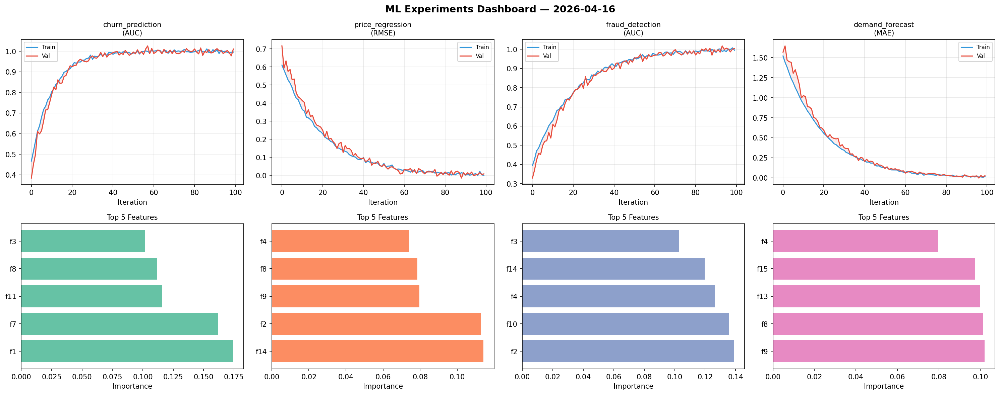
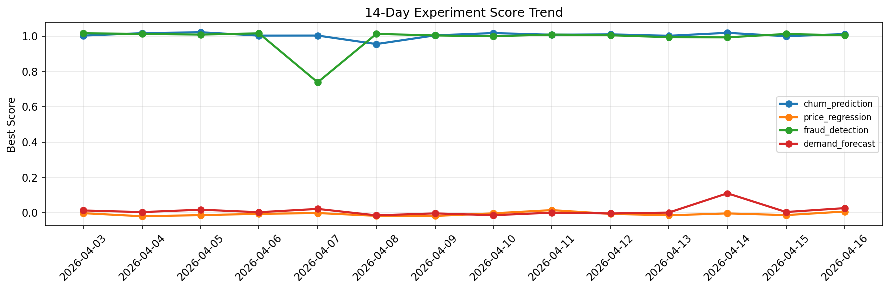

# ML Experiments Report — 2026-04-16

**Run ID:** `2faebeb3ff` | **Experiments:** 4 | **Trials:** 16

## Delta vs Yesterday

| Experiment | Today | Yesterday | Change |
|-----------|-------|-----------|--------|
| churn_prediction | 1.0111 | 0.9988 | 📈 1.2% |
| price_regression | 0.008 | -0.012 | 📈 166.7% |
| fraud_detection | 1.0038 | 1.0115 | 📉 -0.8% |
| demand_forecast | 0.0272 | 0.0053 | 📈 413.2% |

## churn_prediction (AUC)

**Best Score:** 1.0111 (Trial 3)

| Trial | Score | Overfit Gap | Time | LR | Trees | Leaves |
|-------|-------|-------------|------|-----|-------|--------|
| 1 | 0.9706 | 0.037 | 119.14s | 0.2 | 1000 | 31 |
| 2 | 0.6629 | 0.0198 | 27.63s | 0.01 | 200 | 127 |
| 3 ⭐ | 1.0111 | 0.0153 | 115.68s | 0.2 | 500 | 127 |
| 4 | 0.9815 | 0.0166 | 27.43s | 0.2 | 100 | 127 |
| 5 | 0.5981 | 0.0668 | 37.13s | 0.01 | 200 | 127 |

## price_regression (RMSE)

**Best Score:** 0.008 (Trial 1)

| Trial | Score | Overfit Gap | Time | LR | Trees | Leaves |
|-------|-------|-------------|------|-----|-------|--------|
| 1 ⭐ | 0.008 | 0.0087 | 136.72s | 0.1 | 500 | 127 |
| 2 | 0.0137 | 0.0037 | 19.13s | 0.1 | 100 | 31 |
| 3 | 0.159 | 0.0257 | 43.84s | 0.05 | 500 | 31 |

## fraud_detection (AUC)

**Best Score:** 1.0038 (Trial 3)

| Trial | Score | Overfit Gap | Time | LR | Trees | Leaves |
|-------|-------|-------------|------|-----|-------|--------|
| 1 | 0.997 | 0.0037 | 6.02s | 0.2 | 100 | 127 |
| 2 | 0.9737 | 0.0123 | 194.94s | 0.05 | 1000 | 31 |
| 3 ⭐ | 1.0038 | 0.0087 | 109.78s | 0.1 | 500 | 15 |
| 4 | 0.6571 | 0.0512 | 9.26s | 0.01 | 200 | 63 |
| 5 | 0.7312 | 0.0038 | 2.09s | 0.01 | 100 | 127 |

## demand_forecast (MAE)

**Best Score:** 0.0272 (Trial 3)

| Trial | Score | Overfit Gap | Time | LR | Trees | Leaves |
|-------|-------|-------------|------|-----|-------|--------|
| 1 | 0.038 | 0.0066 | 47.1s | 0.05 | 500 | 31 |
| 2 | 0.6889 | 0.0372 | 24.45s | 0.01 | 100 | 127 |
| 3 ⭐ | 0.0272 | 0.0093 | 26.51s | 0.1 | 100 | 63 |
