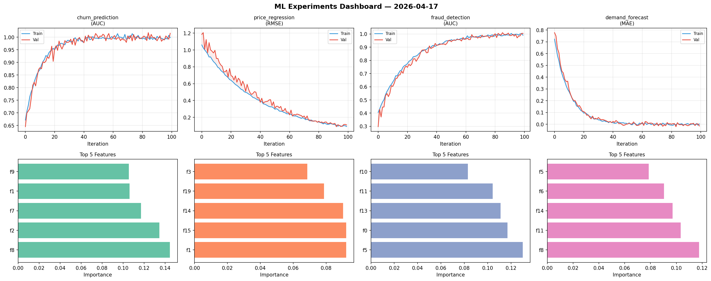
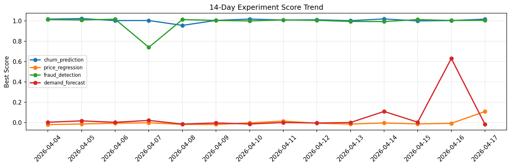

# ML Experiments Report — 2026-04-17

**Run ID:** `7698ed7fea` | **Experiments:** 4 | **Trials:** 19

## Delta vs Yesterday

| Experiment | Today | Yesterday | Change |
|-----------|-------|-----------|--------|
| churn_prediction | 1.0157 | 1.0021 | 📈 1.4% |
| price_regression | 0.1096 | -0.006 | 📈 1926.7% |
| fraud_detection | 1.0044 | 1.003 | 📈 0.1% |
| demand_forecast | -0.0147 | 0.63 | 📉 -102.3% |

## churn_prediction (AUC)

**Best Score:** 1.0157 (Trial 2)

| Trial | Score | Overfit Gap | Time | LR | Trees | Leaves |
|-------|-------|-------------|------|-----|-------|--------|
| 1 | 0.7633 | 0.0185 | 20.46s | 0.01 | 100 | 15 |
| 2 ⭐ | 1.0157 | 0.0178 | 140.57s | 0.2 | 500 | 63 |
| 3 | 1.0145 | 0.0161 | 6.07s | 0.2 | 100 | 31 |

## price_regression (RMSE)

**Best Score:** 0.1096 (Trial 4)

| Trial | Score | Overfit Gap | Time | LR | Trees | Leaves |
|-------|-------|-------------|------|-----|-------|--------|
| 1 | 0.9586 | 0.0539 | 2.11s | 0.01 | 100 | 63 |
| 2 | 1.129 | 0.1424 | 28.82s | 0.01 | 500 | 31 |
| 3 | 0.1453 | 0.0308 | 159.55s | 0.05 | 1000 | 127 |
| 4 ⭐ | 0.1096 | 0.0189 | 7.2s | 0.05 | 200 | 127 |
| 5 | 0.1115 | 0.0022 | 169.68s | 0.05 | 1000 | 63 |

## fraud_detection (AUC)

**Best Score:** 1.0044 (Trial 1)

| Trial | Score | Overfit Gap | Time | LR | Trees | Leaves |
|-------|-------|-------------|------|-----|-------|--------|
| 1 ⭐ | 1.0044 | 0.0141 | 110.47s | 0.1 | 500 | 15 |
| 2 | 0.9773 | 0.0198 | 78.33s | 0.2 | 500 | 15 |
| 3 | 0.9928 | 0.0021 | 7.32s | 0.2 | 100 | 63 |
| 4 | 0.9879 | 0.0069 | 12.21s | 0.1 | 1000 | 127 |
| 5 | 0.9976 | 0.0011 | 9.23s | 0.2 | 100 | 63 |

## demand_forecast (MAE)

**Best Score:** -0.0147 (Trial 5)

| Trial | Score | Overfit Gap | Time | LR | Trees | Leaves |
|-------|-------|-------------|------|-----|-------|--------|
| 1 | 0.1584 | 0.0188 | 26.82s | 0.05 | 500 | 127 |
| 2 | -0.0131 | 0.0176 | 254.93s | 0.1 | 1000 | 127 |
| 3 | 1.1406 | 0.0335 | 28.8s | 0.01 | 500 | 127 |
| 4 | 0.0841 | 0.0008 | 22.59s | 0.05 | 100 | 15 |
| 5 ⭐ | -0.0147 | 0.0171 | 4.2s | 0.2 | 100 | 31 |
| 6 | 0.008 | 0.0093 | 47.84s | 0.2 | 200 | 63 |
