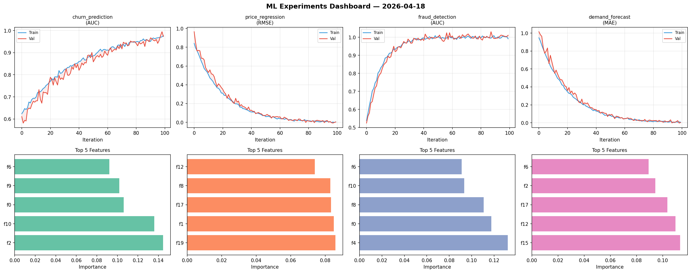
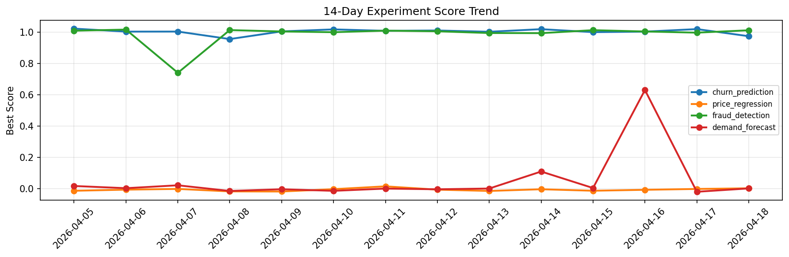

# ML Experiments Report — 2026-04-18

**Run ID:** `10a4e75b59` | **Experiments:** 4 | **Trials:** 15

## Delta vs Yesterday

| Experiment | Today | Yesterday | Change |
|-----------|-------|-----------|--------|
| churn_prediction | 0.973 | 1.0183 | 📉 -4.4% |
| price_regression | 0.0035 | -0.0006 | 📈 410.0% |
| fraud_detection | 1.0107 | 0.9956 | 📈 1.5% |
| demand_forecast | 0.0028 | -0.0186 | 📈 115.1% |

## churn_prediction (AUC)

**Best Score:** 0.973 (Trial 3)

| Trial | Score | Overfit Gap | Time | LR | Trees | Leaves |
|-------|-------|-------------|------|-----|-------|--------|
| 1 | 0.799 | 0.0127 | 33.54s | 0.01 | 200 | 15 |
| 2 | 0.9639 | 0.0014 | 82.5s | 0.05 | 500 | 127 |
| 3 ⭐ | 0.973 | 0.0037 | 21.82s | 0.05 | 100 | 15 |
| 4 | 0.6578 | 0.0374 | 59.01s | 0.01 | 500 | 15 |

## price_regression (RMSE)

**Best Score:** 0.0035 (Trial 1)

| Trial | Score | Overfit Gap | Time | LR | Trees | Leaves |
|-------|-------|-------------|------|-----|-------|--------|
| 1 ⭐ | 0.0035 | 0.0013 | 9.26s | 0.1 | 1000 | 31 |
| 2 | 0.4879 | 0.0132 | 10.42s | 0.01 | 500 | 127 |
| 3 | 0.1753 | 0.0141 | 115.2s | 0.05 | 500 | 31 |

## fraud_detection (AUC)

**Best Score:** 1.0107 (Trial 3)

| Trial | Score | Overfit Gap | Time | LR | Trees | Leaves |
|-------|-------|-------------|------|-----|-------|--------|
| 1 | 0.6452 | 0.0653 | 22.66s | 0.01 | 100 | 63 |
| 2 | 0.9715 | 0.0087 | 26.69s | 0.05 | 200 | 63 |
| 3 ⭐ | 1.0107 | 0.0194 | 36.25s | 0.2 | 200 | 127 |

## demand_forecast (MAE)

**Best Score:** 0.0028 (Trial 3)

| Trial | Score | Overfit Gap | Time | LR | Trees | Leaves |
|-------|-------|-------------|------|-----|-------|--------|
| 1 | 0.0033 | 0.0132 | 133.3s | 0.1 | 500 | 127 |
| 2 | 1.1173 | 0.1325 | 61.33s | 0.01 | 1000 | 15 |
| 3 ⭐ | 0.0028 | 0.0045 | 80.48s | 0.1 | 500 | 15 |
| 4 | 0.0134 | 0.0004 | 134.88s | 0.1 | 500 | 63 |
| 5 | 0.005 | 0.0031 | 42.96s | 0.1 | 200 | 63 |
