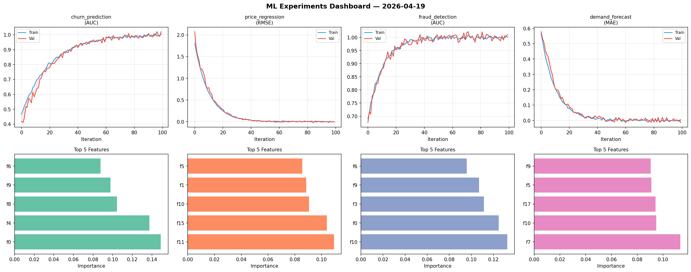
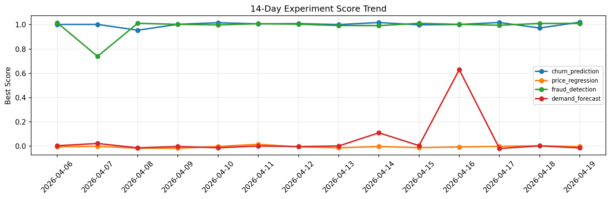

# ML Experiments Report — 2026-04-19

**Run ID:** `b8b11ae8af` | **Experiments:** 4 | **Trials:** 16

## Delta vs Yesterday

| Experiment | Today | Yesterday | Change |
|-----------|-------|-----------|--------|
| churn_prediction | 1.0209 | 0.973 | 📈 4.9% |
| price_regression | -0.003 | 0.0035 | 📉 -185.7% |
| fraud_detection | 1.0108 | 1.0107 | 📉 0.0% |
| demand_forecast | -0.014 | 0.0028 | 📉 -600.0% |

## churn_prediction (AUC)

**Best Score:** 1.0209 (Trial 2)

| Trial | Score | Overfit Gap | Time | LR | Trees | Leaves |
|-------|-------|-------------|------|-----|-------|--------|
| 1 | 1.0083 | 0.0057 | 67.25s | 0.1 | 500 | 31 |
| 2 ⭐ | 1.0209 | 0.0161 | 60.94s | 0.1 | 500 | 127 |
| 3 | 0.8054 | 0.0002 | 46.83s | 0.01 | 200 | 15 |

## price_regression (RMSE)

**Best Score:** -0.003 (Trial 3)

| Trial | Score | Overfit Gap | Time | LR | Trees | Leaves |
|-------|-------|-------------|------|-----|-------|--------|
| 1 | 0.9885 | 0.1069 | 82.15s | 0.01 | 500 | 63 |
| 2 | 0.0967 | 0.0328 | 15.23s | 0.05 | 200 | 15 |
| 3 ⭐ | -0.003 | 0.0023 | 3.19s | 0.2 | 100 | 31 |
| 4 | 0.685 | 0.1093 | 3.66s | 0.01 | 100 | 127 |
| 5 | 0.0796 | 0.0048 | 89.51s | 0.05 | 500 | 15 |
| 6 | 0.1832 | 0.0239 | 55.6s | 0.05 | 500 | 31 |

## fraud_detection (AUC)

**Best Score:** 1.0108 (Trial 3)

| Trial | Score | Overfit Gap | Time | LR | Trees | Leaves |
|-------|-------|-------------|------|-----|-------|--------|
| 1 | 0.9956 | 0.0005 | 18.08s | 0.2 | 200 | 15 |
| 2 | 0.9501 | 0.0043 | 21.74s | 0.05 | 500 | 63 |
| 3 ⭐ | 1.0108 | 0.0108 | 6.0s | 0.2 | 100 | 127 |
| 4 | 1.0016 | 0.0005 | 6.76s | 0.2 | 100 | 15 |

## demand_forecast (MAE)

**Best Score:** -0.014 (Trial 3)

| Trial | Score | Overfit Gap | Time | LR | Trees | Leaves |
|-------|-------|-------------|------|-----|-------|--------|
| 1 | 0.014 | 0.0057 | 47.2s | 0.1 | 1000 | 31 |
| 2 | 0.015 | 0.0037 | 14.63s | 0.1 | 100 | 31 |
| 3 ⭐ | -0.014 | 0.0201 | 179.07s | 0.2 | 1000 | 63 |
