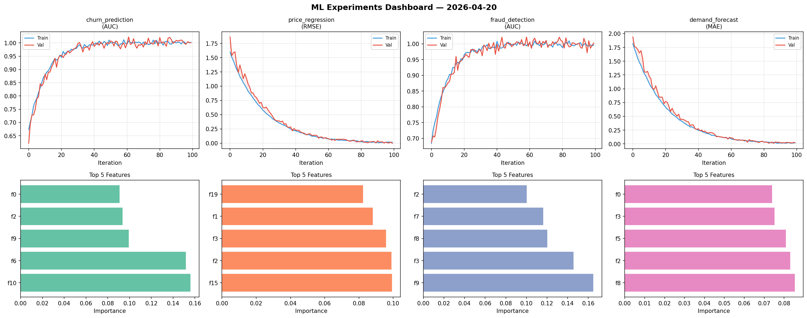
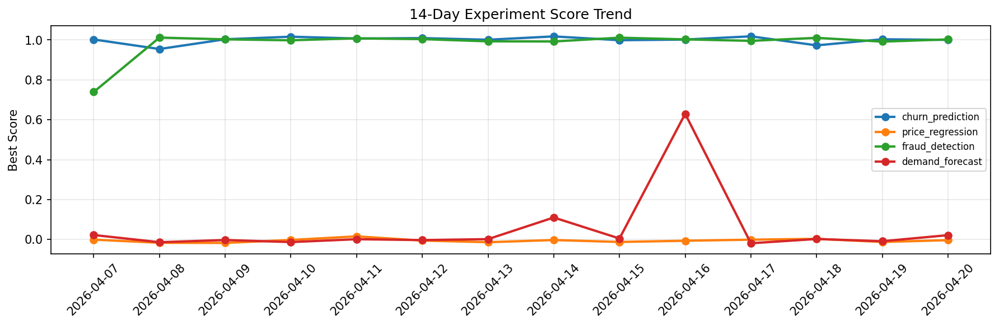

# ML Experiments Report — 2026-04-20

**Run ID:** `aa65259e4a` | **Experiments:** 4 | **Trials:** 15

## Delta vs Yesterday

| Experiment | Today | Yesterday | Change |
|-----------|-------|-----------|--------|
| churn_prediction | 1.0004 | 1.0036 | 📉 -0.3% |
| price_regression | -0.003 | -0.0122 | 📈 75.4% |
| fraud_detection | 1.0029 | 0.9917 | 📈 1.1% |
| demand_forecast | 0.022 | -0.0084 | 📈 361.9% |

## churn_prediction (AUC)

**Best Score:** 1.0004 (Trial 1)

| Trial | Score | Overfit Gap | Time | LR | Trees | Leaves |
|-------|-------|-------------|------|-----|-------|--------|
| 1 ⭐ | 1.0004 | 0.002 | 33.29s | 0.2 | 200 | 31 |
| 2 | 0.7236 | 0.0042 | 92.37s | 0.01 | 500 | 31 |
| 3 | 0.9723 | 0.0082 | 1.66s | 0.05 | 100 | 15 |

## price_regression (RMSE)

**Best Score:** -0.003 (Trial 3)

| Trial | Score | Overfit Gap | Time | LR | Trees | Leaves |
|-------|-------|-------------|------|-----|-------|--------|
| 1 | 0.6699 | 0.0731 | 18.95s | 0.01 | 200 | 63 |
| 2 | 0.1719 | 0.0268 | 14.2s | 0.05 | 200 | 63 |
| 3 ⭐ | -0.003 | 0.0181 | 219.29s | 0.1 | 1000 | 63 |

## fraud_detection (AUC)

**Best Score:** 1.0029 (Trial 3)

| Trial | Score | Overfit Gap | Time | LR | Trees | Leaves |
|-------|-------|-------------|------|-----|-------|--------|
| 1 | 0.7516 | 0.025 | 50.04s | 0.01 | 200 | 63 |
| 2 | 0.6652 | 0.0235 | 27.74s | 0.01 | 100 | 31 |
| 3 ⭐ | 1.0029 | 0.0064 | 16.31s | 0.2 | 200 | 31 |
| 4 | 0.6423 | 0.0349 | 26.42s | 0.01 | 200 | 63 |

## demand_forecast (MAE)

**Best Score:** 0.022 (Trial 4)

| Trial | Score | Overfit Gap | Time | LR | Trees | Leaves |
|-------|-------|-------------|------|-----|-------|--------|
| 1 | 0.0595 | 0.0016 | 146.63s | 0.05 | 500 | 15 |
| 2 | 0.0873 | 0.0004 | 1.83s | 0.05 | 200 | 63 |
| 3 | 0.0971 | 0.0166 | 12.19s | 0.05 | 100 | 63 |
| 4 ⭐ | 0.022 | 0.0046 | 144.33s | 0.1 | 500 | 15 |
| 5 | 0.6715 | 0.0866 | 14.11s | 0.01 | 100 | 15 |
