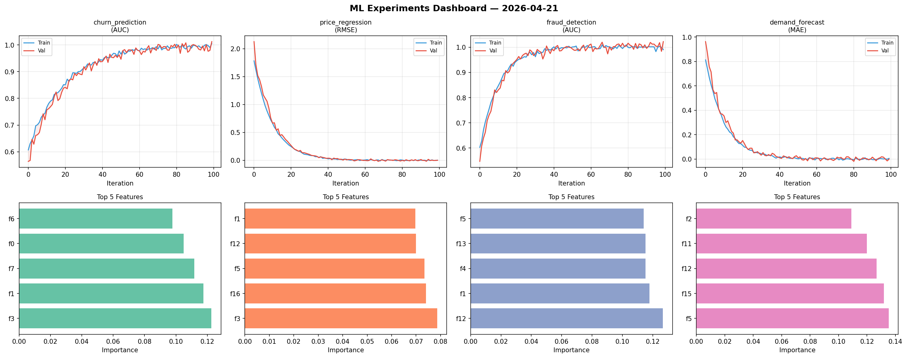
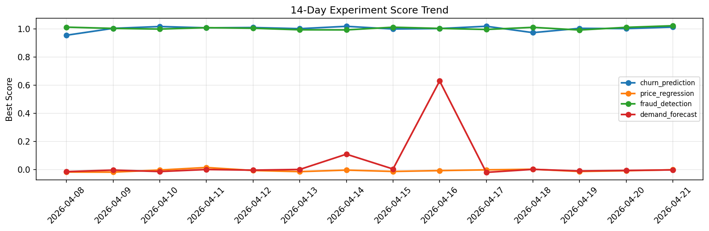

# ML Experiments Report — 2026-04-21

**Run ID:** `84727c7d55` | **Experiments:** 4 | **Trials:** 19

## Delta vs Yesterday

| Experiment | Today | Yesterday | Change |
|-----------|-------|-----------|--------|
| churn_prediction | 1.0124 | 1.0016 | 📈 1.1% |
| price_regression | -0.0001 | -0.007 | 📈 98.6% |
| fraud_detection | 1.022 | 1.0106 | 📈 1.1% |
| demand_forecast | -0.001 | -0.0049 | 📈 79.6% |

## churn_prediction (AUC)

**Best Score:** 1.0124 (Trial 4)

| Trial | Score | Overfit Gap | Time | LR | Trees | Leaves |
|-------|-------|-------------|------|-----|-------|--------|
| 1 | 0.7633 | 0.0162 | 27.21s | 0.01 | 100 | 15 |
| 2 | 0.9984 | 0.0056 | 39.3s | 0.2 | 500 | 63 |
| 3 | 0.6855 | 0.0517 | 29.2s | 0.01 | 100 | 63 |
| 4 ⭐ | 1.0124 | 0.0072 | 264.08s | 0.1 | 1000 | 31 |
| 5 | 0.9797 | 0.0109 | 28.61s | 0.05 | 500 | 15 |

## price_regression (RMSE)

**Best Score:** -0.0001 (Trial 1)

| Trial | Score | Overfit Gap | Time | LR | Trees | Leaves |
|-------|-------|-------------|------|-----|-------|--------|
| 1 ⭐ | -0.0001 | 0.0029 | 88.01s | 0.2 | 500 | 63 |
| 2 | 0.5494 | 0.0322 | 230.99s | 0.01 | 1000 | 31 |
| 3 | 0.0191 | 0.0006 | 144.59s | 0.1 | 500 | 15 |
| 4 | 0.8282 | 0.0559 | 13.61s | 0.01 | 200 | 31 |
| 5 | 1.3192 | 0.1111 | 121.23s | 0.01 | 500 | 31 |

## fraud_detection (AUC)

**Best Score:** 1.022 (Trial 3)

| Trial | Score | Overfit Gap | Time | LR | Trees | Leaves |
|-------|-------|-------------|------|-----|-------|--------|
| 1 | 0.9823 | 0.0234 | 55.17s | 0.05 | 1000 | 31 |
| 2 | 0.9295 | 0.0105 | 53.41s | 0.05 | 200 | 127 |
| 3 ⭐ | 1.022 | 0.032 | 30.97s | 0.2 | 200 | 31 |
| 4 | 0.6879 | 0.0439 | 7.34s | 0.01 | 100 | 31 |

## demand_forecast (MAE)

**Best Score:** -0.001 (Trial 5)

| Trial | Score | Overfit Gap | Time | LR | Trees | Leaves |
|-------|-------|-------------|------|-----|-------|--------|
| 1 | 1.3155 | 0.2097 | 18.78s | 0.01 | 1000 | 127 |
| 2 | 0.1132 | 0.0096 | 5.71s | 0.05 | 100 | 31 |
| 3 | 0.5015 | 0.0091 | 30.39s | 0.01 | 200 | 15 |
| 4 | 0.0716 | 0.0013 | 50.52s | 0.05 | 500 | 15 |
| 5 ⭐ | -0.001 | 0.0066 | 5.89s | 0.2 | 500 | 127 |
