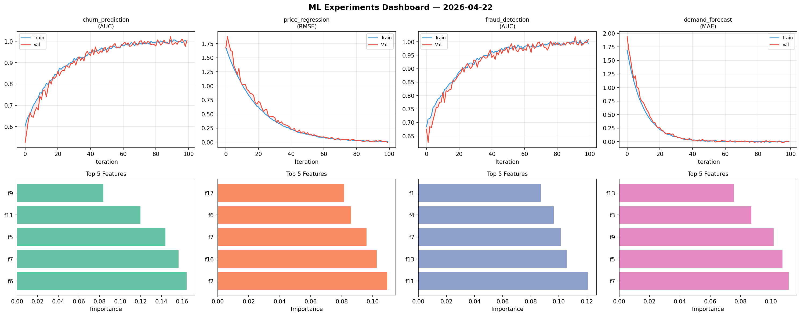
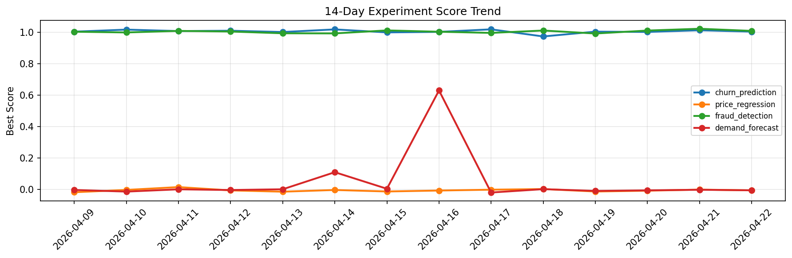

# ML Experiments Report — 2026-04-22

**Run ID:** `483689615f` | **Experiments:** 4 | **Trials:** 23

## Delta vs Yesterday

| Experiment | Today | Yesterday | Change |
|-----------|-------|-----------|--------|
| churn_prediction | 1.0036 | 1.0124 | 📉 -0.9% |
| price_regression | -0.0048 | -0.0001 | 📉 -470.0% |
| fraud_detection | 1.0084 | 1.022 | 📉 -1.3% |
| demand_forecast | -0.0045 | -0.001 | 📉 -350.0% |

## churn_prediction (AUC)

**Best Score:** 1.0036 (Trial 2)

| Trial | Score | Overfit Gap | Time | LR | Trees | Leaves |
|-------|-------|-------------|------|-----|-------|--------|
| 1 | 0.7764 | 0.0045 | 59.4s | 0.01 | 1000 | 15 |
| 2 ⭐ | 1.0036 | 0.0088 | 22.14s | 0.1 | 100 | 15 |
| 3 | 0.9516 | 0.0146 | 70.5s | 0.05 | 1000 | 63 |
| 4 | 0.9833 | 0.0171 | 80.32s | 0.2 | 1000 | 63 |
| 5 | 0.9969 | 0.0077 | 5.61s | 0.1 | 100 | 15 |

## price_regression (RMSE)

**Best Score:** -0.0048 (Trial 5)

| Trial | Score | Overfit Gap | Time | LR | Trees | Leaves |
|-------|-------|-------------|------|-----|-------|--------|
| 1 | -0.0026 | 0.004 | 21.82s | 0.2 | 100 | 63 |
| 2 | 0.4575 | 0.0162 | 94.47s | 0.01 | 500 | 127 |
| 3 | 0.0568 | 0.0025 | 150.76s | 0.05 | 1000 | 31 |
| 4 | 0.0314 | 0.0271 | 105.48s | 0.1 | 500 | 15 |
| 5 ⭐ | -0.0048 | 0.0161 | 100.43s | 0.1 | 500 | 15 |
| 6 | 0.6722 | 0.0932 | 23.02s | 0.01 | 500 | 31 |

## fraud_detection (AUC)

**Best Score:** 1.0084 (Trial 1)

| Trial | Score | Overfit Gap | Time | LR | Trees | Leaves |
|-------|-------|-------------|------|-----|-------|--------|
| 1 ⭐ | 1.0084 | 0.0151 | 14.76s | 0.1 | 100 | 15 |
| 2 | 0.9923 | 0.0016 | 26.27s | 0.1 | 500 | 127 |
| 3 | 0.994 | 0.0069 | 121.51s | 0.2 | 1000 | 15 |
| 4 | 0.964 | 0.013 | 10.38s | 0.05 | 100 | 31 |
| 5 | 0.9968 | 0.0008 | 17.54s | 0.1 | 100 | 31 |
| 6 | 0.9888 | 0.006 | 52.18s | 0.1 | 200 | 15 |

## demand_forecast (MAE)

**Best Score:** -0.0045 (Trial 2)

| Trial | Score | Overfit Gap | Time | LR | Trees | Leaves |
|-------|-------|-------------|------|-----|-------|--------|
| 1 | 0.0775 | 0.0004 | 13.99s | 0.05 | 100 | 31 |
| 2 ⭐ | -0.0045 | 0.0083 | 22.22s | 0.2 | 500 | 31 |
| 3 | 0.714 | 0.0587 | 15.45s | 0.01 | 500 | 63 |
| 4 | -0.0042 | 0.0017 | 222.31s | 0.2 | 1000 | 127 |
| 5 | 0.9083 | 0.1189 | 58.59s | 0.01 | 500 | 31 |
| 6 | 0.0134 | 0.0 | 47.46s | 0.1 | 1000 | 127 |
