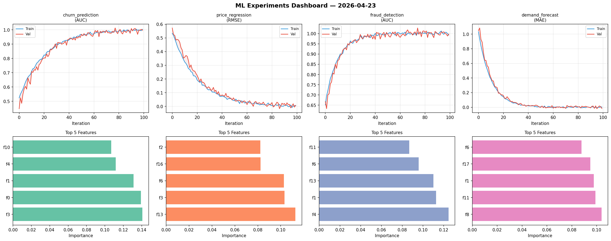
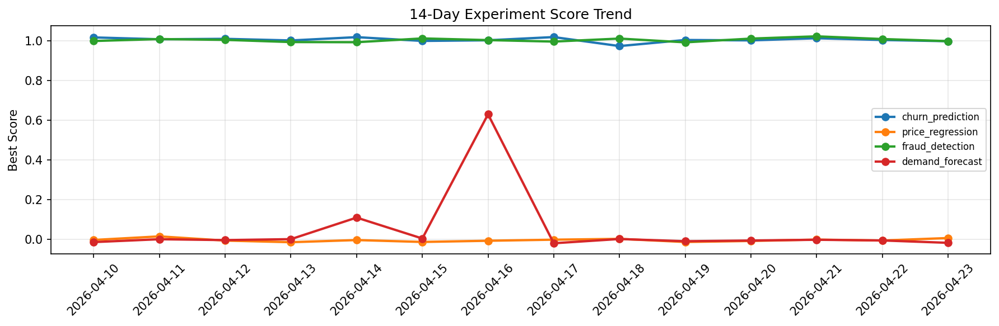

# ML Experiments Report — 2026-04-23

**Run ID:** `915cf7cc3a` | **Experiments:** 4 | **Trials:** 19

## Delta vs Yesterday

| Experiment | Today | Yesterday | Change |
|-----------|-------|-----------|--------|
| churn_prediction | 0.9974 | 1.0036 | 📉 -0.6% |
| price_regression | 0.0077 | -0.0048 | 📈 260.4% |
| fraud_detection | 0.9978 | 1.0084 | 📉 -1.1% |
| demand_forecast | -0.0164 | -0.0045 | 📉 -264.4% |

## churn_prediction (AUC)

**Best Score:** 0.9974 (Trial 5)

| Trial | Score | Overfit Gap | Time | LR | Trees | Leaves |
|-------|-------|-------------|------|-----|-------|--------|
| 1 | 0.9847 | 0.0066 | 7.36s | 0.1 | 100 | 127 |
| 2 | 0.9493 | 0.009 | 136.2s | 0.05 | 500 | 31 |
| 3 | 0.7964 | 0.0031 | 144.68s | 0.01 | 1000 | 15 |
| 4 | 0.9941 | 0.0075 | 28.53s | 0.2 | 100 | 127 |
| 5 ⭐ | 0.9974 | 0.0065 | 150.77s | 0.1 | 1000 | 127 |

## price_regression (RMSE)

**Best Score:** 0.0077 (Trial 1)

| Trial | Score | Overfit Gap | Time | LR | Trees | Leaves |
|-------|-------|-------------|------|-----|-------|--------|
| 1 ⭐ | 0.0077 | 0.0036 | 14.26s | 0.1 | 100 | 127 |
| 2 | 0.3313 | 0.022 | 7.02s | 0.01 | 100 | 31 |
| 3 | 0.4195 | 0.0519 | 74.24s | 0.01 | 500 | 63 |
| 4 | 0.0172 | 0.0111 | 25.42s | 0.2 | 100 | 127 |
| 5 | 1.0782 | 0.0354 | 40.94s | 0.01 | 200 | 127 |

## fraud_detection (AUC)

**Best Score:** 0.9978 (Trial 2)

| Trial | Score | Overfit Gap | Time | LR | Trees | Leaves |
|-------|-------|-------------|------|-----|-------|--------|
| 1 | 0.9859 | 0.0089 | 134.75s | 0.1 | 1000 | 127 |
| 2 ⭐ | 0.9978 | 0.0051 | 28.39s | 0.2 | 100 | 127 |
| 3 | 0.6319 | 0.0288 | 118.04s | 0.01 | 500 | 127 |

## demand_forecast (MAE)

**Best Score:** -0.0164 (Trial 1)

| Trial | Score | Overfit Gap | Time | LR | Trees | Leaves |
|-------|-------|-------------|------|-----|-------|--------|
| 1 ⭐ | -0.0164 | 0.0189 | 114.83s | 0.2 | 500 | 63 |
| 2 | -0.0007 | 0.0019 | 149.95s | 0.2 | 500 | 63 |
| 3 | 0.0901 | 0.0051 | 151.91s | 0.05 | 1000 | 63 |
| 4 | -0.0146 | 0.0256 | 59.93s | 0.1 | 200 | 15 |
| 5 | 0.1139 | 0.0105 | 219.79s | 0.05 | 1000 | 31 |
| 6 | 0.0082 | 0.0063 | 15.2s | 0.2 | 100 | 31 |
