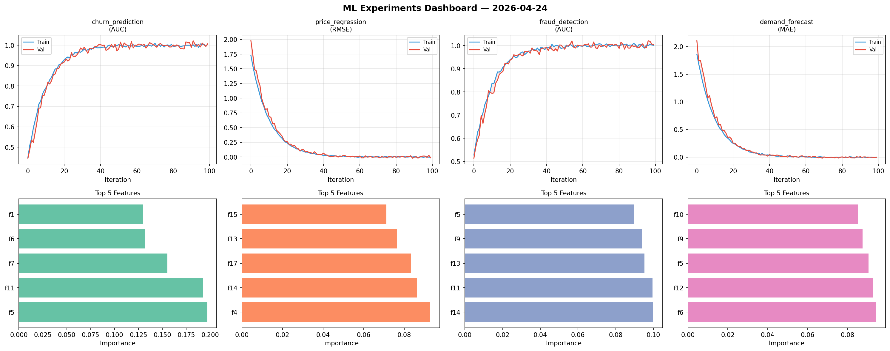
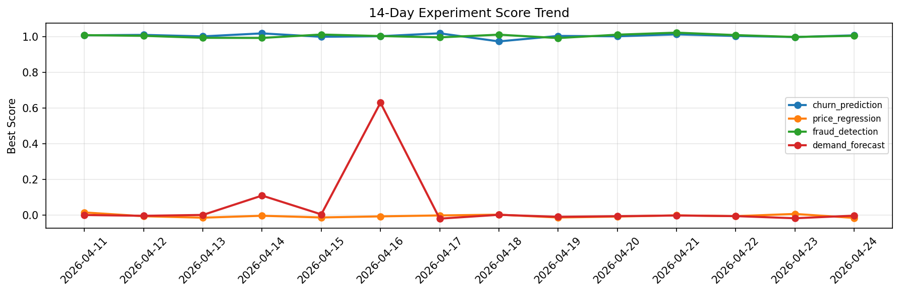

# ML Experiments Report — 2026-04-24

**Run ID:** `96742b732f` | **Experiments:** 4 | **Trials:** 21

## Delta vs Yesterday

| Experiment | Today | Yesterday | Change |
|-----------|-------|-----------|--------|
| churn_prediction | 1.007 | 0.9974 | 📈 1.0% |
| price_regression | -0.0145 | 0.0077 | 📉 -288.3% |
| fraud_detection | 1.0041 | 0.9978 | 📈 0.6% |
| demand_forecast | -0.0019 | -0.0164 | 📈 88.4% |

## churn_prediction (AUC)

**Best Score:** 1.007 (Trial 4)

| Trial | Score | Overfit Gap | Time | LR | Trees | Leaves |
|-------|-------|-------------|------|-----|-------|--------|
| 1 | 0.9951 | 0.0067 | 70.43s | 0.2 | 500 | 63 |
| 2 | 1.0003 | 0.0083 | 85.24s | 0.1 | 500 | 63 |
| 3 | 0.9863 | 0.0143 | 177.54s | 0.1 | 1000 | 127 |
| 4 ⭐ | 1.007 | 0.0022 | 117.32s | 0.2 | 500 | 15 |
| 5 | 0.9998 | 0.001 | 51.48s | 0.1 | 200 | 15 |

## price_regression (RMSE)

**Best Score:** -0.0145 (Trial 4)

| Trial | Score | Overfit Gap | Time | LR | Trees | Leaves |
|-------|-------|-------------|------|-----|-------|--------|
| 1 | 0.0103 | 0.0014 | 141.43s | 0.1 | 1000 | 127 |
| 2 | 0.0155 | 0.0179 | 5.93s | 0.1 | 100 | 127 |
| 3 | 0.0544 | 0.0015 | 270.86s | 0.05 | 1000 | 15 |
| 4 ⭐ | -0.0145 | 0.0111 | 26.64s | 0.2 | 100 | 127 |

## fraud_detection (AUC)

**Best Score:** 1.0041 (Trial 6)

| Trial | Score | Overfit Gap | Time | LR | Trees | Leaves |
|-------|-------|-------------|------|-----|-------|--------|
| 1 | 0.9648 | 0.0059 | 35.86s | 0.05 | 200 | 15 |
| 2 | 1.0039 | 0.0138 | 17.71s | 0.1 | 200 | 63 |
| 3 | 0.7769 | 0.0192 | 27.26s | 0.01 | 1000 | 31 |
| 4 | 0.9393 | 0.0047 | 23.48s | 0.05 | 100 | 31 |
| 5 | 0.6227 | 0.0717 | 3.27s | 0.01 | 100 | 63 |
| 6 ⭐ | 1.0041 | 0.0034 | 43.09s | 0.2 | 200 | 127 |

## demand_forecast (MAE)

**Best Score:** -0.0019 (Trial 2)

| Trial | Score | Overfit Gap | Time | LR | Trees | Leaves |
|-------|-------|-------------|------|-----|-------|--------|
| 1 | 1.2808 | 0.0537 | 27.06s | 0.01 | 200 | 127 |
| 2 ⭐ | -0.0019 | 0.0029 | 37.0s | 0.2 | 500 | 63 |
| 3 | 0.1754 | 0.0171 | 149.75s | 0.05 | 500 | 127 |
| 4 | 0.0054 | 0.0036 | 28.61s | 0.1 | 200 | 15 |
| 5 | 0.8334 | 0.1151 | 107.63s | 0.01 | 500 | 31 |
| 6 | 0.0086 | 0.0044 | 175.07s | 0.1 | 1000 | 15 |
